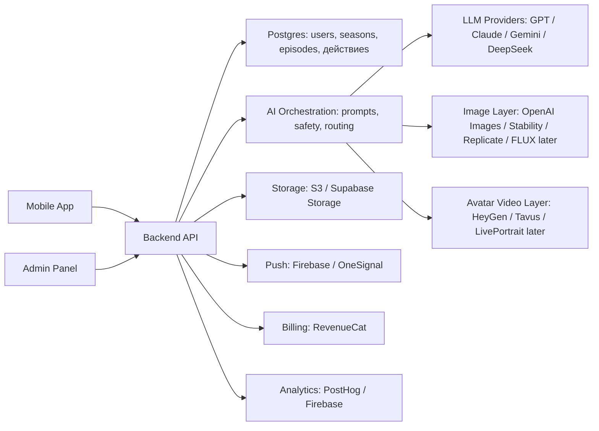

# Исследование АУРА. Мировой рынок и логика гипотез

Версия отчета: 01.06.2026

## ОПИСАНИЕ ПРОЕКТА И ГИПОТЕЗА #1

Проект АУРА рассматривается не как отдельный трекер привычек, не как очередная библиотека медитаций и не как декоративное avatar-приложение. Базовая идея шире: создать ежедневный цифровой ритуал, в котором пользователь получает личное отражение дня, выбирает одно маленькое действие, проходит короткий reset и видит, что его прогресс или образ себя изменился именно из-за сделанного шага.

География этого отчета - мировой рынок потребительских приложений. Русский язык здесь используется как язык повествования и принятия решения, а не как ограничение рынка: конкурентная карта, источники, категории и монетизация собираются глобально.

Логика продукта строится вокруг связки смысл -> действие -> reset -> видимый прогресс. В этой связке смысл не остается абстрактной интерпретацией, действие не превращается в тяжелую productivity-систему, reset не живет как отдельная медитация, а avatar/progress не является случайной косметикой. Ценность появляется только тогда, когда пользователь понимает причинность: я сделал маленький шаг, и поэтому мой образ прогресса изменился.

Гипотеза №1: на мировом рынке потребительских приложений есть место для приложения, которое объединяет личный смысл, короткое действие, reset и причинно видимый прогресс в одну ежедневную петлю. Эта гипотеза пока не доказана как product-market fit, но уже поддержана масштабной картой соседних рынков и конкурентных сигналов.

В основу отчета положена большая карта рынка: 68,085 исходных записей, 37,176 уникализированных объектов и 557 сохраненных исследовательских материалов. Эти данные не используются как “доказательство успеха” продукта сами по себе. Они нужны для последовательной проверки: существует ли рынок, есть ли деньги, насколько плотна конкуренция, где может быть белое пятно, кто аудитория и какую петлю продукта нужно тестировать первой.

### Логика гипотез

Исследование специально построено как цепочка, а не как набор независимых таблиц. Сначала фиксируется продуктовая идея: если АУРА должна соединить смысл, действие, reset и видимый прогресс, то первая проверка - существует ли вообще такая форма продукта и не занята ли она уже конкурентами. После этого нужно понять, есть ли вокруг нее мировые рынки и деньги: без этого даже красивая продуктовая петля остается маленьким экспериментом.

Дальше проверка переходит к конкурентам и белому пятну. Здесь важно не доказывать, что конкурентов нет, а увидеть, где именно существующие решения разрывают петлю: у одних есть reset без действия, у других действие без личного смысла, у третьих avatar без причинности, у четвертых прогресс без мягкого эмоционального входа. Только после этого имеет смысл говорить об аудитории: кто уже живет рядом с этой проблемой, какие приложения и ритуалы использует, за что платит и какие формулировки считает безопасными или манипулятивными.

Последний шаг - продуктовое ядро. Если рынки есть, конкуренты понятны, белое пятно выглядит узким, а аудитория имеет недавнее поведение, тогда MVP должен проверять не весь возможный продукт, а одну причинную петлю: личный смысл -> маленькое действие -> короткий reset -> видимый прогресс -> причина вернуться завтра. Пока эта цепочка не пройдет ручную проверку, интервью и прототипные сессии, все выводы остаются проверяемыми гипотезами, а не финальным решением.

### Цепочка проверки: как строится исследование

Дальше отчет идет не по темам, а по изменению логики. Каждый блок отвечает на один риск: сначала проверяем, существует ли форма продукта; затем - есть ли вокруг нее деньги; затем - не занята ли причинная петля; затем - есть ли аудитория с похожим поведением; затем - какое ядро продукта нужно собирать первым.

| Гипотеза | Что мы думаем | Почему пошли проверять | Что смотрели | Текущий вывод |
| --- | --- | --- | --- | --- |
| гипотеза 1 | Мы думаем, что АУРА может быть отдельной формой потребительского приложения, а не набором разрозненных функций. | Потому что на пересечении смысла, действия, reset и видимого прогресса может возникать ежедневный ритуал. | Пошли смотреть соседние рынки и конкурентов: есть ли уже такая форма и насколько она занята. | Форма выглядит правдоподобно, но риск скрытого клона остается открытым до ручной проверки близких конкурентов. |
| гипотеза 2 | Мы думаем, что вокруг этой формы есть деньги. | Потому что mindfulness, coaching, spiritual guidance, avatar/identity и progression уже монетизируются. | Собрали TAM/SAM/SOM, цены, сигналы платных экранов и рыночные источники. | Денежный аргумент сильный направленно, но это еще не доказательство выручки АУРЫ. |
| гипотеза 3 | Мы думаем, что белое пятно есть не в отсутствии конкурентов, а в недособранной причинной петле. | Многие продукты закрывают reset, смысл, действие или avatar отдельно, но не обязательно связывают их причинно. | Собрали ключевых конкурентов, типов конкурентов, карту белого пятна и проверку публичных страниц. | Белое пятно узкое и интересное, но требует проверки экранов первого пользовательского опыта. |
| гипотеза 4 | Мы думаем, что АУРА может конкурировать не шириной функций, а связкой “смысл -> действие -> avatar/progress”. | Если конкурентное преимущество строить только на avatar или astrology, продукт попадет в занятые категории. | Сравнили повторяющиеся паттерны: reset, привычки, прогресс, avatar, AI-персонализация, платная глубина. | Преимущество возможно только в причинной сборке петли; отдельные функции сами по себе не защищают продукт. |
| гипотеза 5 | Мы думаем, что у АУРЫ есть общая аудитория с соседними продуктами. | Пользователь уже имеет недавнее поведение: ритуалы, journaling, self-improvement, spiritual guidance, progress tools. | Собрали ICP-сегменты, VOC, Reddit/forum/context signals и вопросы для интервью. | Первые сегменты для проверки: Spiritual self-improvers и Habit/progress users; их нужно подтверждать интервью. |
| гипотеза 6 | Мы думаем, что продуктовое ядро должно быть одной короткой сессией, а не большим приложением. | Если причинность не считывается за одну сессию, avatar/progress станет декорацией, а reset — отдельной практикой. | Собрали MVP-петлю, прототипный сценарий, оценочную карту и очередь проверки. | MVP сформулирован, но не доказан без прототипных сессий. |

### Итог первого блока

На уровне идеи АУРА уже сформулирована достаточно узко: это не “еще одно wellness-приложение”, а ежедневный ритуал с причинной связкой между смыслом, действием и видимым изменением. Это делает исследование проверяемым: если в конкурентах уже есть такая же связка, гипотеза слабеет; если пользователи не считывают причинность в прототипе, продуктовая ставка тоже слабеет.

Следующий шаг логичен: если идея продукта сформулирована, нужно понять, какие мировые рынки могут поддержать такую форму, где уже есть платные привычки пользователей и какие соседние категории дают нам не только цифры, но и поведенческий контекст.

## ОПРЕДЕЛЕНИЕ МИРОВЫХ ЦЕЛЕВЫХ РЫНКОВ И ГИПОТЕЗА #2

Для проверки первой гипотезы исследование выделяет пять мировых направлений. Они не равны пяти отдельным продуктам: каждое направление отвечает за один слой будущей ценности АУРА. Mindfulness дает reset и привычку платить за эмоциональное состояние. Coaching/self-improvement дает действие, структуру роста и язык прогресса. Astrology/esoterics дает личный смысл, символический контекст и готовность платить за персональные интерпретации. Avatar/identity дает видимое отражение изменения. Gaming/progression используется как бенчмарк механик возврата, награды и прогресса, но не как прямой рынок АУРА.

| Направление | Приложений из магазинов | Уникальных объектов всего | Кандидатов в анализ | Роль в гипотезе |
| --- | ---: | ---: | ---: | --- |
| Mindfulness / reset | 2,550 | 9,723 | 21 | соседний рынок для конкурентной карты |
| Avatar / identity | 2,506 | 7,944 | 49 | соседний рынок для конкурентной карты |
| Astrology / esoterics | 2,206 | 2,657 | 59 | соседний рынок для конкурентной карты |
| Coaching / self-improvement | 2,651 | 3,857 | 50 | соседний рынок для конкурентной карты |
| Gaming / progression бенчмарк | 3,204 | 14,304 | 8 | бенчмарк механик, не прямой TAM |

Чтобы было понятно, сколько материала собрано по каждой нише, ниже отдельно показана сводка. Здесь есть три уровня: общий объем показывает ширину карты рынка, приложения из магазинов ближе всего к конкурентному полю, а кандидаты в анализ показывают, какие продукты уже вынесены в более внимательное сравнение. Глобально в пакете сейчас 37,176 уникализированных объектов; ниши нельзя просто складывать между собой, потому что один продукт может попадать в несколько тематических контекстов.

| Ниша | Исходных записей | Уникальных объектов | Приложений из магазинов | Доля приложений | В анализ | На ручную проверку | Покрытие | Как читать |
| --- | ---: | ---: | ---: | --- | ---: | ---: | --- | --- |
| Mindfulness / reset | 15,181 | 9,865 | 2,550 | 25.8% | 21 | 0 | источников: 9; сильных: 3; средних: 2 | возможность есть, нужна ручная выборочная проверка |
| Avatar / identity | 15,000 | 10,058 | 2,506 | 24.9% | 49 | 3 | источников: 9; сильных: 3; средних: 2 | возможность есть, нужна ручная выборочная проверка |
| Astrology / esoterics | 5,475 | 2,700 | 2,206 | 81.7% | 59 | 7 | источников: 8; сильных: 1; средних: 3 | рынок плотный или контекст неясен |
| Coaching / self-improvement | 7,679 | 3,864 | 2,651 | 68.6% | 50 | 8 | источников: 8; сильных: 1; средних: 3 | рынок плотный или контекст неясен |
| Gaming / progression бенчмарк | 24,750 | 17,139 | 3,204 | 18.7% | 8 | 0 | источников: 10; сильных: 3; средних: 2 | бенчмарк механик, не primary-рынок |

### Как собрана доказательная база

Доказательная база не опирается на один источник и не сводится к одной таблице конкурентов. Мы совместили несколько типов сигналов: карточки мобильных приложений, Android-кросс-проверку, desktop/browser-продукты, игровые продукты как источник механик прогресса, обсуждения пользователей, публичные страницы компаний, платные экраны и рыночные источники. Поэтому в тексте разделяются три уровня: широкий рынок, очищенная карта объектов и приложения, которые ближе всего к реальному конкурентному полю.

| Семейство источников | Собрано сигналов | После очистки | Ниш | Как использовать |
| --- | ---: | ---: | --- | --- |
| Steam: PC/gaming продукты как бенчмарк progression и возврат механик | 27642 | 17505 | 5 | используем как ориентир механик прогресса, не как прямой рынок АУРЫ |
| Desktop/Mac/PC stores: соседние desktop-продукты и productivity/wellness контекст | 15397 | 2478 | 5 | поддерживающий слой для проверки позиционирования, цен и соседних продуктов |
| App Store: карточки приложений, категории, рейтинги, отзывы и ссылки | 12000 | 6958 | 5 | ближе всего к конкурентной карте потребительских приложений |
| itch.io: indie/game эксперименты, avatar/identity и cozy/progression паттерны | 7047 | 5696 | 3 | используем как ориентир механик прогресса, не как прямой рынок АУРЫ |
| Google Play / Android: кросс-проверка карточек и сигналов цен | 2527 | 1646 | 5 | ближе всего к конкурентной карте потребительских приложений |
| Reddit/forum/community: VOC, боли, обходные решения и язык пользователей | 2339 | 1852 | 5 | используем как язык боли и возражений, не как репрезентативный опрос |
| Сайты компаний и страницы цен: позиционирование, платный экран и сигналы платной глубины | 560 | 482 | 5 | поддерживающий слой для проверки позиционирования, цен и соседних продуктов |
| Chrome Web Store: browser-extension слой и lightweight utility patterns | 252 | 252 | 5 | поддерживающий слой для проверки позиционирования, цен и соседних продуктов |
| прочие нормализованные исходные сигналы | 251 | 251 | 5 | поддерживающий слой для проверки позиционирования, цен и соседних продуктов |

Важно читать эту базу аккуратно: большой объем данных показывает масштаб и направление рынка, но финальные продуктовые решения нельзя принимать только по публичным описаниям. Их нужно подтверждать ручным разбором близких конкурентов, интервью и прототипными сессиями.

### Что реально нашли по каждой нише: ключевые приложения

Ниже показана конкретная картина рынка: по каждой нише показаны заметные потребительские приложения из уже собранной базы. Это не финальный список прямых конкурентов АУРЫ, но он отвечает на практический вопрос: какие приложения мы нашли, насколько они крупные по отзывам и почему эта ниша важна для гипотезы.

#### Mindfulness / reset

Mindfulness / reset: в этой нише собрано 15,181 исходных записей, 9,865 уникализированных объектов и 2,550 приложений из магазинов. В более внимательный анализ вынесено 21 приложение; ручная проверка пока не выделена. Для АУРЫ эта ниша важна так: соседний рынок для конкурентной карты. Денежный сигнал сейчас читается как: сильный направленный денежный аргумент.

| Приложение | Компания | Источник | Отзывы | Рейтинг | Монетизация | Почему важно для АУРЫ |
| --- | --- | --- | ---: | --- | --- | --- |
| Calm | Calm.com | App Store / Google Play | 1,956,370 | 4.77376 | бесплатно | Показывает рынок короткого reset, mental health, meditation, journaling или эмоциональной саморегуляции. Для АУРЫ это источник языка спокойного входа и ежедневного ритуала. Релевантность предварительная: по названию, категории и описанию. |
| Headspace: Sleep & Meditation | Headspace Inc. | App Store / Google Play | 974,022 | 4.84264 | бесплатно | Показывает рынок короткого reset, mental health, meditation, journaling или эмоциональной саморегуляции. Для АУРЫ это источник языка спокойного входа и ежедневного ритуала. Релевантность предварительная: по названию, категории и описанию. |
| I am - Daily Affirmations | Monkey Taps | App Store / Google Play | 715,211 | 4.84183 | бесплатно | Показывает рынок короткого reset, mental health, meditation, journaling или эмоциональной саморегуляции. Для АУРЫ это источник языка спокойного входа и ежедневного ритуала. Релевантность предварительная: по названию, категории и описанию. |
| Finch: Self-Care Pet | Finch Care Public Benefit Corporation | App Store / Google Play | 704,428 | 4.94855 | бесплатно | Показывает рынок короткого reset, mental health, meditation, journaling или эмоциональной саморегуляции. Для АУРЫ это источник языка спокойного входа и ежедневного ритуала. Релевантность предварительная: по названию, категории и описанию. |
| Insight Timer: Meditate, Sleep | Insight Network Inc | App Store / Google Play | 440,173 | 4.89501 | бесплатно | Показывает рынок короткого reset, mental health, meditation, journaling или эмоциональной саморегуляции. Для АУРЫ это источник языка спокойного входа и ежедневного ритуала. Релевантность предварительная: по названию, категории и описанию. |
| BetterSleep: Relax and Sleep | Ipnos Software Inc. | App Store / Google Play | 390,333 | 4.74429 | бесплатно | Показывает рынок короткого reset, mental health, meditation, journaling или эмоциональной саморегуляции. Для АУРЫ это источник языка спокойного входа и ежедневного ритуала. Релевантность предварительная: по названию, категории и описанию. |
| Balance: Meditation & Sleep | The Mind Company | App Store / Google Play | 119,464 | 4.88073 | бесплатно | Показывает рынок короткого reset, mental health, meditation, journaling или эмоциональной саморегуляции. Для АУРЫ это источник языка спокойного входа и ежедневного ритуала. Релевантность предварительная: по названию, категории и описанию. |
| Fabulous: Daily Habit Tracker | Fabulous | App Store / Google Play | 87,905 | 4.44095 | бесплатно | Показывает рынок короткого reset, mental health, meditation, journaling или эмоциональной саморегуляции. Для АУРЫ это источник языка спокойного входа и ежедневного ритуала. Релевантность предварительная: по названию, категории и описанию. |

#### Avatar / identity

Avatar / identity: в этой нише собрано 15,000 исходных записей, 10,058 уникализированных объектов и 2,506 приложений из магазинов. В более внимательный анализ вынесено 49 приложений; на ручную проверку уже выделено 3. Для АУРЫ эта ниша важна так: соседний рынок для конкурентной карты. Денежный сигнал сейчас читается как: сильный направленный денежный аргумент.

| Приложение | Компания | Источник | Отзывы | Рейтинг | Монетизация | Почему важно для АУРЫ |
| --- | --- | --- | ---: | --- | --- | --- |
| ChatGPT | OpenAI OpCo, LLC | App Store / Google Play | 7,582,257 | 4.83563 | бесплатно | Показывает спрос на avatar/identity/AI companion механику. Для АУРЫ важно проверить, может ли образ себя меняться не декоративно, а причинно от действия. Релевантность предварительная: по названию, категории и описанию. |
| Grok - AI Chat & Video | X Corp. | App Store / Google Play | 1,207,762 | 4.88381 | бесплатно | Показывает спрос на avatar/identity/AI companion механику. Для АУРЫ важно проверить, может ли образ себя меняться не декоративно, а причинно от действия. Релевантность предварительная: по названию, категории и описанию. |
| Character AI: Chat, Talk, Text | Character.AI | App Store / Google Play | 535,071 | 4.33654 | бесплатно | Показывает спрос на avatar/identity/AI companion механику. Для АУРЫ важно проверить, может ли образ себя меняться не декоративно, а причинно от действия. Релевантность предварительная: по названию, категории и описанию. |
| ZEPETO: Avatar, Connect & Live | NAVER Z Corporation | App Store / Google Play | 515,481 | 4.65143 | бесплатно | Показывает спрос на avatar/identity/AI companion механику. Для АУРЫ важно проверить, может ли образ себя меняться не декоративно, а причинно от действия. Релевантность предварительная: по названию, категории и описанию. |
| PolyBuzz: Chat with Characters | CLOUD WHALE INTERACTIVE TECHNOLOGY LLC. | App Store / Google Play | 417,661 | 4.43872 | бесплатно | Показывает спрос на avatar/identity/AI companion механику. Для АУРЫ важно проверить, может ли образ себя меняться не декоративно, а причинно от действия. Релевантность предварительная: по названию, категории и описанию. |
| Lensa AI: Photo Editor | Prisma labs, inc. | desktop store | 415,712 | 4.69597 | бесплатно или freemium; модель требует проверки | Показывает спрос на avatar/identity/AI companion механику. Для АУРЫ важно проверить, может ли образ себя меняться не декоративно, а причинно от действия. Отмеченные теги: avatar_or_identity. |
| IMVU: Fun 3D Avatar Chat Game | IMVU | App Store / Google Play | 364,215 | 4.60362 | бесплатно | Показывает спрос на avatar/identity/AI companion механику. Для АУРЫ важно проверить, может ли образ себя меняться не декоративно, а причинно от действия. Релевантность предварительная: по названию, категории и описанию. |
| Replika - AI Friend | Luka, Inc. | App Store / Google Play | 227,803 | 4.44685 | бесплатно | Показывает спрос на avatar/identity/AI companion механику. Для АУРЫ важно проверить, может ли образ себя меняться не декоративно, а причинно от действия. Релевантность предварительная: по названию, категории и описанию. |

#### Astrology / esoterics

Astrology / esoterics: в этой нише собрано 5,475 исходных записей, 2,700 уникализированных объектов и 2,206 приложений из магазинов. В более внимательный анализ вынесено 59 приложений; на ручную проверку уже выделено 7. Для АУРЫ эта ниша важна так: соседний рынок для конкурентной карты. Денежный сигнал сейчас читается как: сильный направленный денежный аргумент.

| Приложение | Компания | Источник | Отзывы | Рейтинг | Монетизация | Почему важно для АУРЫ |
| --- | --- | --- | ---: | --- | --- | --- |
| Bible | Life.Church | App Store / Google Play | 13,311,404 | 4.91606 | бесплатно | Показывает рынок личного смысла: horoscope, tarot, moon/spiritual guidance, manifestation или symbolic reflection. Для АУРЫ это источник входа через смысл, но не доказательство действия. Релевантность предварительная: по названию, категории и описанию. |
| Nebula: Spiritual Guidance | Spiritual Nebula Limited | App Store / Google Play | 169,696 | 4.57524 | бесплатно | Показывает рынок личного смысла: horoscope, tarot, moon/spiritual guidance, manifestation или symbolic reflection. Для АУРЫ это источник входа через смысл, но не доказательство действия. Релевантность предварительная: по названию, категории и описанию. |
| Faladdin: Zodiac & Love | Truemium | App Store / Google Play | 89,741 | 4.59496 | бесплатно | Показывает рынок личного смысла: horoscope, tarot, moon/spiritual guidance, manifestation или symbolic reflection. Для АУРЫ это источник входа через смысл, но не доказательство действия. Релевантность предварительная: по названию, категории и описанию. |
| Kaave: Tarot, Angel, Horoscope | Didilabs BV | App Store / Google Play | 55,523 | 4.75138 | бесплатно | Показывает рынок личного смысла: horoscope, tarot, moon/spiritual guidance, manifestation или symbolic reflection. Для АУРЫ это источник входа через смысл, но не доказательство действия. Релевантность предварительная: по названию, категории и описанию. |
| CHANI: Your Astrology Guide | Chani Nicholas Incorporated | App Store / Google Play | 54,144 | 4.91533 | бесплатно | Показывает рынок личного смысла: horoscope, tarot, moon/spiritual guidance, manifestation или symbolic reflection. Для АУРЫ это источник входа через смысл, но не доказательство действия. Релевантность предварительная: по названию, категории и описанию. |
| Sanctuary Psychic Reading | Sanctuary Ventures Inc | App Store / Google Play | 44,109 | 4.79692 | бесплатно | Показывает рынок личного смысла: horoscope, tarot, moon/spiritual guidance, manifestation или symbolic reflection. Для АУРЫ это источник входа через смысл, но не доказательство действия. Релевантность предварительная: по названию, категории и описанию. |
| TimePassages Astrology | AstroGraph Software | App Store / Google Play | 43,574 | 4.838 | бесплатно | Показывает рынок личного смысла: horoscope, tarot, moon/spiritual guidance, manifestation или symbolic reflection. Для АУРЫ это источник входа через смысл, но не доказательство действия. Релевантность предварительная: по названию, категории и описанию. |
| Daily Horoscope - Astrology! | Astera Dijital Hizmetler Anonim Sirketi | App Store / Google Play | 35,630 | 4.62518 | бесплатно | Показывает рынок личного смысла: horoscope, tarot, moon/spiritual guidance, manifestation или symbolic reflection. Для АУРЫ это источник входа через смысл, но не доказательство действия. Релевантность предварительная: по названию, категории и описанию. |

#### Coaching / self-improvement

Coaching / self-improvement: в этой нише собрано 7,679 исходных записей, 3,864 уникализированных объектов и 2,651 приложений из магазинов. В более внимательный анализ вынесено 50 приложений; на ручную проверку уже выделено 8. Для АУРЫ эта ниша важна так: соседний рынок для конкурентной карты. Денежный сигнал сейчас читается как: средний направленный денежный аргумент.

| Приложение | Компания | Источник | Отзывы | Рейтинг | Монетизация | Почему важно для АУРЫ |
| --- | --- | --- | ---: | --- | --- | --- |
| Impulse - Brain Training | GMRD Apps Limited | App Store / Google Play | 832,218 | 4.74822 | бесплатно | Показывает рынок self-improvement, habit, AI coach, routine или goal guidance. Для АУРЫ это источник слоя действия и платной глубины, но не доказательство мягкого ритуального опыта. Релевантность предварительная: по названию, категории и описанию. |
| Finch: Self-Care Pet | Finch Care Public Benefit Corporation | App Store / Google Play | 704,428 | 4.94855 | бесплатно | Показывает рынок self-improvement, habit, AI coach, routine или goal guidance. Для АУРЫ это источник слоя действия и платной глубины, но не доказательство мягкого ритуального опыта. Релевантность предварительная: по названию, категории и описанию. |
| Structured: Daily Planner Todo | unorderly GmbH | App Store / Google Play | 159,816 | 4.79678 | бесплатно | Показывает рынок self-improvement, habit, AI coach, routine или goal guidance. Для АУРЫ это источник слоя действия и платной глубины, но не доказательство мягкого ритуального опыта. Релевантность предварительная: по названию, категории и описанию. |
| Habit Tracker | InnerGrow | App Store / Google Play | 141,431 | 4.79463 | бесплатно | Показывает рынок self-improvement, habit, AI coach, routine или goal guidance. Для АУРЫ это источник слоя действия и платной глубины, но не доказательство мягкого ритуального опыта. Релевантность предварительная: по названию, категории и описанию. |
| Productive - Habit Tracker | Mosaic S.r.l. | App Store / Google Play | 91,108 | 4.59673 | бесплатно | Показывает рынок self-improvement, habit, AI coach, routine или goal guidance. Для АУРЫ это источник слоя действия и платной глубины, но не доказательство мягкого ритуального опыта. Релевантность предварительная: по названию, категории и описанию. |
| Fabulous: Daily Habit Tracker | Fabulous | App Store / Google Play | 87,905 | 4.44095 | бесплатно | Показывает рынок self-improvement, habit, AI coach, routine или goal guidance. Для АУРЫ это источник слоя действия и платной глубины, но не доказательство мягкого ритуального опыта. Релевантность предварительная: по названию, категории и описанию. |
| Zing AI: Home & Gym Workouts | Zing Coach Inc. | App Store / Google Play | 30,671 | 4.77053 | бесплатно | Показывает рынок self-improvement, habit, AI coach, routine или goal guidance. Для АУРЫ это источник слоя действия и платной глубины, но не доказательство мягкого ритуального опыта. Релевантность предварительная: по названию, категории и описанию. |
| Streaks | Crunchy Bagel | App Store / Google Play | 27,335 | 4.81496 | платно | Показывает рынок self-improvement, habit, AI coach, routine или goal guidance. Для АУРЫ это источник слоя действия и платной глубины, но не доказательство мягкого ритуального опыта. Релевантность предварительная: по названию, категории и описанию. |

#### Gaming / progression бенчмарк

Gaming / progression бенчмарк: в этой нише собрано 24,750 исходных записей, 17,139 уникализированных объектов и 3,204 приложений из магазинов. В более внимательный анализ вынесено 8 приложений; ручная проверка пока не выделена. Для АУРЫ эта ниша важна так: бенчмарк механик, не прямой TAM. Денежный сигнал сейчас читается как: деньги видны, но это бенчмарк, не прямой TAM.

| Приложение | Компания | Источник | Отзывы | Рейтинг | Монетизация | Почему важно для АУРЫ |
| --- | --- | --- | ---: | --- | --- | --- |
| Roblox | Roblox Corporation | App Store / Google Play | 18,852,783 | 4.51961 | бесплатно | Показывает бенчмарк progression/quest/avatar механик. Для АУРЫ это не прямой TAM, а источник механик возврата, видимого прогресса и награды. Релевантность предварительная: по названию, категории и описанию. |
| 8 Ball Pool™ | Miniclip.com | App Store / Google Play | 4,683,643 | 4.75221 | бесплатно | Показывает бенчмарк progression/quest/avatar механик. Для АУРЫ это не прямой TAM, а источник механик возврата, видимого прогресса и награды. Релевантность предварительная: по названию, категории и описанию. |
| Candy Crush Saga | King | App Store / Google Play | 3,928,435 | 4.70617 | бесплатно | Показывает бенчмарк progression/quest/avatar механик. Для АУРЫ это не прямой TAM, а источник механик возврата, видимого прогресса и награды. Релевантность предварительная: по названию, категории и описанию. |
| Clash Royale | Supercell | App Store / Google Play | 3,795,629 | 4.59762 | бесплатно | Показывает бенчмарк progression/quest/avatar механик. Для АУРЫ это не прямой TAM, а источник механик возврата, видимого прогресса и награды. Релевантность предварительная: по названию, категории и описанию. |
| Subway Surfers | Sybo Games ApS | App Store / Google Play | 3,727,320 | 4.64777 | бесплатно | Показывает бенчмарк progression/quest/avatar механик. Для АУРЫ это не прямой TAM, а источник механик возврата, видимого прогресса и награды. Релевантность предварительная: по названию, категории и описанию. |
| MONOPOLY GO! | Scopely, Inc. | App Store / Google Play | 3,684,825 | 4.79866 | бесплатно | Показывает бенчмарк progression/quest/avatar механик. Для АУРЫ это не прямой TAM, а источник механик возврата, видимого прогресса и награды. Релевантность предварительная: по названию, категории и описанию. |
| Royal Match | Dream Games | App Store / Google Play | 3,668,789 | 4.69166 | бесплатно | Показывает бенчмарк progression/quest/avatar механик. Для АУРЫ это не прямой TAM, а источник механик возврата, видимого прогресса и награды. Релевантность предварительная: по названию, категории и описанию. |
| Discord - Talk, Play, Hang Out | Discord Inc. | App Store / Google Play | 3,443,757 | 4.70101 | бесплатно | Показывает бенчмарк progression/quest/avatar механик. Для АУРЫ это не прямой TAM, а источник механик возврата, видимого прогресса и награды. Релевантность предварительная: по названию, категории и описанию. |

### Главные повторяющиеся паттерны в функциях и возможностях

Отдельно важно показать не только названия топ-приложений, а то, что у них повторяется внутри продукта. Ниже это прочитано по feature tags, карточкам приложений, оценочным картам и top-intersection кандидатам. Это не утверждение, что каждая функция реализована одинаково глубоко: часть сигналов видна из публичных карточек и отзывов, поэтому они дают карту паттернов, а не финальный вывод после ручного прохождения первого пользовательского опыта.

| Категория | Строк функций | Топ-кандидатов | Что повторяется в функциях | Примеры из топа | Что забираем в АУРУ |
| --- | ---: | ---: | --- | --- | --- |
| Mindfulness / reset | 2399 | 0 | meditation, breathing, reset (2,399); habit loop, streak, ежедневные отметки (1,378); уровни, XP, квесты, прогресс (1,222); дневник, mood tracking, reflection (994); социальность / community / sharing (609); фото- и video-генерация (558); coaching / советы / план роста (554) | Calm, Headspace: Sleep & Meditation, I am - Daily Affirmations, Finch: Self-Care Pet | Брать короткий reset и эмоциональный вход, но связывать его с действием и изменением avatar/progress. |
| Avatar / identity | 2281 | 25 | avatar / identity / future-self образ (2,306); фото- и video-генерация (1,102); уровни, XP, квесты, прогресс (1,073); социальность / community / sharing (1,023); AI-персонализация / AI-чат (776); habit loop, streak, ежедневные отметки (438); coaching / советы / план роста (250) | ChatGPT, Grok - AI Chat & Video, Character AI: Chat, Talk, Text, ZEPETO: Avatar, Connect & Live | Не делать “редактор аватаров”: avatar должен быть следом действия и героем личного сериала. |
| Astrology / esoterics | 2201 | 41 | астрология, horoscope, birth chart (2,242); уровни, XP, квесты, прогресс (1,138); habit loop, streak, ежедневные отметки (947); manifestation / духовные практики (928); социальность / community / sharing (872); tarot/oracle интерпретации (713); фото- и video-генерация (533) | Bible, Nebula: Spiritual Guidance, Faladdin: Zodiac & Love, Kaave: Tarot, Angel, Horoscope | Использовать дату рождения/символы как персональный вход, но выводить пользователя в действие, а не оставлять в чтении. |
| Coaching / self-improvement | 2534 | 27 | coaching / советы / план роста (2,561); habit loop, streak, ежедневные отметки (1,341); уровни, XP, квесты, прогресс (1,290); социальность / community / sharing (949); AI-персонализация / AI-чат (847); фото- и video-генерация (664); meditation, breathing, reset (562) | Impulse - Brain Training, Finch: Self-Care Pet, Structured: Daily Planner Todo, Habit Tracker | Забирать структуру роста и привычки, но делать ее мягче, короче и менее похожей на task manager. |
| Gaming / progression бенчмарк | 3137 | 7 | habit loop, streak, ежедневные отметки (1,761); уровни, XP, квесты, прогресс (1,678); социальность / community / sharing (940); meditation, breathing, reset (858); фото- и video-генерация (722); coaching / советы / план роста (512); дневник, mood tracking, reflection (277) | Roblox, 8 Ball Pool™, Candy Crush Saga, Clash Royale | Брать сезоны, XP, квесты, награды и возврат как механику, но не превращать АУРУ в игру ради игры. |

Главный вывод из паттернов: рынок уже научил пользователей нескольким вещам. Пользователь ожидает персонализацию, ежедневный якорь, видимый прогресс, reminder/return loop, платную глубину и иногда avatar или AI companion. Но почти везде эти элементы живут раздельно: meditation дает состояние, habit apps дают действие, astrology дает смысл, avatar-приложения дают образ, gaming дает возвращаемость. Возможность АУРЫ как раз в сборке этих повторяющихся паттернов в одну причинную петлю: смысл -> действие -> reset -> видимое изменение -> следующая серия.

Что это значит для MVP: первая версия должна не демонстрировать “много функций”, а доказать, что самые частые паттерны действительно соединяются. Минимальный набор: персональный вход, один daily-ритуал, маленькое действие, короткий reset, avatar/progress feedback, память эпизодов и причина вернуться завтра. Все остальное - social, marketplace, длинные библиотеки контента, глубокая кастомизация и дорогое видео - должно идти после проверки базовой петли.

Гипотеза №2: мировые соседние рынки достаточно велики и монетизируемы, чтобы продолжать проверку АУРА, но рыночные цифры должны читаться как sizing для направления, а не как прогноз выручки самого продукта.

| Рынок | Рабочая SAM-оценка | Денежный вывод | Оценка | Граница |
| --- | ---: | --- | ---: | --- |
| Mindfulness / reset | $252M | сильный направленный денежный аргумент | 9 | Можно использовать как направленный сигнал, но нельзя усиливать вывод до доказательства product-market fit без ручной проверки, подтверждения платного экрана и пользовательских сессий. |
| Avatar / identity | $420M | сильный направленный денежный аргумент | 10 | Можно использовать как направленный сигнал, но нельзя усиливать вывод до доказательства product-market fit без ручной проверки, подтверждения платного экрана и пользовательских сессий. |
| Astrology / esoterics | $374M | сильный направленный денежный аргумент | 9 | Можно использовать как направленный сигнал, но нельзя усиливать вывод до доказательства product-market fit без ручной проверки, подтверждения платного экрана и пользовательских сессий. |
| Coaching / self-improvement | $300M | средний направленный денежный аргумент | 8 | Можно использовать как направленный сигнал, но нельзя усиливать вывод до доказательства product-market fit без ручной проверки, подтверждения платного экрана и пользовательских сессий. |
| Gaming / progression бенчмарк | $671M | деньги видны, но это бенчмарк, не прямой TAM | 7 | Нельзя считать прямым рынком АУРА без доказанного ritual/self-improvement overlap; использовать как механику прогресса и возврат. |

Расчетное пересечение рынков в текущей модели дает рабочую рамку около $202M. Это не обещание выручки и не финальная оценка бизнеса, а ориентир: рынок выглядит достаточно крупным, чтобы продолжать проверку. Денежную гипотезу можно считать сильнее только после проверки реальных платных экранов, цен, моделей пробного периода и готовности пользователей платить именно за похожую ценность.

## ОЦЕНКА РАЗМЕРА РЫНКА: TAM/SAM/SOM

Рыночная модель АУРА намеренно построена как диапазон, а не как одна “красивая” цифра. Такой подход нужен, потому что АУРА находится на пересечении нескольких соседних рынков, а не внутри одной готовой категории, где можно просто взять готовый отчет и перенести его на продукт.

Логика расчета такая: сначала берется широкий размер рынка, затем выделяется та часть, которая может быть обслуживаемой для похожего потребительского продукта, после чего применяется понижающий коэффициент уверенности. Это защищает модель от завышения: mindfulness, coaching и spiritual guidance ближе к прямой проверке, avatar/identity шире и требует скидки, а gaming используется как источник механик прогресса, но не как прямой рынок АУРЫ.

| Направление | Какой тип рынка | Базовая оценка | Оценка с поправкой | Риск модели | Как читать |
| --- | --- | ---: | ---: | --- | --- |
| gaming/progression | бенчмарк механик, не прямой TAM | $671M | $470M | не считать прямым рынком АУРА | использовать только как бенчмарк механик возврата, прогресса и монетизации, не включать в прямой TAM АУРА |
| astrology/esoterics | прямой соседний рынок | $374M | $262M | поддержано косвенным сигналом, но нужна ручная проверка платной модели и готовности платить | использовать как направленный рыночный ориентир до ручной проверки платного экрана, ICP и доказательства готовности платить |
| avatar/identity | широкий соседний рынок с сильной поправкой на ширину consumer-рынка | $420M | $294M | поддержано косвенным сигналом, но нужна ручная проверка платной модели и готовности платить | использовать как денежный контекст с сильной поправкой на широту consumer/self-improvement рынка |
| coaching/self-improvement | прямой соседний рынок | $300M | $210M | широкий диапазон источников, нужен консервативный диапазон | использовать как направленный рыночный ориентир до ручной проверки платного экрана, ICP и доказательства готовности платить |
| mindfulness/reset | прямой соседний рынок | $252M | $176M | поддержано косвенным сигналом, но нужна ручная проверка платной модели и готовности платить | использовать как направленный рыночный ориентир до ручной проверки платного экрана, ICP и доказательства готовности платить |
| пересечение АУРЫ | расчетное пересечение АУРЫ | $202M | $80.8M | модельное пересечение, высокий риск завысить вывод | читать как рабочую модельную SAM-оценку для проверки, а не как прогноз выручки или инвесторский рыночный вывод |

Для гипотезы о деньгах это означает жесткую границу: рыночная модель показывает, что направление достаточно интересно для проверки, но не доказывает, что АУРА заработает эти деньги. Эту гипотезу можно усиливать только после проверки платных сценариев у конкурентов, интервью о готовности платить и прототипных сессий, где пользователь понимает платную глубину продукта.

### Как определить рынок АУРЫ

Для презентации важно не спорить, является ли АУРА “астрологией”, “аватарами”, “mindfulness” или “игрой”. Продукт на самом деле находится на пересечении, но для стратегии нужно выбрать основной рынок входа и вспомогательные рынки механик. Самая сильная рабочая позиция сейчас такая: основной рынок - mobile wellness / self-improvement / entertainment app, где пользователь приходит за личным смыслом, эмоциональным состоянием и ощущением движения. Astrology/esoterics дает язык персонального входа, avatar/identity дает визуальный образ изменения, gaming дает механику сериала, сезонов, квестов и возврата, но не является прямым позиционированием продукта.

| Уровень рынка | Что это для АУРЫ | Зачем учитывать | Рабочее решение |
| --- | --- | --- | --- |
| Базовый рынок | Мобильные потребительские приложения | Мы делаем мобилку, поэтому конкурируем за привычку открыть приложение, пройти короткую сессию и вернуться завтра. | Считать верхним уровнем, но не использовать как доказательство спроса само по себе. |
| Основная категория входа | Wellness / self-improvement / emotional guidance | Пользователь приходит не “создать аватар”, а улучшить состояние, понять себя и сделать маленький шаг. | Использовать как главный язык рынка и ЦА. |
| Смысловой слой | Astrology / esoterics / symbolic guidance | Дата рождения, символы и личные интерпретации дают ощущение “это про меня”. | Использовать как вход, но не обещать судьбу или точные предсказания. |
| Визуальный слой | Avatar / identity / future self | Avatar делает изменение видимым и эмоционально привязывает пользователя к истории. | Не позиционировать как редактор аватаров; использовать как герой личного сериала. |
| Механика возврата | Gaming / progression / life series | Сезоны, эпизоды, квесты, мягкий прогресс и память делают продукт возвращаемым. | Брать механику из gaming, но не превращать продукт в игру ради игры. |

Такой выбор категории делает исследование последовательным: сначала мы доказываем, что в мобильных wellness/self-improvement/entertainment категориях есть деньги и привычка платить; затем показываем, какие фичи и механики берем из соседних рынков; затем собираем прототип, где дата рождения, avatar, reset, действие и Life Series работают вместе.

| Сценарий | Достижимая аудитория | Активация | Платящая доля | Средний годовой чек | Годовая выручка | Как читать |
| --- | ---: | --- | --- | --- | ---: | --- |
| defensive | 100,000 | 25% | 2% | $50 | $25,000 | маленький проверочный бизнес, полезен для проверки, но не для venture-вывод |
| conservative | 250,000 | 32% | 3% | $60 | $144,000 | ранний нишевый бизнес, имеет смысл при сильной удерживаемости |
| base | 1,000,000 | 40% | 5% | $80 | $1.6M | ранний нишевый бизнес, имеет смысл при сильной удерживаемости |
| strong_niche | 2,500,000 | 45% | 7% | $95 | $7.5M | venture-релевантно только если возврат и платная глубина реально работают |
| upside | 5,000,000 | 50% | 9% | $110 | $24.8M | крупный outcome требует доказанного дистрибуции, возврата и готовности платить |
| breakout | 10,000,000 | 55% | 11% | $125 | $75.6M | крупный outcome требует доказанного дистрибуции, возврата и готовности платить |

### Итог по рынкам и деньгам

Рыночная картина поддерживает гипотезу 2 только направленно. Вокруг АУРА есть крупные соседние категории, платные привычки и понятные механики потребительских приложений, но ни одна широкая рыночная цифра не является прямым прогнозом выручки АУРА. Самое аккуратное чтение: рынок достаточно большой, чтобы продолжать, но недостаточно доказанный, чтобы принимать решение о запуске.

Поэтому следующий шаг - не спорить о единственной TAM-цифре, а перейти к сценариям входа. Именно сценарии показывают, какой пользовательский мотив может привести человека в продукт и почему пять рынков собираются в одну гипотезу, а не остаются пятью разными направлениями.

## СЦЕНАРИИ ВХОДА КАК СВЯЗУЮЩЕЕ ЗВЕНО

Сценарии входа для АУРА не завязаны на один канал. Логичнее рассматривать несколько мировых consumer-entry сценариев. Первый сценарий - пользователь приходит из состояния тревоги, усталости или перегруза и ищет короткий reset. Второй сценарий - пользователь приходит из self-improvement контекста: он хочет двигаться вперед, но устал от жестких streak и сложных систем. Третий сценарий - пользователь приходит из spiritual/смысл контекста и хочет не просто читать интерпретацию, а превратить ее в действие. Четвертый сценарий - пользователь приходит через avatar/identity интерес и хочет видеть, что версия себя меняется. Пятый сценарий - пользователь возвращается через мягкую progression-механику, если она не выглядит как манипулятивная игра.

Таким образом, рынок АУРА должен рассматриваться не по одному каналу входа, а как пересечение потребностей: состояние, смысл, действие, видимость прогресса и возвращаемость.

### ЛОГИКА СЕГМЕНТАЦИИ

Как и в прошлом исследовательском документе Алины, сегментация здесь нужна не для красивых labels, а для ответа на практический вопрос: через какой мотив человек вообще войдет в систему и какой use case он принесет с собой. Поэтому аудитория АУРА делится не по полу, возрасту или стране, а по мотивационным линиям: смысл, прогресс, reset, identity/avatar и мягкая возвращаемость.

Первая линия - пользователи, которые ищут личный смысл и хотят превратить его в действие. Вторая линия - пользователи, которым нужен видимый прогресс без давления streak. Третья линия - пользователи короткого emotional reset. Четвертая линия - пользователи, которым важна identity/avatar метафора. Пятая линия - progression users, у которых можно брать механику возврата, но нельзя автоматически считать их прямым рынком АУРА.

Эта логика важна для продукта: одна и та же MVP-петля должна быть проверена разными входами. Если spiritual self-improver видит в продукте “очередное гадание”, гипотезы 1 и 6 слабеют. Если habit/progress user видит “еще один task manager”, гипотеза 4 слабеет. Если reset user не связывает calm-down с действием, петля распадается. Поэтому сегментация сразу переводится в проверочные вопросы, а не остается маркетинговой типологией.

| Сегмент | Приоритет | Рынки | Ключевая задача | Почему важен | Как проверять |
| --- | --- | --- | --- | --- | --- |
| Spiritual self-improvers | первичный сегмент: начинать интервью и прототип с этого сегмента | astrology/esoterics/coaching/self-improvement | Превратить личный или символический смысл в одно конкретное действие на сегодня. | Это люди, которые уже ищут личный смысл, символическое отражение дня, дневниковые практики, spiritual guidance или мягкий self-improvement. Для АУРА это самый естественный вход: смысл должен быстро превращаться в одно реальное действие. | Какие приложения, ритуалы, дневники, коучи, avatar-инструменты или reset-практики человек реально использовал за последние 30 дней для задачи: превратить личный или символический смысл в одно конкретное действие на сегодня. |
| Habit and progress users | первичный сегмент: начинать интервью и прототип с этого сегмента | coaching/self-improvement/mindfulness/reset | Сделать размытый личный рост видимым и продолжать движение без тревоги из-за streak. | Это люди, которым не хватает не еще одного списка задач, а более мягкого способа видеть движение вперед. Для АУРА это проверка, может ли прогресс, связанный с действием, заменить жесткий streak pressure. | Какие приложения, ритуалы, дневники, коучи, avatar-инструменты или reset-практики человек реально использовал за последние 30 дней для задачи: сделать размытый личный рост видимым и продолжать движение без тревоги из-за streak. |
| Anxious daily reset users | следующий сегмент: использовать для сравнения после первичных интервью | mindfulness/reset/coaching/self-improvement | Быстро успокоиться и вернуться к дню с одним посильным следующим шагом. | Это пользователи коротких reset, calm, sleep, breathwork и mood tools. Для АУРА они важны как проверка: reset должен не просто успокоить, а вернуть человека к одному посильному следующему шагу. | Какие приложения, ритуалы, дневники, коучи, avatar-инструменты или reset-практики человек реально использовал за последние 30 дней для задачи: быстро успокоиться и вернуться к дню с одним посильным следующим шагом. |
| Cozy/casual progression users | следующий сегмент: использовать для сравнения после первичных интервью | gaming/progression/avatar/identity | Возвращаться потому, что прогресс ощущается мягким, видимым и эмоционально приятным. | Это люди, которым близки мягкие игровые циклы, коллекционирование, daily rewards и уютная progression. Для АУРА это источник языка возвращения, но есть риск выглядеть как манипулятивная возврат-механика. | Какие приложения, ритуалы, дневники, коучи, avatar-инструменты или reset-практики человек реально использовал за последние 30 дней для задачи: возвращаться потому, что прогресс ощущается мягким, видимым и эмоционально приятным. |
| Coaching professionals and structured growth users | следующий сегмент: использовать для сравнения после первичных интервью | coaching/self-improvement | Получать структурную поддержку, которая превращает намерение в регулярную практику. | Это пользователи структурированного роста, coaching и accountability. Для АУРА сегмент полезен как проверка глубины, но продукт не должен превращаться в B2B/career coaching software. | Какие приложения, ритуалы, дневники, коучи, avatar-инструменты или reset-практики человек реально использовал за последние 30 дней для задачи: получать структурную поддержку, которая превращает намерение в регулярную практику. |
| Avatar identity builders | следующий сегмент: использовать для сравнения после первичных интервью | avatar/identity/coaching/self-improvement | Видеть, как версия себя меняется вместе с реальным прогрессом. | Это пользователи identity, avatars, AI companions и future-self визуализаций. Для АУРА сегмент важен как проверка, мотивирует ли визуальное self-change только тогда, когда оно связано с завершенным действием. | Какие приложения, ритуалы, дневники, коучи, avatar-инструменты или reset-практики человек реально использовал за последние 30 дней для задачи: видеть, как версия себя меняется вместе с реальным прогрессом. |

Итог по сегментации: первыми стоит проверять Spiritual self-improvers и Habit and progress users, потому что они дают два разных входа в одну и ту же причинную петлю. Остальные сегменты нужны как сегменты для сравнения: они покажут, является ли АУРА отдельным продуктом с широкой задачей ежедневного ритуала или распадается на несколько уже занятых категорий.

## ОПРЕДЕЛЕНИЕ КОНКУРЕНТОВ И ГИПОТЕЗА #3

Конкурентная среда подтверждает, что пользователь уже решает части задачи через существующие приложения. В top-100 анализ сейчас есть meditation apps, habit trackers, AI journals, spiritual guidance apps, avatar/identity apps и progression products. Рынок не пустой, поэтому сильная ставка АУРА не может звучать как “конкурентов нет”. Ставка должна быть точнее: конкуренты закрывают отдельные части петли, но полная причинная связка смысл -> действие -> reset -> visible identity/progress встречается редко и требует ручной проверки.

| Конкурент | Риск | Приоритет | Денежный сигнал | Что проверить |
| --- | --- | ---: | --- | --- |
| Shepherd: Spiritual Bible BFF | прямой reference-риск | 162.8 | сильный bottom-up косвенный сигнал | проверить full-loop первым |
| Zing AI: Home & Gym Workouts | сильный платный close substitute | 112 | сильный bottom-up косвенный сигнал | проверить действие -> progress causality |
| Miracle Morning Routine | сильный платный close substitute | 111.4 | сильный bottom-up косвенный сигнал | проверить действие -> progress causality |
| EVOLVE: Transform Your Life | сильный платный close substitute | 106 | сильный bottom-up косвенный сигнал | проверить действие -> progress causality |
| Daily Yoga: Yoga for Fitness® | сильный платный close substitute | 99.2 | сильный bottom-up косвенный сигнал | проверить действие -> progress causality |
| Daily Burn: Workout Coach | сильный платный close substitute | 98 | сильный bottom-up косвенный сигнал | проверить действие -> progress causality |
| Myla : Manifest & Vision Board | высокий close-substitute риск | 97.6 | средний bottom-up косвенный сигнал | проверить действие -> progress causality |
| Rosebud: AI Journal & Diary | высокий close-substitute риск | 97 | средний bottom-up косвенный сигнал | проверить действие -> progress causality |
| Habit Tracker : Haby | высокий close-substitute риск | 95.8 | средний bottom-up косвенный сигнал | проверить действие -> progress causality |
| Goddess・Women's Wellness Coach | высокий close-substitute риск | 95.8 | средний bottom-up косвенный сигнал | проверить действие -> progress causality |
| LifeWheel Goal Habit Tracker | высокий close-substitute риск | 95.4 | средний bottom-up косвенный сигнал | проверить действие -> progress causality |
| Habit Tracker | сильный платный close substitute | 94 | сильный bottom-up косвенный сигнал | проверить действие -> progress causality |

### Что видно внутри приложений и отзывов

Если смотреть не только на категории приложений, а на то, за что пользователи хвалят и ругают близкие продукты, картина становится конкретнее. Люди возвращаются не просто “в wellness” или “в коучинг”. Они ищут ежедневный якорь, ощущение движения, эмоциональную поддержку, персонализацию и доказательство, что маленькое действие действительно что-то меняет. Поэтому АУРА должна конкурировать не количеством функций, а качеством одной понятной петли.

| Что повторяется в отзывах | Сигналов | Что это значит для АУРЫ |
| --- | ---: | --- |
| люди просят больше глубины, настроек и персонализации | 156 | после первого момента ценности пользователи хотят больше глубины, настроек и персонализации. |
| пользователям нравится ежедневный ритуал | 127 | это повторяющийся сигнал из отзывов и конкурентных карточек. |
| есть жалобы на цену или подписку | 98 | платная модель должна появляться после понятной ценности, иначе вызывает сопротивление. |
| пользователям нравится avatar/progress feedback | 70 | avatar/progress уже считывается пользователями как ценность, но только если он не декоративный. |
| ценится эмоциональная поддержка | 57 | это повторяющийся сигнал из отзывов и конкурентных карточек. |
| видны причины оттока | 22 | это повторяющийся сигнал из отзывов и конкурентных карточек. |
| сбои ломают доверие и ритуал | 10 | это повторяющийся сигнал из отзывов и конкурентных карточек. |
| есть жалобы на точность и доверие | 4 | это повторяющийся сигнал из отзывов и конкурентных карточек. |

| Что человек пытается сделать | Сигналов | Как это влияет на продукт |
| --- | ---: | --- |
| получить ежедневный якорь | 143 | продукт должен быть коротким ежедневным ритуалом, а не тяжелой системой. |
| структурировать саморазвитие | 119 | это поведенческая задача, которую уже закрывают соседние продукты. |
| сделать рост видимым | 70 | главный мост к avatar-механике: человек хочет видеть, что движение произошло. |
| чувствовать поддержку и ответственность | 42 | это поведенческая задача, которую уже закрывают соседние продукты. |
| быстро эмоционально перезагрузиться | 15 | это поведенческая задача, которую уже закрывают соседние продукты. |
| почувствовать, что продукт видит именно меня | 5 | персонализация должна ощущаться точной, но не предсказательной и не небезопасной. |

| Что раздражает или ломает опыт | Сигналов | Что нельзя повторить в АУРЕ |
| --- | ---: | --- |
| не хватает глубины и кастомизации | 160 | это риск, который должен быть учтен в MVP и первых интервью. |
| подписка не кажется достаточно ценной | 100 | подписка должна продавать глубину после понятной бесплатной петли. |
| вход и доступ создают трение | 45 | это риск, который должен быть учтен в MVP и первых интервью. |
| сбои ломают ежедневный ритуал | 24 | если ежедневный ритуал ломается технически, доверие к эмоциональному продукту падает сильнее. |
| есть риск доверия, точности и безопасности | 20 | AI/spiritual/identity слой обязан иметь мягкие границы и не обещать лишнего. |

Практический вывод из этого слоя: пользователю мало получить “красивый инсайт”. Он должен увидеть, что инсайт превратился в действие, действие было достаточно маленьким, а результат стал видимым. Именно здесь avatar становится не украшением, а способом доказать пользователю изменение.

### Avatar / identity как центральная ставка

Avatar в АУРЕ должен быть не картинкой профиля и не косметической наградой. Его роль - визуализировать будущую версию пользователя и связывать ежедневные действия с видимым изменением. В конкурентных карточках регулярно встречаются обратная связь через avatar/progress, уровни, XP, streak, квесты, дневник и напоминания. Но главный вопрос остается открытым: меняется ли образ пользователя именно потому, что он сделал действие, или просто потому, что приложение хочет удержать его еще на день.

| Пример | Что видно в отзывах | Механики возврата | Вывод для АУРЫ |
| --- | --- | --- | --- |
| Shepherd: Spiritual Bible BFF | люди просят больше глубины, настроек и персонализации (20); пользователям нравится ежедневный ритуал (10); сбои ломают доверие и ритуал (8) | ежедневная петля, streak, уровни/XP, avatar feedback, дневник и рефлексия | Отличаться более широким identity/spiritual контуром, мягкими границами безопасности и надежной связкой действия с видимым прогрессом. |
| Zing AI: Home & Gym Workouts | люди просят больше глубины, настроек и персонализации (16); пользователям нравится ежедневный ритуал (8); есть жалобы на цену или подписку (8) | ежедневная петля, streak, уровни/XP, квесты и челленджи, avatar feedback | Сделать так, чтобы avatar причинно реагировал на завершенное действие, а не существовал как декоративный профиль. |
| Miracle Morning Routine | пользователям нравится ежедневный ритуал (17); люди просят больше глубины, настроек и персонализации (13); пользователям нравится avatar/progress feedback (9) | ежедневная петля, streak, уровни/XP, квесты и челленджи, avatar feedback | Сделать так, чтобы avatar причинно реагировал на завершенное действие, а не существовал как декоративный профиль. |
| EVOLVE: Transform Your Life | пользователям нравится ежедневный ритуал (13); есть жалобы на цену или подписку (11); люди просят больше глубины, настроек и персонализации (10) | ежедневная петля, streak, avatar feedback, дневник и рефлексия, напоминания и привычки | Сделать так, чтобы avatar причинно реагировал на завершенное действие, а не существовал как декоративный профиль. |
| Daily Yoga: Yoga for Fitness® | пользователям нравится avatar/progress feedback (6); пользователям нравится ежедневный ритуал (6); люди просят больше глубины, настроек и персонализации (6) | ежедневная петля, streak, квесты и челленджи, avatar feedback, социальная поддержка | Сделать так, чтобы avatar причинно реагировал на завершенное действие, а не существовал как декоративный профиль. |
| Daily Burn: Workout Coach | пользователям нравится ежедневный ритуал (16); люди просят больше глубины, настроек и персонализации (15); есть жалобы на цену или подписку (14) | ежедневная петля, streak, уровни/XP, avatar feedback, социальная поддержка | Сделать так, чтобы avatar причинно реагировал на завершенное действие, а не существовал как декоративный профиль. |
| Myla : Manifest & Vision Board | пользователям нравится ежедневный ритуал (15); люди просят больше глубины, настроек и персонализации (12); есть жалобы на цену или подписку (8) | ежедневная петля, streak, avatar feedback, дневник и рефлексия, напоминания и привычки | Сделать так, чтобы avatar причинно реагировал на завершенное действие, а не существовал как декоративный профиль. |
| Rosebud: AI Journal & Diary | люди просят больше глубины, настроек и персонализации (17); ценится эмоциональная поддержка (13); есть жалобы на цену или подписку (9) | ежедневная петля, streak, уровни/XP, дневник и рефлексия, напоминания и привычки | Сначала показать ценность ежедневной петли, а платную глубину строить на расширенной персонализации. |
| Habit Tracker : Haby | пользователям нравится ежедневный ритуал (15); люди просят больше глубины, настроек и персонализации (10); есть жалобы на цену или подписку (9) | streak, уровни/XP, avatar feedback, дневник и рефлексия, напоминания и привычки | Сделать так, чтобы avatar причинно реагировал на завершенное действие, а не существовал как декоративный профиль. |
| Goddess・Women's Wellness Coach | люди просят больше глубины, настроек и персонализации (12); есть жалобы на цену или подписку (10); ценится эмоциональная поддержка (9) | ежедневная петля, streak, уровни/XP, avatar feedback, дневник и рефлексия | Сделать так, чтобы avatar причинно реагировал на завершенное действие, а не существовал как декоративный профиль. |

Из avatar-spec следует рабочая модель: пользователь дает входной сигнал дня, выбирает маленькое действие, проходит короткий reset, а avatar отвечает как “лучшая версия себя” и меняется микроскопически, но причинно. Важно не обещать магического преображения и не уходить в диагнозы. Avatar должен показывать: “ты сделал шаг, и это стало частью твоей версии себя”.

Гипотеза №3: востребованной может стать не отдельная медитация, привычка, astrology-механика или avatar-продукт, а связанная система, где смысл быстро превращается в действие, а действие становится видимым. Главный риск для этой гипотезы - скрытый прямой клон внутри первого пользовательского опыта главных конкурентов, прежде всего Shepherd: Spiritual Bible BFF.

### Итог по конкурентам

Конкурентная карта не доказывает, что поле свободно. Наоборот, она показывает плотную среду, где почти каждая часть петли уже кем-то закрывается. Сила гипотезы АУРА появляется только в более узкой формулировке: возможно, рынок занят отдельными функциями, но не занят причинной системой ежедневного ритуала.

Значит, следующий вопрос звучит не “есть ли конкуренты”, а “где именно петля разрывается”. Поэтому отчет переходит от списка конкурентов к белому пятну: какие элементы у рынка есть, каких не хватает, и где у АУРА может быть отличие.

## КОНКУРЕНТНОЕ ПРЕИМУЩЕСТВО И ГИПОТЕЗА #4

| Направление | Доля полной петли | Возможность | Как читать |
| --- | ---: | --- | --- |
| Mindfulness / reset | 3.82% | возможность есть, но нужна выборочная ручная проверка | это можно держать как узкое направленное белое пятно: кандидаты с похожей полной петлей редки, но выборочная проверка обязательна. |
| Avatar / identity | 2.83% | возможность есть, но нужна выборочная ручная проверка | это можно держать как узкое направленное белое пятно: кандидаты с похожей полной петлей редки, но выборочная проверка обязательна. |
| Astrology / esoterics | 13.70% | рынок видим, но вывод о белом пятне слабый без новых доказательств | не усиливать гипотезу 3: плотность/контекст/прямота пока слишком неоднозначны. |
| Coaching / self-improvement | 13.02% | рынок видим, но вывод о белом пятне слабый без новых доказательств | не усиливать гипотезу 3: плотность/контекст/прямота пока слишком неоднозначны. |
| Gaming / progression бенчмарк | 1.03% | механический бенчмарк, не основное белое пятно | Не использовать как доказательство гипотезы 3. Это источник механик, а не доказательство рынка АУРА. |

Гипотеза №4: конкурентное преимущество АУРЫ может появиться не из отдельной функции, а из причинной сборки петли. Не “новое wellness-приложение”, а короткая трансформационная сессия с визуальной обратной связью: смысл превращается в действие, действие объясняет изменение avatar/progress, а это изменение дает повод вернуться завтра. Если прогресс меняется произвольно, продукт станет декоративной avatar-игрушкой. Если действие никак не связано со смыслом, продукт станет обычным трекером привычек. Если reset живет отдельно, продукт станет библиотекой практик.

## СВЯЗКА БЕЛОГО ПЯТНА И АУДИТОРИИ

Белое пятно нельзя оценивать отдельно от аудитории. Даже если кандидаты с похожей полной петлей редки, это становится продуктовой возможностью только там, где есть люди с недавним поведением, текущими обходными решениями и языком боли. Поэтому следующий слой соединяет гипотезы 3 и 5: по каждому мировому направлению видно, какой разрыв найден в конкурентной среде, какой сегмент туда ложится и какой первый шаг проверки нужен.

| Рынок | Доля полной петли | Вывод по белому пятну | Подходящий сегмент | Первый шаг проверки |
| --- | --- | --- | --- | --- |
| Mindfulness / reset | 3.82% | узкое белое пятно выглядит правдоподобно: кандидаты с похожей полной петлей редки, но нужна первичная ручная проверка | Habit and progress users / Anxious daily reset users | сначала проверить первичную аудиторию через интервью о недавнем поведении, затем ручную проверку конкурентов высокого риска |
| Avatar / identity | 2.83% | узкое белое пятно выглядит правдоподобно: кандидаты с похожей полной петлей редки, но нужна первичная ручная проверка | Cozy/casual progression users / Avatar identity builders | использовать как сегмент для сравнения после первичных интервью и ручной проверки конкурентов высокого риска |
| Gaming / progression бенчмарк | 1.03% | использовать как источник механик прогресса и возврата, но не как прямое доказательство белого пятна АУРЫ | Cozy/casual progression users | взять progression/avatar/возврат паттерны в прототип, но не использовать gaming как доказательство гипотезы 3 |
| Coaching / self-improvement | 13.02% | рынок видим и плотен; вывод о белом пятне слабый без нового ручного доказательства | Spiritual self-improvers / Habit and progress users | сначала проверить первичную аудиторию через интервью о недавнем поведении, затем ручную проверку конкурентов высокого риска |
| Astrology / esoterics | 13.70% | рынок видим и плотен; вывод о белом пятне слабый без нового ручного доказательства | Spiritual self-improvers | сначала проверить первичную аудиторию через интервью о недавнем поведении, затем ручную проверку конкурентов высокого риска |

Практический вывод: mindfulness/reset и avatar/identity выглядят как самые чистые поля белого пятна по редкости кандидатов с похожей полной петлей, но они все равно требуют ручной проверки. Astrology/esoterics и coaching дают сильную аудиторию и деньги, но доля полной петли выше, поэтому вывод о белом пятне там слабее. Gaming остается источником механик, а не прямым рынком.

### Итог по белому пятну и аудитории

Белое пятно выглядит не как пустой рынок, а как узкая недособранная петля. Это более сильная и более честная формулировка: АУРА не должна победить все wellness, coaching, astrology, avatar и gaming-продукты; ей нужно доказать, что связка смысл -> маленькое действие -> reset -> видимый прогресс дает пользователю другой опыт.

Но даже хорошее белое пятно ничего не стоит без аудитории с недавним поведением. Поэтому следующий блок отвечает на вопрос: кто уже живет рядом с этой задачей, какие текущие решения использует и с кого начинать интервью.

## АУДИТОРИЯ, ИНТЕРВЬЮ И ГИПОТЕЗА #5

На текущем этапе аудитория описывается не демографией, а поведением. Рабочее название - digital ritual users: люди, которые уже используют приложения, чтобы регулировать состояние, видеть движение вперед, получать личный смысл, возвращаться к практике и иногда платить за персонализацию, глубину или поддержку.

| Сегмент | Приоритет | Оценка | Ключевая задача |
| --- | --- | ---: | --- |
| Spiritual self-improvers | первичный сегмент: начинать интервью и прототип с этого сегмента | 10 | Превратить личный или символический смысл в одно конкретное действие на сегодня. |
| Habit and progress users | первичный сегмент: начинать интервью и прототип с этого сегмента | 10 | Сделать размытый личный рост видимым и продолжать движение без тревоги из-за streak. |
| Anxious daily reset users | следующий сегмент: использовать для сравнения после первичных интервью | 9 | Быстро успокоиться и вернуться к дню с одним посильным следующим шагом. |
| Cozy/casual progression users | следующий сегмент: использовать для сравнения после первичных интервью | 9 | Возвращаться потому, что прогресс ощущается мягким, видимым и эмоционально приятным. |
| Coaching professionals and structured growth users | следующий сегмент: использовать для сравнения после первичных интервью | 9 | Получать структурную поддержку, которая превращает намерение в регулярную практику. |
| Avatar identity builders | следующий сегмент: использовать для сравнения после первичных интервью | 8 | Видеть, как версия себя меняется вместе с реальным прогрессом. |

Первые интервью и прототипные сессии нужно начинать с двух первичных сегментов: Spiritual self-improvers и Habit and progress users. Первый проверяет, доверяет ли пользователь личному смыслу настолько, чтобы перейти к действию. Второй проверяет, может ли прогресс, связанный с действием, заменить обычный чеклист или давление streak.

Гипотеза №5: первичная аудитория АУРА находится среди людей, у которых уже есть недавнее поведение вокруг ежедневного ритуала, прогресса, reset или личного смысла, и которым нужна не новая функция, а более короткий и связанный цикл изменения.

## КЛЮЧЕВЫЕ НАБЛЮДЕНИЯ И ВОПРОСЫ ДЛЯ ПРОВЕРКИ

| Тема | Сигналов | Вопрос для интервью |
| --- | ---: | --- |
| Ежедневный якорь и повторяемый ритуал | 3,234 | Расскажи про последний цифровой ритуал, к которому ты возвращался несколько дней подряд. Что именно заставляло открыть его снова? |
| Видимый прогресс и доказательство, что действие помогает | 5,931 | Когда ты в последний раз бросил практику, потому что не видел, что она реально работает? |
| Перегруз, streak anxiety и тяжелые productivity-системы | 2,301 | Что в последнем self-improvement/productivity app стало слишком тяжелым или давящим? |
| Персонализация и ощущение “меня увидели” | 4,743 | Какая персональная подсказка за последний месяц попала в точку, а какая показалась пустой или манипулятивной? |
| Доверие, безопасность и граница мягкого guidance | 1,263 | Что сделало бы такой продукт небезопасным, cringe, манипулятивным или не для тебя? |
| Глубина, свежесть и кастомизация после первого момента ценности | 1,544 | За какую глубину в похожем продукте тебе было бы не жалко платить после первой бесплатной пользы? |
| Цена, подписка и доказательство ценности | 1,312 | За что ты уже платишь в этой зоне и что должно случиться бесплатно, чтобы подписка стала честной? |
| Рекомендации, принадлежность и легкость рассказа другу | 2,431 | Как бы ты одним предложением объяснил другу, зачем это открыть завтра? |

Вопросы для следующей проверки должны быть прикладными, как в образце: какой последний цифровой ритуал человек реально использовал; что стало слишком тяжелым или давящим; за какую глубину он уже платит; какая персональная подсказка показалась точной; как он объяснил бы продукт другу; что сделало бы продукт небезопасным, cringe или манипулятивным.

### Итог по аудитории и интервью

Пока самая рабочая аудитория описывается как digital ritual users, но это не финальный ICP. Это набор людей, у которых уже есть поведение рядом с проблемой: они возвращаются к приложениям, ищут смысл или reset, используют трекеры, платные подсказки или персонализацию и могут рассказать конкретный последний эпизод.

Именно поэтому продуктовую модель нельзя собирать из желаний команды. Она должна быть следующей гипотезой, выведенной из рынков, конкурентов, белого пятна и первых вопросов к пользователям.

## ИТОГОВАЯ МОДЕЛЬ ПРОДУКТА И ГИПОТЕЗА #6

По текущим данным продуктовая модель должна опираться на несколько столпов. Первый столп - персональное отражение дня, которое не выглядит общей мотивационной фразой. Второй - одно маленькое действие, связанное со смыслом. Третий - короткий reset, который снижает трение перед действием. Четвертый - видимый прогресс или avatar/identity feedback, который меняется причинно. Пятый - мягкая причина вернуться завтра без наказания и тревоги из-за streak.

Если расширять ядро, его стоит описывать не как набор экранов, а как последовательность внутренних состояний пользователя. Сначала человек должен почувствовать: “это про меня сегодня”. Затем он должен увидеть одно действие, которое реально можно сделать. После этого ему нужен короткий reset, чтобы снизить сопротивление. И только затем появляется avatar/progress: не как приз, а как доказательство, что действие стало частью новой версии себя.

Более сильная продуктовая формулировка: АУРА может быть не “приложением с аватаром”, а персональным сериалом о собственной жизни. Каждый день становится коротким эпизодом, где у пользователя есть тема, внутренний конфликт, маленькое действие и изменение героя. Avatar в такой модели - не картинка и не скин, а главный персонаж этого сериала: будущая версия пользователя, которая меняется не от кликов, а от прожитых решений. Тогда возврат строится не только на streak, а на желании узнать: какой я сегодня, какой эпизод моей жизни сейчас идет, что изменится в моем персонаже, если я сделаю один шаг.

| Слой личного сериала | Что это значит для пользователя | Как это делает АУРА | Что сломает идею |
| --- | --- | --- | --- |
| Сезон | Большая жизненная тема на 7-14 дней: уверенность, отношения, тело, деньги, дом, творчество, спокойствие. | АУРА собирает серию эпизодов вокруг одной темы и показывает, как меняется герой за период. | Если нет сезона, продукт распадается на случайные ежедневные подсказки. |
| Эпизод дня | Короткая история сегодняшнего состояния: что происходит, где напряжение, какой выбор важен. | Дата рождения и чек-ин дают персональный вход, но эпизод всегда привязан к сегодняшнему запросу. | Если эпизод звучит абстрактно, пользователь не чувствует “это про меня”. |
| Сцена действия | Один маленький поступок, который можно сделать в реальной жизни. | Приложение превращает смысл в действие: написать сообщение, выйти на прогулку, разобрать угол, сказать честную фразу. | Если действия нет, АУРА остается чтением, а не продуктом изменения. |
| Герой/avatar | Визуальная версия пользователя, которая постепенно набирает черты, предметы, свет, состояние и историю. | Avatar меняется после эпизода: не “получил награду”, а “в герое появилась новая черта”. | Если avatar не связан с поступком, он выглядит как декоративный редактор внешности. |
| Память сериала | Лента прошлых эпизодов: что человек прожил, какие выборы сделал, какие темы повторяются. | АУРА показывает не статистику ради статистики, а личную историю изменения. | Если нет памяти, продукт не создает эмоциональной привязанности. |
| Следующая серия | Мягкое ожидание завтрашнего эпизода без наказания за пропуск. | Возврат звучит как “продолжим твою историю”, а не как “ты потеряешь streak”. | Если возврат строится только на давлении, продукт попадает в отвергаемый productivity-паттерн. |

### Рабочие концепции приложения

Чтобы идея стала понятной для презентации, ее можно разложить не на список функций, а на несколько рабочих продуктовых концепций. Во всех вариантах стартовый вход может быть очень простым: дата рождения, имя, время или место рождения, текущий запрос дня, настроение и короткий личный контекст. Важно, что дата рождения здесь не должна продаваться как жесткое предсказание. Она работает как символический и персональный вход: человек чувствует “это про меня”, но ценность появляется только тогда, когда этот вход запускает эпизод, действие, reset и изменение avatar.

| Концепция | Что вводит человек | Что получает | Как соединяется с АУРОЙ | Почему это может работать |
| --- | --- | --- | --- | --- |
| 1. Life Series / сериал о себе | Дата рождения + выбранная жизненная тема сезона. | Персональный сезон из 7-14 коротких эпизодов: каждый день раскрывает одну сцену жизни. | Каждый эпизод дает смысл, действие, reset и изменение героя/avatar; история накапливается как сериал. | Это самая сильная удерживающая рамка: человек возвращается не за советом, а за продолжением своей истории. |
| 2. Future Self Avatar | Дата рождения + цель пользователя: спокойствие, уверенность, фокус, отношения, тело, деньги. | Главный герой сериала: будущая версия себя и карта качеств, которые человек постепенно проявляет. | Каждое действие усиливает конкретную черту avatar: ясность, смелость, мягкость, дисциплина, открытость. | Делает avatar эмоциональным персонажем, а не украшением профиля. |
| 3. Daily Aura Code | Дата рождения + короткий вопрос “что сегодня хочется изменить?” | Персональный код дня: тема, риск дня, ресурс дня и одно маленькое действие. | Код дня становится названием эпизода; после выполнения действия avatar получает новый след прожитого выбора. | Подходит как самый простой daily-вход: быстро, лично, без тяжелого первого пользовательского опыта. |
| 4. Ritual of the Day | Дата рождения + состояние сейчас: тревожно, устало, расфокусировано, пусто, вдохновленно. | Короткий ежедневный ритуал: смысловая подсказка, 30-60 секунд reset и действие на сегодня. | Reset становится подготовкой к сцене действия, а не отдельной медитацией ради медитации. | Связывает spiritual/wellness вход с практической ежедневной привычкой. |
| 5. Symbol to Action | Дата рождения + выбранный символ дня: архетип, стихия, карта, цвет, энергия, настроение. | Символическая интерпретация без жестких обещаний и три варианта действия разной сложности. | Символ становится мотивом эпизода; действие доказывает, что это не просто чтение, а прожитая сцена. | Использует интерес к astrology/esoterics, но выводит его из чтения в поведение. |
| 6. Inner Weather | Дата рождения + быстрый чек-ин: энергия, напряжение, ясность, желание контакта. | “Внутренняя погода” дня: что поддерживает, что может мешать, какой шаг будет самым мягким. | Продукт не говорит “кто ты навсегда”, а помогает прожить один день осознаннее и увидеть сдвиг. | Снижает риск недоверия: это не диагноз и не судьба, а мягкая навигация по состоянию. |
| 7. Compatibility With Myself | Дата рождения + конфликт дня: хочу одно, делаю другое; хочу начать, но откладываю. | Разбор внутреннего конфликта: какая часть хочет роста, какая защищается, какой шаг их примиряет. | Эпизод строится вокруг внутреннего конфликта; после действия avatar показывает не “уровень”, а согласованность. | Хорошо раскрывает эмоциональную глубину и может стать платной персональной механикой. |

Из этих концепций самая сильная базовая версия для MVP выглядит как связка Life Series + Future Self Avatar + Daily Aura Code + Ritual of the Day. Человек вводит дату рождения и короткий запрос дня, попадает в “серию” своей жизни, получает персональный смысловой вход, выбирает одно действие, проходит короткий reset и видит, как avatar меняется из-за выполненного шага. Остальные концепции можно рассматривать как расширения: Symbol to Action усиливает spiritual/astrology слой, Inner Weather делает продукт безопаснее и мягче, Compatibility With Myself добавляет эмоциональную глубину.

### Сравнение концепций: почему выбираем не одну красивую идею, а связку

Чтобы выбор продукта выглядел доказательно, важно сравнить концепции не только по вкусу, а по тому, какие рыночные сигналы их поддерживают. Ниже каждая концепция прочитана через собранные данные: какие категории ее подтверждают, какой пользовательский мотив она закрывает, где риск и какое место ей дать в продукте. Это защищает решение от ощущения “просто придумали красивую механику”.

| Концепция | Какие данные поддерживают | Какую задачу закрывает | Риск | Решение |
| --- | --- | --- | --- | --- |
| Life Series / сериал о себе | Gaming/progression показывает силу сезонов, эпизодов, прогресса и возврата; self-improvement показывает спрос на движение вперед. | Пользователь возвращается не за разовым советом, а за продолжением личной истории. | Если эпизоды будут случайными, сериал не соберется. | Брать в ядро: это главная метафора продукта. |
| Future Self Avatar | Avatar/identity и AI companion категории показывают спрос на визуальное/персональное отражение себя. | Пользователь хочет видеть версию себя, которая меняется вместе с поступками. | Если avatar декоративный, продукт конкурирует с редакторами внешности. | Брать в ядро, но только как причинный avatar, связанный с действием. |
| Daily Aura Code | Astrology/esoterics подтверждает интерес к дате рождения, символам и персональным интерпретациям. | Пользователь получает быстрый вход “это про меня сегодня”. | Если код звучит как предсказание судьбы, падает доверие и растет safety-риск. | Брать как вход, но не как самостоятельную ценность. |
| Ritual of the Day | Mindfulness/reset и habit loop показывают привычку к коротким ежедневным практикам. | Пользователь получает маленький ритуал, который снижает сопротивление перед действием. | Если reset отделить от действия, АУРА станет еще одной библиотекой медитаций. | Брать в MVP как мост между смыслом и действием. |
| Symbol to Action | Spiritual guidance и manifestation-паттерны показывают спрос на символический язык, но конкурентное отличие появляется только при переводе в действие. | Пользователь превращает символ дня в конкретный поступок. | Слишком много эзотерики может выглядеть манипулятивно. | Оставить как усилитель для spiritual-сегмента. |
| Inner Weather | Mood tracking, journaling и reset-паттерны показывают спрос на мягкую навигацию по состоянию. | Пользователь понимает свое состояние без диагноза и жестких обещаний. | Может стать обычным mood tracker без визуального вау. | Использовать как safety-рамку и формат чек-ина. |
| Compatibility With Myself | Coaching/self-improvement поддерживает работу с внутренним конфликтом и accountability. | Пользователь видит, какая часть хочет роста, какая сопротивляется, и что их примиряет. | Сложнее объяснить в первом экране; может стать слишком терапевтическим. | Оставить для платной глубины и более поздних сезонов. |
| Life Canvas | Avatar/identity дает визуальный спрос, gaming дает progression, journaling дает память, а social/share-паттерны показывают ценность красивой карточки. | Пользователь видит не только героя, но и картинку своей жизни, которая меняется от действий. | Если делать слишком дорогое видео каждый день, экономика ломается. | Брать как главный visual roadmap: сначала карточка, потом сезонная эволюция, потом premium animation. |

Вывод из сравнения: ни одна концепция в одиночку не дает достаточно сильного продукта. Сериал без avatar может стать обычным дневником. Avatar без действия станет красивой игрушкой. Дата рождения без поведения станет гороскопом. Reset без смысла станет медитацией. Поэтому ядро АУРЫ должно быть именно связкой: Life Series + Daily Aura Code + Ritual of the Day + Future Self Avatar + Life Canvas.

### Доказательная база: что уже держит продуктовую ставку

На текущем уровне доказательств сильнее всего подтверждены не финальная готовность рынка купить АУРУ, а сама логика сборки продукта. Мы видим крупные соседние рынки, повторяющиеся функции, платные привычки и пользовательские боли. Но прямое доказательство спроса появится только после прототипных сессий и проверки платной глубины.

| Слой доказательств | Что уже есть | Что это поддерживает | Граница доказательства |
| --- | --- | --- | --- |
| Масштаб рынка | 37,176 уникализированных объектов; 13,117 приложений из магазинов по пяти направлениям. | Есть достаточно большой контекст, чтобы не считать идею маленькой локальной фантазией. | Это не доказывает спрос именно на АУРУ. |
| Деньги | Рабочая рамка пересечения около $202M; сильные денежные сигналы в mindfulness, avatar/identity и astrology/esoterics. | В соседних категориях пользователи уже платят за состояние, смысл, персонализацию и визуальную/AI-ценность. | Нужно подтвердить готовность платить именно за сезон, память и Life Canvas. |
| Функциональные паттерны | Повторяются ежедневную петлю, reset, streak/progress, avatar/identity, AI-персонализация, journaling, платная глубина. | АУРА не изобретает поведение с нуля, а соединяет знакомые паттерны в новую причинную петлю. | Публичные карточки не показывают всю глубину первого пользовательского опыта. |
| Белое пятно | Полная петля “смысл -> действие -> reset -> avatar/progress -> возврат” выглядит редкой среди близких направлений. | Отличие стоит искать не в отдельной функции, а в причинной сборке. | Нужна проверка главных конкурентов внутри продукта. |
| Аудитория | 6 сегментов; первые кандидаты - Spiritual self-improvers и Habit/progress users; VOC показывает запрос на персонализацию, прогресс, доверие и понятную ценность. | Есть люди с близким недавним поведением, которым можно показать прототип. | Сегменты пока не подтверждены интервью. |
| Продуктовое ядро | 8 шагов MVP-петли; сформулированы экраны, тарифы, avatar roadmap и техническая лестница. | Идея уже переводится в конкретный MVP, а не остается абстрактной концепцией. | Нужно проверить, считывают ли пользователи причинность без объяснения. |

Таким образом, решение не в том, чтобы выбрать одну концепцию и выбросить остальные. Правильнее собрать продуктовую архитектуру: Life Series отвечает за возврат, Daily Aura Code - за персональный вход, Ritual of the Day - за переход к действию, Future Self Avatar - за героя, Life Canvas - за визуальную картину изменений, а Compatibility With Myself и Symbol to Action становятся платной глубиной для отдельных сезонов.

Главная граница для всех концепций: АУРА не должна обещать судьбу, диагноз или точное предсказание по дате рождения. Рабочая формулировка честнее: дата рождения и символический профиль помогают создать личный язык входа, но продукт доказывает ценность только тогда, когда пользователь совершает маленькое действие и видит понятный сдвиг.

Пример первой пользовательской сессии: человек вводит дату рождения и пишет “я хочу перестать откладывать важный разговор”. АУРА не отвечает предсказанием. Она открывает эпизод дня: “серия про честность без давления”. Пользователь получает короткий reset, выбирает действие “написать одно честное сообщение без требования ответа”, отмечает выполнение, а avatar получает новую черту - не абстрактный XP, а след эпизода: больше ясности, света, прямоты. На следующий день приложение возвращает не наказанием за пропуск, а продолжением: “вчера ты сделал сцену честности; сегодня можно закрепить ее одним спокойным шагом”.

### Продуктовый вердикт: какое приложение стоит делать

Если отвечать прямо, АУРУ не стоит запускать как “астрологию с аватаром”, “AI-дневник”, “трекер привычек” или “генератор красивых видео”. Все эти категории уже понятны рынку, но каждая по отдельности слабее исходной идеи. Самая сильная формулировка продукта: мобильное приложение “личный сериал о себе”, где дата рождения и текущий запрос запускают ежедневный эпизод, эпизод превращается в одно действие, действие обновляет future-self avatar, а сезон собирается в историю изменений.

Такой продукт сохраняет первую идею: специалист по astrology/смыслу, цифровые avatar, лучшая версия себя и визуальное раскрытие “другой жизни”. Но он делает эту идею более продуктовой: не просто показать красивую версию себя, а связать ее с маленьким реальным действием. Иначе пользователь посмотрит картинку, восхитится один раз и уйдет. Сила АУРЫ должна быть в повторяемой петле: “я понял себя сегодня -> сделал маленький шаг -> увидел, как мой герой изменился -> хочу продолжить сезон”.

| Решение | Что делать | Почему это следует из исследования |
| --- | --- | --- |
| Главная категория | Emotional self-improvement / ежедневный ритуал, а не чистая astrology и не чистый avatar editor. | Так мы берем деньги и привычку платить из self-improvement/wellness, персональность из astrology, визуальный вау из avatar/AI и возврат из game progression. |
| Главная метафора | Life Series: персональный сериал о собственной жизни. | Это лучше объясняет возврат, сезоны, эпизоды, avatar и память, чем абстрактное “приложение для роста”. |
| Главная механика | Смысл дня -> одно действие -> reset -> обновление future-self avatar. | Это отличает продукт от чтения гороскопа, дневника, медитации и редактора аватаров. |
| Главный визуальный слой | Сначала статичный или слоистый future-self avatar; видео только как редкий premium-момент. | Видео может быть дорогим и разрушить маржу; базовая петля должна быть дешевой, быстрой и повторяемой. |
| Главная аудитория старта | Spiritual self-improvers и habit/progress users. | Первые хотят личный смысл, вторые хотят видеть движение. АУРА нужна именно на пересечении этих мотиваций. |
| Главная монетизация | Freemium + подписка на сезонную глубину + premium/token для дорогих визуальных сцен. | Так платная ценность появляется после первого момента пользы и не заставляет включать дорогой видео-avatar каждый день. |

Практический вывод: первая версия должна быть не максимально широкой, а максимально ясной. Пользователь открывает приложение не “посмотреть астрологию” и не “сделать аватар”, а продолжить личный сезон. Внутри сезона каждый день есть короткая серия, одно действие и визуальный след. Это и есть продуктовая ставка.

### Avatar / Life Canvas: что именно должно меняться

Отдельно важно зафиксировать: avatar в АУРЕ не должен быть только лицом, скином или talking head. Более сильная идея - **Life Canvas**, то есть визуальная картина жизни пользователя. Меняется не только персонаж, но и сцена вокруг него: свет, пространство, предметы, погода, цвет, символы, следы действий, сезонная атмосфера и “кадр” текущей жизни. Тогда avatar становится не декоративной картинкой, а визуальным дневником изменений.

Эта механика лучше соответствует исходной идее “ты в другой жизни / лучшая версия себя / сериал о себе”. Пользователь должен видеть не просто “мой аватар стал красивее”, а “мой мир немного изменился, потому что я сделал конкретный шаг”. Например, после действия про честный разговор у героя появляется больше света, открытое окно, письмо на столе или более прямая поза. После действия про заботу о теле меняется энергия сцены, одежда, цвет, пространство. После действия про деньги появляется порядок, структура, рабочий стол, символ ресурса. Так АУРА превращает абстрактный прогресс в эмоциональную картинку жизни.

| Что меняется | Визуальное изменение | От чего зависит | Роль в продукте | Риск |
| --- | --- | --- | --- | --- |
| Герой | Поза, взгляд, выражение, стиль, черта дня, уровень энергии. | Завершенное действие и эмоциональная отметка пользователя. | Да: статичный/слоистый future-self avatar. | Если герой меняется без объяснения, пользователь не верит причинности. |
| Сцена жизни | Комната, город, природа, рабочее место, дорога, окно, пространство вокруг героя. | Тема сезона: отношения, тело, деньги, дом, творчество, спокойствие. | Да, но как карточка эпизода, не как тяжелое видео. | Если сцена слишком случайная, продукт станет генератором красивых картинок. |
| Свет и цвет | Теплее/холоднее, яснее/мягче, больше воздуха, контраст, утро/вечер. | Состояние до и после reset, уровень ясности, завершение действия. | Да: самый дешевый и понятный способ показать изменение. | Если визуальный язык не стабилен, прогресс будет плохо считываться. |
| Предметы и символы | Письмо, ключ, растение, зеркало, книга, чашка, карта, билет, свеча, инструмент. | Тип действия: разговор, забота, порядок, смелость, отдых, творчество. | Да: 1 предмет как след эпизода. | Символы нельзя делать слишком эзотерическими или непонятными. |
| Сезонная эволюция | За 7 дней сцена становится цельнее: больше света, порядка, дороги, открытости. | Накопление завершенных эпизодов внутри сезона. | Минимально: before/after сезона. | Если нет накопления, сериал распадается на случайные daily cards. |
| Кадр другой жизни | Редкий premium-кадр: “я в другой версии жизни”, трейлер сезона, future-self poster. | Финал сезона, milestone, платный token или premium-подписка. | Не в базовой норме; лучше как premium/вау-слой. | Дорогая генерация может съесть маржу, если давать ее ежедневно. |

Рекомендуемая логика roadmap по avatar такая: сначала сделать не видео, а устойчивую визуальную грамматику. MVP должен показывать avatar + scene card: герой, фон, свет, один символ и след действия. Версия 1 добавляет сезонную эволюцию: before/after, галерею эпизодов, карту изменений, разные стили. Версия 2 добавляет редких визуальных premium-моментах: анимированную карточку, talking avatar, трейлер сезона, “другая жизнь” как редкий вау-кадр. Это позволит сохранить магию аватаров, но не разрушить экономику продукта.

| Этап roadmap | Что видит пользователь | Как делать | Где монетизировать | Что должно доказаться |
| --- | --- | --- | --- | --- |
| MVP: Life Canvas card | Одна статичная карточка после эпизода: герой + сцена + свет + символ + короткая подпись. | Шаблоны, image generation по лимиту, правила “действие -> визуальный след”. | Входит в базовую петлю и подписку. | Пользователь понимает, почему картинка изменилась. |
| V1: Season evolution | 7-дневная галерея изменений, before/after сезона, карта черт и повторяющихся тем. | Сохранение visual state, consistency prompts, style presets, история эпизодов. | Основная ценность Aura Plus. | Пользователь возвращается, чтобы увидеть продолжение визуальной истории. |
| V1.5: Style packs | Стили жизни: cinematic, soft mystic, clean future-self, cozy, fashion/editorial. | Preset styles, LoRA/style references или контролируемые prompt-шаблоны. | Premium-стили или часть Aura Premium. | Пользователь выбирает стиль и готов платить за более точный образ себя. |
| V2: Animated moments | Короткая анимированная карточка или 3-5 секунд движения сцены. | Image-to-video через Runway/Luma/Stability/Replicate или локальный пайплайн. | Лимит в Premium или token. | Анимация повышает share/save/return, а не просто разово удивляет. |
| V3: Living avatar | Talking/future-self avatar, который обращается к пользователю в финале сезона. | HeyGen/D-ID/Tavus/AKOOL или локальные talking-head модели. | Только premium/token, не ежедневная бесплатная норма. | Пользователь готов платить за редкое обращение future-self. |

Итог по аватарам: центральная ставка - не “сгенерировать пользователя в красивом образе”, а **показывать визуальную эволюцию его жизни**. Это может стать главным отличием АУРЫ: у конкурентов часто есть avatar, карточки, AI-chat или гороскоп; у АУРЫ должен быть причинный Life Canvas, где каждая маленькая сцена появляется из выбора пользователя.

### Детальная комплектация продукта

Ниже - не просто список желаемых функций, а рекомендуемая комплектация приложения по версиям. Это важно, потому что слабое место идеи сейчас не в недостатке возможностей, а в риске сделать слишком много несвязанных функций. MVP должен доказывать одну петлю, v1 - расширять сезон и монетизацию, v2 - добавлять дорогой avatar/video слой только после подтверждения возврата и оплаты.

| Блок | MVP | Версия 1 | Позже | Почему так |
| --- | --- | --- | --- | --- |
| Первый вход | Дата рождения, имя, текущий запрос дня, выбор темы сезона. | Время/место рождения опционально, сохраненные темы, мягкий экран приватности. | Импорт календаря/заметок только после доверия. | Вход должен быть личным, но не тяжелым и не пугающим. |
| Сезон | 7-дневный сезон: уверенность, спокойствие, отношения, фокус, тело, деньги или творчество. | 14- и 30-дневные сезоны, развилки, финал сезона, повторение темы. | Сезоны от авторов/экспертов и персональные сезонные пакеты. | Сезон дает причину вернуться без давления streak. |
| Эпизод дня | Короткий текст: название серии, тема, внутренний конфликт, ресурс, риск, одно действие. | Разные тона: мягкий, дерзкий, духовный, рациональный; сохранение любимых эпизодов. | Голосовой эпизод и cinematic-трейлер сезона. | Эпизод - основной носитель смысла, он должен быть точным и коротким. |
| Действие | Одно действие на сегодня плюс выбор сложности: 2 минуты, 10 минут, смелый шаг. | Планирование времени, напоминание, короткая заметка-доказательство, повтор действия. | Интеграция с календарем или задачами. | Без действия продукт остается чтением, а не изменением. |
| Reset | 30-60 секунд дыхания/заземления/микронастроя перед действием. | Несколько reset-форматов под состояние: тревога, усталость, злость, пустота. | Голосовые reset и персональные аудио. | Reset нужен как мост к действию, а не как отдельная библиотека медитаций. |
| Future-self avatar | Статичный или слоистый avatar: свет, состояние, предмет, черта дня, след действия. | Сезонная эволюция avatar, выбор стиля, галерея изменений. | Видео-avatar, talking avatar, сезонный трейлер. | Avatar должен быть доказательством прожитого выбора, а не декоративной картинкой. |
| Память | Лента эпизодов: дата, тема, действие, изменение avatar, короткая заметка. | Итог недели, карта повторяющихся тем, before/after сезона. | Личный архив сезонов и экспорт красивой истории. | Память создает эмоциональную привязанность и платную глубину. |
| Социальность | Не делать социальную сеть; только сохранить/поделиться одной карточкой. | Share-карточка “мой эпизод дня” без раскрытия личных данных. | Мягкие челленджи или сезоны от авторов. | Социальность может помочь маркетингу, но рано ломает интимность продукта. |

Самая важная оптимизация: убрать из MVP все, что не доказывает причинную петлю. Не нужен большой дневник, большая библиотека медитаций, социальная сеть, бесконечный редактор avatar, маркетплейс практик и ежедневное видео. Эти вещи могут появиться позже, но в первой версии они размоют продукт и увеличат себестоимость.

### Рекомендуемые тарифы и упаковка ценности

Тарифы должны вытекать из логики продукта. Если АУРА продает “одно предсказание” или “одно видео”, экономика и удержание будут слабыми. Если АУРА продает сезон личных изменений, память и avatar-эволюцию, подписка выглядит честнее. Поэтому базовая модель: бесплатный вход дает первый момент ценности, подписка открывает сезонную глубину, а дорогие визуальные сцены продаются отдельно или лимитируются.

| Тариф | Цена для проверки | Что входит | Ограничение | Зачем нужен |
| --- | --- | --- | --- | --- |
| Free / первый опыт | $0 | Один короткий эпизод дня, базовый reset, одно действие, первый статичный avatar-след. | Ограниченная история, без полной сезонной памяти, без deep visual. | Доказать “это про меня” до платного экрана. |
| Aura Plus | $7.99-9.99 в месяц или $39.99-59.99 в год | Ежедневные эпизоды, 7-дневные сезоны, память действий, avatar-эволюция, несколько reset-форматов. | Видео-avatar не безлимитный; image/avatar сцены ограничены разумным лимитом. | Основная подписка для регулярной петли и здоровой маржи. |
| Aura Premium | $14.99-19.99 в месяц или годовой план с сильной скидкой | Более глубокие сезоны, расширенная рефлексия, больше avatar-стилей, weekly recap, premium-сезоны. | Видео остается лимитированным: например, 1-2 special scenes в месяц. | Для пользователей, которым нужна глубина, красота и личная история. |
| Visual tokens / packs | $2.99-9.99 за пакеты или включено частично в Premium | Сезонный трейлер, talking avatar, cinematic-сцена, редкий milestone-ролик. | Только для дорогих генераций; не смешивать с ежедневной базовой петлей. | Монетизировать вау-аватары без разрушения подписочной экономики. |
| Creator / expert seasons | Позже: разовые сезоны или revenue share | Сезоны от авторов: отношения, деньги, тело, творчество, женская энергия, уверенность. | Не делать до доказанного ядра и понятной модерации. | Расширить контент и маркетинг после product-market fit-сигналов. |

Рекомендация по платному экрану: не показывать его до первого завершенного мини-цикла. Пользователь должен сначала увидеть персональный эпизод, выбрать действие и получить первый avatar-след. Только после этого можно продавать продолжение сезона: “открой полную 7-дневную историю, сохрани изменения героя и получи следующий эпизод”. Такой платный экран связан с ценностью, а не выглядит как попытка взять деньги до доверия.

### Первый релиз: что именно должно быть в приложении

Если бы нужно было завтра отдать продуктовую спецификацию на первый кликабельный прототип, она должна выглядеть так: один поток, один сезон, один avatar, одна петля. Ниже - минимальный набор экранов, который уже отвечает на вопрос “что мы создаем”.

| Экран | Что на нем | Зачем нужен |
| --- | --- | --- |
| 1. Первый экран | Обещание: “продолжи сериал о себе”; выбор языка и мягкое объяснение, что это не предсказание судьбы. | Сразу отделить АУРУ от жесткой astrology и медицинских обещаний. |
| 2. Дата рождения + состояние сейчас | Дата рождения, имя, текущий запрос, состояние, тема сезона. | Соединить символический профиль и реальный контекст дня. |
| 3. Старт сезона | Название сезона, герой/future-self, 7 коротких закрытых эпизодов впереди. | Создать ожидание продолжения, а не одноразовую выдачу. |
| 4. Эпизод дня | Название серии, смысл дня, внутренний конфликт, ресурс, риск. | Дать ощущение “это про меня сегодня”. |
| 5. Выбор действия | Три действия разной сложности: мягкое, обычное, смелое. | Пользователь сам выбирает уровень, поэтому меньше сопротивления. |
| 6. Reset | 30-60 секунд подготовки к действию: дыхание, фраза, фокус. | Перевести смысл из головы в действие. |
| 7. Отметка действия / рефлексия | Отметка выполнения, одна строка заметки, эмоция после действия. | Собрать доказательство действия без тяжелого контроля. |
| 8. Изменение avatar | Future-self avatar получает свет, предмет, черту, цвет или состояние из эпизода. | Показать причинность: действие изменило героя. |
| 9. Причина вернуться завтра | “Завтра откроется следующая серия”; тизер без наказания за пропуск. | Возврат через любопытство и историю. |
| 10. Платный экран после ценности | Предложение продолжить сезон, сохранить историю и открыть avatar-эволюцию. | Деньги берутся за продолжение понятной ценности. |

Такой первый релиз не отвечает на все мечты о продукте, но он отвечает на главный вопрос исследования: может ли исходная идея стать понятным приложением. Если пользователь проходит этот поток и хочет следующий эпизод, у АУРЫ есть ядро. Если нет - добавление видео, соцсети или большего количества астрологических данных не спасет продукт.

### Продуктовая спецификация: путь пользователя по дням

Чтобы после исследования можно было переходить к дизайну и ТЗ, продукт нужно описать не только как набор экранов, но и как развитие опыта во времени. Для АУРЫ критично доказать четыре момента: первый вау в День 1, повторное открытие в День 2, завершение первого сезона в День 7 и понятный личный результат к Дню 30.

| Момент | Что происходит | Что должен почувствовать пользователь | Что нужно в продукте | Метрика |
| --- | --- | --- | --- | --- |
| День 1 | Регистрация, дата рождения, запрос дня, выбор темы сезона, первый эпизод, одно действие, reset, первый Life Canvas/avatar след. | “Это про меня сегодня, и я понял, что могу сделать маленький шаг”. | Нужны 10 экранов первого релиза: вход, профиль, сезон, эпизод, действие, reset, отметка, avatar change, tomorrow hook, платный экран после ценности. | Activation to first episode, completion первой петли, понимание причинности avatar. |
| День 2 | Пуш/напоминание, короткое продолжение вчерашней истории, новый эпизод, новое действие, сравнение вчера/сегодня. | “История продолжается, вчерашний шаг не исчез”. | Нужна память вчерашнего эпизода и простая связка “вчера -> сегодня”. | D1 return, episode open, second действие completion. |
| День 7 | Финал первого сезона: 7 эпизодов, карта действий, before/after Life Canvas, summary черт героя. | “Я вижу, что неделя была не случайной, у нее появилась история”. | Нужен season recap и первый сильный платный/возврат момент. | завершение сезона, save/share recap, пробный период/намерение подписаться. |
| День 30 | Несколько сезонов или один длинный цикл, архив изменений, повторяющиеся темы, персональные рекомендации следующего сезона. | “Я вижу свою траекторию, а не отдельные советы”. | Нужны архив, карта паттернов, рекомендации следующего сезона и premium visual moment. | D30 возврат, конверсия в оплату, willingness to pay for visual/premium depth. |

Граница MVP: первый релиз должен полностью закрыть День 1 и частично День 2. День 7 можно показать в кликабельном прототипе или симуляции. День 30 не нужно строить сразу, но он нужен как продуктовый “север”: вся память, сезоны, avatar evolution и монетизация должны вести к ощущению траектории.

### Что точно не делать в MVP

Границы продукта так же важны, как функции. Если в MVP добавить все привлекательные идеи сразу, АУРА станет дорогой, размытой и непроверяемой. Поэтому в первую версию сознательно не включаем следующее.

| Не делаем | Почему | Когда вернуться |
| --- | --- | --- |
| Ежедневный видео-avatar | Слишком дорогой слой до доказанного возврат и willingness to pay. | Вернуть как premium/token после season completion. |
| Социальная сеть | Ломает интимность продукта и усложняет модерацию. | Сначала share-card, потом мягкие челленджи. |
| Маркетплейс практик | Рано: нет доказанного ядра и качества контента. | После creator/expert seasons. |
| Большой дневник | Уводит в занятый рынок journaling и создает лишнее трение. | Оставить короткую заметку-доказательство. |
| AR / метавселенная / 3D-мир | Не нужно для проверки причинной петли. | Только если Life Canvas доказал сильный визуальный спрос. |
| Human coaching внутри MVP | Меняет операционную модель и unit economics. | Проверять отдельно как high-ticket слой. |

### Прототипы как гипотезы

Дальше исследование должно мыслить не “один раз придумали продукт”, а “каждая гипотеза рождает новый прототип”. Сначала есть сырая идея: специалист по astrology/смысл, цифровые avatar, визуальная лучшая версия себя, сериал о жизни, заметки и действия. Потом мы смотрим рынки и конкурентов, забираем повторяющиеся паттерны, собираем первый прототип, проверяем его на конкурентах и ЦА, после чего уточняем продукт. Это нормальная логика: прототип не финальный дизайн, а инструмент принятия решения.

| Шаг | Вопрос | Что прототипируем | Какое решение принимаем |
| --- | --- | --- | --- |
| 0. Сырая идея | Можно ли соединить дату рождения, avatar, личный смысл, действия и сериал о себе? | Короткое описание Life Series + Future Self Avatar + Daily Aura Code. | Если это не собирается в одну историю, продукт распадается на чужие категории. |
| 1. Рыночный прототип | В каких рынках эта идея вообще живет и где есть деньги? | Карта пяти категорий: wellness, self-improvement, astrology, avatar/identity, gaming/progression. | Если деньги видны только в нерелевантных рынках, гипотеза 2 ослабляется. |
| 2. Функциональный прототип | Какие фичи нужны, чтобы продукт не был просто чтением или аватаркой? | Экран входа, эпизод дня, маленькое действие, reset, изменение avatar, память сезона. | Если фича уже везде есть и не дает отличия, она становится hygiene, а не преимуществом. |
| 3. Конкурентный прототип | Есть ли у конкурентов такая же связка внутри первого пользовательского опыта? | Ручной проход по главным конкурентам: смысл, действие, reset, avatar и платный экран. | Если найден скрытый клон, нужно сузить или изменить ставку. |
| 4. Аудиторный прототип | Кто понимает ценность быстрее: spiritual users, habit users, reset users или avatar users? | Одинаковая петля, но разные входы и формулировки для сегментов. | Первичный ICP выбирается по недавнему поведению, а не по симпатии команды. |
| 5. Технический прототип | Можно ли это реально собрать современными сервисами и сколько это будет стоить? | Схема генерации текста, изображений/avatar, видео, хранения памяти и аналитики. | Если видео/avatar слишком дорогие, MVP должен начинаться с image/static avatar и текста. |
| 6. Экономический прототип | При каком прайсинге, частоте генераций и конверсии модель имеет смысл? | юнит-модель: подписка, лимиты генераций, себестоимость, валовая маржа, маркетинг. | Если себестоимость съедает маржу, меняем механику или монетизацию до разработки. |

Эта логика важна для клиента: мы не утверждаем сразу, что финальный продукт найден. Мы показываем путь: идея выглядит достаточно сильной, чтобы продолжать; теперь ее нужно последовательно сузить через конкурентов, пользователя, технологию, экономику и маркетинг.

### Функциональная карта MVP

Если собрать текущую продуктовую ставку в MVP, он должен быть не большим комбайном, а проверкой одной цепочки. Ниже функции разложены по роли: какие обязательны для первой проверки, какие усиливают отличие, какие лучше оставить как следующий этап.

| Функция | Зачем нужна | Что делать в MVP | Что проверять у конкурентов |
| --- | --- | --- | --- |
| Дата рождения и символический профиль | Вход в ощущение “это про меня”. | Да, но коротко: дата рождения + имя + текущий запрос. | Есть в astrology/spiritual продуктах, но часто остается чтением без действия. |
| Эпизод дня / Life Series | Сюжетная рамка возврата: сегодня идет новая серия моей жизни. | Да, это главный продуктовый угол. | Встречается в играх/квестах, но редко соединяется с личным смыслом и avatar self. |
| Future Self Avatar | Визуальный герой, который меняется от действий. | Да, но можно начать со статичного/полустатичного avatar и состояния. | Avatar есть во многих продуктах, но причинность действие -> identity надо проверять. |
| Одно маленькое действие | Переводит смысл в реальное поведение. | Обязательно: без действия продукт остается чтением. | Habit/coaching продукты сильны здесь, поэтому нужна мягкая и персональная подача. |
| Короткий reset | Снижает сопротивление перед действием. | Да, 30-60 секунд, без тяжелой библиотеки медитаций. | Mindfulness-продукты сильны, но часто reset живет отдельно от действия. |
| Память сезона | Показывает историю изменений, а не просто streak. | Минимально: лента эпизодов и черт avatar. | В habit/productivity часто есть история, но она сухая и счетчиковая. |
| Видео-avatar / deep visual generation | Может дать вау-эффект и shareability. | Осторожно: сначала проверить себестоимость и ценность. | Сильно для маркетинга, но может быть дорогим и не обязательным для первой петли. |
| Заметки, to-do, дневник | Поддерживает действия и память. | Только как легкий слой, не превращать в productivity app. | Рынок занят, поэтому это hygiene, а не основное отличие. |

Практический вывод по функциям: MVP должен проверять Life Series, Future Self Avatar, Daily Aura Code, маленькое действие, reset и память эпизодов. Видеоаватары, богатая кастомизация, социальность, marketplace, сложные заметки и глубокая генерация могут стать расширением, но их опасно ставить в центр до проверки себестоимости и пользовательской ценности.

### Техническая реализуемость и себестоимость

Следующий обязательный вопрос: можно ли это сделать технически и при какой себестоимости. На уровне современной реализации базовый MVP выглядит реализуемым: текстовый смысловой вход, короткие сценарии, статичный или полугенерируемый avatar, память эпизодов, действия и аналитика не требуют невозможных технологий. Самый дорогой и рискованный слой - частая генерация видео-avatar или сложного персонализированного визуального результата на каждого пользователя.

| Слой | Реализуемость | Себестоимость | Решение для продукта |
| --- | --- | --- | --- |
| Текст и интерпретации | Высокая | Низкая/средняя на пользователя при лимитах. | Можно включать в MVP, но нужны safety-рамки и запрет жестких предсказаний. |
| Статичный avatar / future self image | Высокая | Контролируемая, если генерировать не на каждый клик. | Хороший первый визуальный слой. |
| Микроизменения avatar | Средняя/высокая | Можно удешевить через шаблоны, слои, состояния, аксессуары, свет, цвет, текстуры. | Лучше для MVP, чем полноценное видео. |
| Видео-avatar | Средняя | Потенциально высокая; зависит от длительности, качества, частоты и провайдера. | Проверять отдельно: может быть premium или разовой покупкой, а не ежедневной бесплатной механикой. |
| Память сериала | Высокая | Низкая: хранение эпизодов, действий, тегов, состояний. | Обязательный слой удержания. |
| Аналитика и валидация | Высокая | Низкая/средняя. | Нужна с первого прототипа: понимать, где пользователь теряет смысл. |

Экономическая проверка должна идти от частоты генераций. Если пользователь каждый день получает дорогое видео, модель может не сойтись при обычной подписке. Если же ежедневная петля строится на тексте, легком reset, статичном avatar и редких визуальных premium-моментах, экономика становится гораздо реалистичнее. Поэтому до финального ТЗ нужно посчитать три сценария: дешевый MVP со статичным аватаром, средний MVP с image/avatar и дорогой MVP с видео-avatar.

| Сценарий экономики | Что входит | Как монетизировать | Главный риск |
| --- | --- | --- | --- |
| Static-avatar MVP | Текст, эпизод дня, действие, reset, статичный avatar со слоями. | Подписка с бесплатной daily-петлей и платной глубиной. | Может не хватить визуального вау, но лучше для первой экономики. |
| Image/avatar MVP | Периодическая генерация образов, сезонные изменения, персональные визуальные карточки. | Подписка + лимиты генераций + платные пакеты. | Нужно считать себестоимость генераций и лимиты. |
| Premium видео-avatar | Видео “лучшая версия себя”, сериальные трейлеры, специальные эпизоды. | Premium-дополнение, токены или разовые покупки. | Высокая себестоимость; нельзя делать бесплатной ежедневной нормой без финмодели. |

### Что технически нужно подключать для avatar и Life Series

Если сопоставить техническую часть с продуктовой идеей, АУРА не должна начинаться с самого дорогого “живого видеоаватара”. Техническая логика должна идти ступенями: сначала собрать работающую ежедневную петлю, затем добавить визуальный future-self образ, потом микропрогресс avatar, и только после этого проверять premium видео-avatar как дорогой вау-слой. Иначе продукт рискует потратить бюджет на генерацию роликов до того, как доказал, что пользователь вообще хочет возвращаться в “сериал о себе”.

| Технический блок | Что делает | Что подключать | Роль в MVP | Главный риск |
| --- | --- | --- | --- | --- |
| 1. Профиль и смысловой вход | Дата рождения, имя, запрос дня, состояние, выбранная тема сезона. | Backend и база: Supabase/Firebase; LLM-слой для интерпретаций и safety-фильтров. | Обязательно в MVP. | Нельзя хранить чувствительные данные без явного согласия и понятной privacy-логики. |
| 2. Сценарий эпизода | Сформировать серию дня: тема, конфликт, мягкий смысл, одно действие, короткий reset. | LLM orchestration + prompt/version storage + moderation/safety rules. | Обязательно в MVP. | Если генерация звучит как гадание или диагноз, доверие падает. |
| 3. Static / layered avatar | Показать героя/future-self без дорогого видео: образ, свет, состояние, предметы, черты. | Image generation API или шаблонный avatar-builder; хранение ассетов в storage/CDN. | Лучший первый визуальный слой. | Если avatar не связан с действием, он становится косметикой. |
| 4. Микроизменения avatar | После действия менять не весь avatar, а черту: свет, позу, аксессуар, фон, карточку эпизода. | Template engine + image generation по лимиту + rules engine “действие -> изменение”. | Желательно в MVP или сразу после него. | Нужна объяснимая причинность, иначе пользователь не поймет, почему образ изменился. |
| 5. Voice / narration | Озвучить эпизод, reset или обращение future-self. | TTS API, например ElevenLabs или аналог; аудио-кэширование. | Не обязательно, но может усилить эмоциональность. | Голос повышает стоимость и требования к качеству; плохой голос ломает ощущение премиальности. |
| 6. Видео-avatar / living avatar | Сделать ролики “лучшая версия себя”, трейлер сезона, special episode или talking avatar. | HeyGen / D-ID / Tavus для avatar-video; Runway или похожие video generation API для cinematic-сцен. | Не ставить в ежедневную бесплатную норму; тестировать как premium. | Самый дорогой слой: себестоимость, задержку, повторные попытки, права на лицо/образ и consent. |
| 7. Память сериала и аналитика | Хранить эпизоды, действия, состояния avatar, возврат, платный экран, понимание причинности. | Postgres/Supabase, object storage, event analytics, A/B flags. | Обязательно с первой версии. | Без аналитики невозможно понять, где ломается петля: смысл, действие, reset или avatar. |

Практическая рекомендация: первая техническая версия должна быть дешевой, но эмоционально понятной. То есть текстовый эпизод, одно действие, reset, статичный или слоистый avatar, память эпизодов и базовая аналитика. Видео-avatar лучше вынести в отдельный paid/premium эксперимент: например, пользователь получает один бесплатный “трейлер сезона” после нескольких завершенных эпизодов, а дальше платит токенами или подпиской за редкие специальные эпизоды. Это лучше соответствует экономике и не убивает маржу ежедневной петли.

Ниже не финальный выбор подрядчиков, а расширенная карта подключаемых сервисов для MVP и следующих итераций. Здесь важно мыслить не “какой один сервис выбрать”, а “какой стек даст нам управляемую себестоимость и нужный эмоциональный эффект”. Цены, лимиты, задержку и правила consent у таких API меняются, поэтому перед финмоделью и ТЗ их нужно перепроверять по официальным страницам и считать на конкретных сценариях: сколько текстовых эпизодов, сколько image/avatar генераций, сколько секунд видео, сколько голос-over и сколько повторные попытки на одного пользователя.

| Тип | Сервис / источник | Как может использоваться в АУРЕ | Цена / единица для проверки | Как читать для решения | Источник |
| --- | --- | --- | --- | --- | --- |
| Image/API | OpenAI Image Generation API | Генерация и редактирование image/avatar cards, визуальных карточек эпизода, future-self образов. | Считать по модели, качеству, размеру и числу изображений. | Подходит для image-first MVP: быстро проверить, цепляет ли пользователя “образ себя”. | https://openai.com/index/image-generation-api/ |
| Model marketplace | Replicate | Доступ к разным image/video/open-source моделям через API и pay-as-you-go эксперименты. | Pay-as-you-go по времени работы модели/GPU. | Удобно для прототипирования и сравнения моделей без жесткой привязки к одному поставщику. | https://replicate.com/pricing |
| Image/video API | Stability AI API | Быстрая генерация visual cards, стилизация, image-to-image, отдельные video-эксперименты. | Кредитная модель; Stable Image Core указан как 3 credits за генерацию. | Хороший кандидат для недорогих визуальных карточек и проверки альтернатив к OpenAI/Replicate. | https://platform.stability.ai/pricing |
| Video API | Runway API | Кинематографичная video generation, трейлеры сезонов, visual episodes. | Кредитная модель; пример API billing: 5s video около $0.25 по указанной таблице. | Использовать для редких вау-моментов, а не для ежедневной бесплатной нормы. | https://docs.dev.runwayml.com/usage/billing/ |
| Video/API | Luma Dream Machine / Ray | Text-to-video и image-to-video для коротких “сцен жизни”, mood-трейлеров и visual episodes. | Кредитная модель по секундам видео; тарифы Plus/Pro/Ultra начинаются с $30/$90/$300 в месяц. | Смотреть как cinematic-слой рядом с Runway/Kling, особенно для image-to-video экспериментов. | https://lumalabs.ai/pricing |
| Avatar video API | HeyGen API | Avatar video, talking avatar, digital twin / instant avatar сценарии. | Pay-as-you-go: стандартный Avatar III около $1/min, Avatar IV до $3-5/min, Video Agent около $2/min. | Сильный кандидат для premium-видеослоя; custom digital twin и режимы вычитки требуют enterprise-проверки. | https://help.heygen.com/en/articles/10060327-heygen-api-pricing-explained |
| Avatar video API | D-ID API | Talking avatars / agents / video presenter сценарии. | Планы от пробный период до paid; пробный период дает ограниченные минуты video/streaming, далее кредиты/планы. | Проверять для talking portrait и agent-слоя; важно смотреть watermark, лицензию и права на персональный avatar. | https://www.d-id.com/pricing/api/ |
| Conversational avatar API | Tavus API | Conversational video interface и AI-replica сценарии. | API/цен требует отдельной коммерческой проверки по выбранному сценарию. | Больше подходит для дорогого future-self conversation, чем для простого MVP. | https://docs.tavus.io/api-reference |
| Avatar video platform | Synthesia | AI-presenter videos, avatars, dubbing, personal avatars, API access на старших планах. | Планы от ~$29/month; API access указан на Creator/выше, enterprise - custom. | Скорее B2B/training-style бенчмарк, полезен для понимания качества avatar-presenter рынка. | https://www.synthesia.io/pricing |
| Avatar video platform/API | Colossyan | AI avatars, custom avatars, AI-голоса, auto-translation, API для автоматизации видео. | Starter около $27/month с 15 min/month; Business около $88/month, API included/add-on по плану. | Полезен как бенчмарк “аватар + обучение + сценарии”, но для АУРЫ может быть слишком корпоративным. | https://www.colossyan.com/pricing |
| Avatar video platform/API | Elai | Avatar-presenter, talking photo, video slides, API integration. | Free/basic/advanced; Basic около $23/month annually, Advanced около $59/user/month annually. | Смотреть как быстрый бенчмарк talking-avatar без сложной cinematic-части. | https://elai.io/pricing/ |
| Enterprise avatar API | Hour One | Automated avatar video production at scale через enterprise API. | API доступен enterprise-пользователям; цена обычно custom. | Не MVP-провайдер, но важен как ориентир верхнего B2B-слоя рынка. | https://helpcenter.hourone.ai/knowledge/api |
| Interactive avatar | DeepBrain AI / AI Studios | Interactive avatar, AI video generator, dubbing, talking avatar, enterprise deployment. | Interactive avatar: add-on slots около $49/slot/month; conversation usage примерно $0.2-0.5/min по модели. | Интересен для future-self conversation, но требует жесткого контроля стоимости минут разговора. | https://help.aistudios.com/en/articles/14683575-how-does-interactive-avatar-pricing-work |
| Avatar/API | AKOOL API | Streaming avatar, talking avatar, talking photo, lipsync, face swap, генератор голоса. | Кредитная сетка: talking avatar 1080p 5 credits/10s, 4K 10 credits/10s; streaming avatar 1-1.2 credits/10s. | Хороший кандидат для тестов talking/streaming avatar, но нужно понять цену одного credit и качество. | https://akool.com/ja-jp/api-pricing |
| Avatar/ad video API | Creatify API | AI Avatar, URL-to-video, product videos, AI shorts, ad clone. | API Starter $99/month за 500 credits; AI Avatar 5 credits/30s; Aurora 0.5-1 credit/sec. | Больше ad/UGC-инструмент; полезен для маркетинговых avatar-роликов и performance-креативов. | https://docs.creatify.ai/billing |
| Voice API | ElevenLabs API | Text-to-speech, голос narration, эмоциональный голос reset. | Считать по плану, символам/минутам и требованиям к голос clone. | Добавлять после проверки текстовой петли; голос повышает стоимость и ожидание качества. | https://elevenlabs.io/docs/overview/intro |
| Voice/STT API | Cartesia | TTS/STT и голосовые agent-сценарии, если АУРА пойдет в аудио/разговорный режим. | Кредитная модель; STT указан как credits per second, voice-agent минуты считаются отдельно. | Резервный вариант для voice-first механик и быстрых low-latency сценариев. | https://cartesia.ai/pricing |
| Backend | Supabase | Auth, Postgres, storage, edge functions, база эпизодов и состояния avatar. | Планы и usage по MAU/storage/egress/functions. | Подходит как быстрый backend для MVP, но нужно считать MAU/storage/egress. | https://supabase.com/pricing |
| Backend | Firebase | Auth, analytics, remote config, push notifications, mobile backend. | Spark/Blaze; по фактическому использованию цен для Firebase/Google Cloud ресурсов. | Альтернатива Supabase, особенно если делать mobile-first и быстро включать аналитику/remote config. | https://firebase.google.com/pricing |
| Payments | RevenueCat | Подписки, платные экраны, логика доступа, App Store/Google Play billing, A/B-тесты платного экрана. | Считать по выручке/MAU и выбранному плану. | Практически обязательный кандидат для мобильной подписочной модели, чтобы не писать логику биллинга с нуля. | https://www.revenuecat.com/pricing/ |
| Analytics | PostHog | Продуктовая аналитика, воронки, флаги функций, записи сессий, эксперименты. | по фактическому использованию по событиям, записям сессий и функциям. | Нужен для проверки, где ломается петля: первый пользовательский опыт, первый avatar, действие, reset, платный экран. | https://posthog.com/pricing |

Отдельно нужно рассмотреть локальный/open-source слой. Он не заменяет внешние API в первом прототипе, потому что требует GPU, MLOps, очередей, мониторинга качества, прав на модели и инженеров, которые будут чинить пайплайн. Но он важен стратегически: если у АУРЫ выстрелит регулярная визуальная петля, локальные модели могут снизить переменную себестоимость, дать больше контроля над стилем и убрать зависимость от одного avatar-провайдера.

| Локальная модель / слой | Что делает | Роль для АУРЫ | Экономика | Риск | Источник |
| --- | --- | --- | --- | --- | --- |
| ComfyUI | Оркестрация локальных visual workflows: image, image-to-image, animation nodes, batch generation. | Лаборатория для сборки пайплайна “future-self card -> micro-animation -> video variation”. | Нет оплаты за API-вызов, но нужны GPU/серверы, настройка, обновления, хранение и QA. | Высокая сложность поддержки; custom nodes могут ломаться после обновлений. | https://github.com/comfy-org/ComfyUI |
| FLUX.1 / Stable Diffusion family | Статичные avatar cards, стили, mood-образы, “я в другой жизни”, сезонные visual states. | Кандидат для дешевого image-first слоя после доказательства спроса. | Переменная стоимость уходит в GPU-время; лицензии и коммерческие условия проверять по конкретной модели. | Нужны LoRA/style control, prompt QA и safety-фильтры, иначе образ будет нестабильным. | https://huggingface.co/black-forest-labs/FLUX.1-schnell |
| LivePortrait | Оживление портрета по driving video / motion template, мимика и движение головы. | Хороший локальный кандидат для “живого” future-self без полного text-to-video. | GPU-инференс + подготовка исходных портретов; на Apple Silicon может быть существенно медленнее, чем на RTX. | Нужны consent, стабильная фронтальная фотография, контроль похожести и защита от deepfake-рисков. | https://github.com/KlingAIResearch/LivePortrait |
| SadTalker | Talking head video из одного портрета и аудио. | Прототип для “avatar говорит со мной” без покупки дорогого API на каждой итерации. | Локальный GPU-инференс; Apache 2.0 у репозитория, но все равно проверять веса/зависимости/коммерческое использование. | Качество может выглядеть менее premium, чем у hosted avatar-сервисов; нужен human QA. | https://github.com/OpenTalker/SadTalker |
| Wav2Lip | Lip-sync для уже готового видео/лица по аудиодорожке. | Инструментальный модуль, если нужно синхронизировать рот, а не генерировать весь avatar. | Локальный инференс; стоимость - GPU и поддержка окружения. | Не решает мимику/эмоцию целиком; может давать механический lip-sync. | https://github.com/Rudrabha/Wav2Lip |
| MuseTalk | Real-time/high-quality lip synchronization через latent-space inpainting. | Кандидат для более качественного talking-face слоя после базовой проверки работоспособности. | GPU-инференс и интеграция; нужно тестировать задержку и стабильность на пользовательских лицах. | Research/open-source слой: до production нужен отдельный техаудит качества, лицензий и воспроизводимости. | https://github.com/TMElyralab/MuseTalk |
| AnimateDiff / video diffusion workflows | Короткие стилизованные движения, atmospheric scenes, animated episode cards. | Может дать не “говорящую голову”, а более красивый сериализованный visual mood. | GPU-время и настройка ComfyUI-workflows. | Сложнее держать постоянство лица/персонажа; подходит для mood-сцен, но не для identity-heavy avatar. | https://github.com/guoyww/AnimateDiff |

Из этого получается не один стек, а три реалистичных технических маршрута. Маршрут A - быстрый hosted MVP: OpenAI/Stability/Replicate для картинок, Supabase/Firebase для backend, RevenueCat для подписок, PostHog для аналитики. Маршрут B - гибрид: ежедневная петля остается дешевой, а HeyGen/D-ID/AKOOL/Creatify/Runway/Luma включаются только для premium-эпизодов. Маршрут C - локальная визуальная лаборатория: ComfyUI + FLUX/Stable Diffusion + LivePortrait/SadTalker/Wav2Lip/MuseTalk, когда уже понятно, какие визуальные моменты реально удерживают пользователя и какие нужно удешевлять.

| Этап | Что собираем | Кандидаты | Что должно стать понятно |
| --- | --- | --- | --- |
| MVP 0: доказать петлю | Backend, LLM-сценарии, static/layered avatar, analytics, платный экран foundation. | Supabase/Firebase, OpenAI Image/Stability/Replicate, RevenueCat, PostHog. | Проверяем: человек понимает “сериал о себе”, возвращается и завершает действия. |
| MVP 1: усилить образ | Периодические future-self cards, сезонные изменения, avatar progress, голос reset. | Image API + ElevenLabs/Cartesia + storage/CDN. | Проверяем: визуальный образ повышает возврат и willingness to pay. |
| MVP 2: premium video | Редкие трейлеры сезона, talking avatar, “лучшая версия себя” в видео. | HeyGen, D-ID, AKOOL, Creatify, Runway, Luma, Tavus. | Проверяем: пользователь готов платить отдельно за дорогой вау-слой. |
| Scale: снижать себестоимость | Локальные workflows, batch generation, style control, QA и moderation. | ComfyUI, FLUX/Stable Diffusion, LivePortrait, SadTalker, Wav2Lip, MuseTalk. | Переходим сюда только после того, как доказаны сценарии, частота и платность. |

Технический вывод: реализуемость высокая, но АУРА не должна становиться “дорогим генератором видео” раньше времени. Самый здоровый порядок такой: сначала mobile/web MVP с текстом, действиями, reset, слоистым avatar, платежной и аналитической инфраструктурой; затем image/avatar generation по лимитам; затем голос; затем редкий premium видео-avatar; и только после подтверждения спроса - локальный визуальный стек для снижения себестоимости и контроля стиля. Так продукт остается проверяемым, экономика - управляемой, а центральная идея “сериал о себе” не зависит от самого дорогого провайдера.

### Рекомендуемый технологический стек и архитектура

Для MVP важна не максимальная инженерная красота, а скорость проверки, контроль себестоимости и возможность быстро менять продуктовую петлю. Поэтому архитектура должна быть простой: мобильный клиент, backend, база эпизодов, AI-оркестрация, генерация изображений, платежи, аналитика и пуши.

| Слой | Рекомендация | Зачем | Как в MVP | Чего избегать |
| --- | --- | --- | --- | --- |
| Frontend | React Native или Flutter | Нужно быстро собрать iOS/Android и не распыляться на две нативные команды. | React Native предпочтителен, если команда ближе к JS/TS; Flutter - если нужен более контролируемый UI. | Не делать отдельные native iOS/Android до проверки спроса. |
| Backend | NestJS или Supabase Edge Functions | Нужны API для профиля, сезонов, эпизодов, генераций, платежей и аналитики. | Для скорости можно начать с Supabase + server functions; NestJS добавить при росте логики. | Не строить сложный microservice backend в MVP. |
| Database | Postgres | Профили, эпизоды, действия, visual states, subscriptions, эксперименты. | Supabase Postgres. | Не хранить чувствительные данные без явного согласия и политики удаления. |
| AI brain | OpenRouter как роутер + GPT/Claude/Gemini/DeepSeek тестами | Нужно сравнивать качество, цену и стабильность интерпретаций. | Один основной LLM + fallback; жесткие safety prompts и logging версий. | Не завязывать продуктовую логику на один незаменимый prompt. |
| Images / Life Canvas | OpenAI Images / Stability / Replicate; позже FLUX/ComfyUI | Нужны avatar cards, scene cards, before/after, style packs. | Image-first, не video-first. | Не генерировать дорогое изображение на каждый клик. |
| Video / talking avatar | Runway/Luma для сцен; HeyGen/D-ID/Tavus/AKOOL для talking avatar | Нужен premium вау-слой, но не ежедневная механика. | Не включать в базовый MVP; тестировать в concierge/prototype или tokens. | Не обещать пользователю ежедневное видео без финмодели. |
| Storage | S3-compatible storage / Supabase Storage | Хранить visual cards, avatars, audio, exports. | Сохранять только нужные итоговые ассеты, не все промежуточные генерации. | Не копить тяжелые видео без возврат policy. |
| Payments | RevenueCat | Подписки, пробный период, платный экран эксперименты, entitlement, restore purchases. | Подключить до первых платных тестов. | Не писать billing с нуля. |
| Analytics | PostHog / Firebase Analytics | Считать activation, D1/D7, платный экран, completion, avatar causality. | События с первого прототипа. | Не запускать без событий: тогда невозможно понять, что ломается. |
| Push | Firebase Cloud Messaging / OneSignal | Возврат к следующему эпизоду и мягкие reminders. | Только персональные пуши, без давления streak. | Не спамить; продукт должен возвращать историей, а не тревогой. |

Архитектурный вывод: MVP можно собрать без тяжелой собственной AI-инфраструктуры. Главная сложность не в коде, а в управлении качеством генераций, памятью пользователя, безопасной персонализацией и себестоимостью visual layer. Поэтому сначала нужен управляемый hosted stack, а локальные модели и сложный video pipeline стоит подключать после доказанного возврат.

### Модель себестоимости: сколько может стоить продукт на разных масштабах

Ниже не финальная финансовая модель, а ориентировочная рамка для принятия решения. Она показывает, почему ежедневный видео-avatar опасен для MVP, а image-first Life Canvas выглядит здоровее. Числа нужно уточнять после выбора конкретных моделей и тарифов, но логика расходов уже видна.

| Масштаб | LLM/text | Images/Life Canvas | Video/avatar | Storage/infra/push | Support/повторные попытки | Итого / месяц | Как читать |
| --- | --- | --- | --- | --- | --- | --- | --- |
| 100 MAU | $5-25 | $10-60 | $0-100 | $0-50 | $0-50 | $15-285 | Ручной прототип и первые тесты; можно позволить себе больше ручной работы. |
| 1,000 MAU | $30-150 | $80-500 | $0-1,000 | $50-250 | $50-300 | $210-2,200 | MVP уже должен иметь лимиты image/video и понятную аналитику. |
| 10,000 MAU | $200-1,000 | $700-5,000 | $0-10,000+ | $300-1,500 | $300-2,000 | $1,500-19,500+ | Видео каждый день почти точно ломает подписочную экономику. |
| 100,000 MAU | $1,500-8,000 | $5,000-50,000 | $0-100,000+ | $2,000-15,000 | $3,000-20,000 | $11,500-193,000+ | На масштабе нужны лимиты, batching, локальные модели или premium tokens. |

Самая важная экономическая граница: ежедневный текст и легкий Life Canvas можно встроить в подписку, а видео-avatar нужно считать как premium или token. Если подписка стоит $7.99-9.99 в месяц, продукт не может бесплатно генерировать дорогие видео каждый день для активного пользователя. Поэтому MVP должен быть image-first, а video-first сценарий нужно проверять как отдельную платную гипотезу.

### Монетизация: что проверять у конкурентов

Монетизацию АУРЫ нельзя выбирать только из вкуса команды. Ее нужно вывести из конкурентов и себестоимости. В соседних рынках уже видны подписки, встроенные покупки, пробные периоды, годовые планы, кредиты/токены и premium-пакеты. Рабочее решение на сейчас: базовая ежедневная петля должна быстро давать ценность бесплатно или через пробный период, а платная часть должна продавать глубину: историю сезона, расширенный avatar, больше визуальных моментов, персональные ритуалы, архив эпизодов, premium-интерпретации и редкие видео- или avatar-генерации.

| Модель | Почему подходит | Как использовать | Риск |
| --- | --- | --- | --- |
| Подписка | Лучше всего для ежедневного ритуала и памяти сезона. | Основная модель, если возврат подтверждается. | Paywall до первого момента ценности вызовет сопротивление. |
| Freemium + платная глубина | Хорошо совпадает с логикой “сначала почувствуй серию, потом углубляй”. | Оставить короткую daily-петлю доступной, платно продавать глубину и историю. | Если free слишком полный, сложно объяснить подписку. |
| Токены / кредиты | Подходит для дорогих визуальных или video-генераций. | Использовать для premium avatar-моментов, не для базового ежедневного действия. | Может сделать продукт похожим на генератор картинок, а не на ежедневный ритуал. |
| Разовые пакеты | Подходит для сезонов, тем, визуальных стилей, специальных эпизодов. | Можно тестировать после подтверждения базовой петли. | Слабее для регулярной выручки, если нет подписки. |
| Premium coaching / человеческий слой | Может быть дорого и ценно для глубокой аудитории. | Не MVP; рассмотреть как высокий чек позже. | Сложнее операционно и меняет природу продукта. |

Следующий расчет финмодели должен быть простым: цена подписки или средний годовой чек платящего пользователя минус себестоимость генераций, хранение, платежные комиссии, поддержка и маркетинг. Отдельно нужно считать продуктовую маржу без маркетинга и затем проверять, выдерживает ли она платное привлечение. Если стоимость привлечения окажется выше допустимой маржи, придется менять прайсинг, бесплатные лимиты, частоту генераций или маркетинговый канал.

### Монетизационная матрица: что именно продавать

Для АУРЫ важно не просто выбрать “подписку”, а понять, какая платная ценность выглядит честной. Пользователь не должен платить за туманное обещание “мы знаем твою судьбу”. Он должен платить за продолжение личного сезона, сохранение истории, глубину интерпретации, визуальную эволюцию и редкие дорогие avatar-моменты, которые невозможно бесконечно раздавать бесплатно.

| Модель | Вероятность | Потенциал | Что продаем | Решение |
| --- | --- | --- | --- | --- |
| Подписка | Высокая | Высокий | Открывает сезон, архив, расширенные эпизоды, weekly recap, больше avatar-состояний. | Основная модель, если D1/D7 возврат подтверждается. |
| Покупка сезонов | Средняя | Средний | Отдельные темы: отношения, деньги, уверенность, тело, творчество. | Хорошо как дополнение к подписке или тест willingness to pay. |
| Персональные прогнозы / deep reads | Высокая | Высокий | Разбор месяца, совместимость с периодом, сезонная карта, большой personal report. | Можно тестировать рано, но без жестких предсказаний и псевдогарантий. |
| Visual tokens | Средняя | Высокий | Видео-avatar, cinematic trailer, future-self poster, редкие Life Canvas сцены. | Лучший способ не ломать подписочную маржу дорогой генерацией. |
| Маркетплейс практик | Низкая в MVP | Высокий позже | Сезоны от экспертов, практики, авторские маршруты. | Не делать до доказанного ядра и модерации качества. |
| Коучи внутри | Средняя позже | Высокий чек | Платные сессии, сопровождение, human анализ. | Отдельная бизнес-модель, не смешивать с первым MVP. |

### Почему люди платят соседним продуктам и что забирает АУРА

Деньги в соседних категориях появляются не потому, что у приложений красивые интерфейсы. Пользователь платит, когда продукт регулярно снимает напряжение, возвращает к привычке, дает ощущение личной связи или обещает более глубокий доступ к себе. АУРА должна собрать эти мотивы в одну понятную подписочную ценность.

| Соседний тип продукта | Почему платят / возвращаются | Что берет АУРА | Ограничение |
| --- | --- | --- | --- |
| Calm / mindfulness | Платят за снижение тревоги, сон, регулярный reset и ощущение безопасного пространства. | Забираем короткий reset и спокойный тон, но добавляем действие и личную историю. | Не обещать лечение тревоги или медицинский эффект. |
| Finch / cozy self-care | Платят за мягкую заботу, ежедневный прогресс, эмоциональную привязанность и коллекционирование. | Забираем мягкий прогресс и avatar-эмоцию, но связываем их с реальными действиями пользователя. | Не превращать продукт в игрушку без взрослой ценности. |
| Replika / AI companion | Платят за персональное внимание, диалог, близость и ощущение “меня помнят”. | Забираем память и персональность, но не делаем романтического companion как ядро. | Нужны safety-рамки и границы зависимости. |
| Nebula / astrology | Платят за личный язык, символическое объяснение себя, совместимость и прогнозность. | Забираем символический вход, но переводим его в действие, сезон и визуальную трансформацию. | Не строить продукт на категоричных судьбоносных заявлениях. |
| Duolingo / progression | Платят или возвращаются из-за видимого движения, серии, целей, наград и простого ежедневную петлю. | Забираем петлю возвращения и season logic, но избегаем жесткого shame-streak. | Прогресс должен ощущаться поддерживающим, а не давящим. |

### Аналитика, платный экран и финмодель: что нужно доказать до ТЗ

После рынков, конкурентов и технической реализуемости остается главный бизнес-вопрос: при каких цифрах АУРА имеет смысл. Здесь нельзя ограничиться фразой “будет подписка”. Нужна измеримая система: какие события считаем, где показываем платный экран, что продаем, сколько стоит один пользовательский цикл, какую маржу оставляет static/image/video сценарий и какой CAC эта маржа способна выдержать.

Первый вывод: аналитика должна появиться в продукте раньше красоты. Если мы не знаем, дошел ли человек до первого эпизода, понял ли смысл avatar, сделал ли действие, вернулся ли завтра и где уперся в платный экран, то любые разговоры про финмодель будут декоративными. Поэтому в MVP АУРЫ нужны не только генерация и интерфейс, но и нормальная событийная модель.

| Слой аналитики | События | Зачем считать | Какое решение принимаем |
| --- | --- | --- | --- |
| Первый вход | открытие приложения, старт первого опыта, ввод даты рождения, выбор темы, согласие на обработку данных, завершение входа | Понять, не пугает ли вход через дату рождения, символы и персональные данные. | Если drop-off высокий до первого эпизода, упрощаем вход и переносим часть вопросов позже. |
| Первый момент пользы | первый эпизод создан, первый avatar показан, reset запущен, первый шаг выбран, первый шаг завершен | Проверить, случается ли “ага, это про меня” до платного экрана. | Платный экран нельзя ставить до того, как пользователь увидел личный смысл и действие. |
| Ежедневная петля | ежедневный эпизод открыт, reset завершен, рефлексия сохранена, прогресс обновлен, изменение avatar увидено | Понять, есть ли ритуал и что именно возвращает: текст, reset, avatar, прогресс или напоминание. | Сохраняем только те механики, которые реально двигают возврат на D1/D7. |
| Avatar и visual value | avatar-карточка создана, сохранена или отправлена; видео-avatar запрошен и завершен | Отделить “вау” от платной ценности: человек просто смотрит или готов платить/делиться. | Если video смотрят, но не покупают, оставляем его как маркетинговый hook, а не базовую механику. |
| Платный экран и деньги | платный экран показан, пробный период начат, покупка начата/завершена/сорвалась, подписка отменена | Проверить цену, момент показа, пробный период, годовой план и формулировку платной глубины. | Если конверсия слабая, меняем не только цену, но и момент показа платного экрана и состав платной глубины. |
| Качество и безопасность | контент перегенерирован, пользователь поставил негативную оценку, возник safety-сигнал, обращение в поддержку, запрос возврата | В персональном/spiritual продукте доверие важнее количества генераций. | Если много негативных оценок и возвратов, усиливаем ограничения, объяснение и контроль пользователя. |

Вторая часть - сама монетизация. Для АУРЫ базовая модель должна быть гибридной: подписка продает ежедневную глубину и память сезона, а токены или разовые пакеты продают дорогие визуальные сцены. Это важно потому, что App Store и Google Play забирают комиссию, инфраструктура подписок тоже стоит денег, а video/avatar генерация может быстро съесть маржу. По официальным правилам Apple Small Business Program снижает комиссию до 15% для подходящих разработчиков до порога $1M proceeds; Google Play для автоматически продлеваемых подписок указывает 15% комиссию сервиса; RevenueCat позволяет стартовать бесплатно и затем берет процент от отслеживаемой выручки сверх порога; PostHog и похожие analytics-инструменты считаются по фактическому использованию. Значит, финмодель должна учитывать не только AI API, но и комиссии магазинов, инструменты подписки, analytics, storage, поддержку и возвраты.

| Статья финмодели | Как влияет | Откуда проверять | Решение для АУРЫ |
| --- | --- | --- | --- |
| App Store / Google Play комиссия | Уменьшает валовую выручку до чистой выручки; для подписок и small-business сценариев часто считать 15%, но условия нужно подтвердить по аккаунту и стране. | Apple Small Business Program; комиссии Google Play | В базовой модели считать 15% как оптимистичный сценарий и 30% как стресс-сценарий. |
| RevenueCat / инфраструктура подписок | Нужен для логики доступа, платного экрана, пробных периодов и экспериментов, восстановлений покупок и связки с аналитикой. | тарифы RevenueCat | В MVP экономит разработку; в финмодели закладывать процент комиссии после бесплатного порога. |
| Аналитика / эксперименты | События, воронки, флаги функций, записи сессий, A/B-тесты платного экрана. | тарифы PostHog | Это не “приятное дополнение”: без аналитики нельзя считать возврат, конверсию и срок окупаемости. |
| Стоимость AI-текста | Стоимость генерации эпизода, интерпретации, reset, micro-coaching. | Выбранный LLM-провайдер | Должна быть низкой и входить в ежедневную подписочную петлю. |
| Стоимость image/avatar | Стоимость карточек, future-self образов, сезонных изменений. | OpenAI/Stability/Replicate или локальный visual stack | Давать лимиты: например, daily text бесплатно/в подписке, image - несколько раз в неделю или по плану. |
| Стоимость video/avatar | Стоимость секунд или минут talking/cinematic avatar. | HeyGen/D-ID/AKOOL/Creatify/Runway/Luma/Tavus | Не включать безлимитно в подписку; продавать как premium, token или награда за milestone. |
| Возвраты, поддержка и повторные попытки | Ошибки генерации, неудачные образы, жалобы на подписку, повторные попытки. | Внутренняя аналитика и теги поддержки | Добавлять запас к себестоимости, особенно в video/avatar сценариях. |

Третья часть - формула. Для первой финмодели достаточно не “огромной Excel-машины”, а понятной unit-логики, которую можно расширять:

- Чистая выручка на платящего пользователя = цена подписки или средняя выручка на платящего пользователя минус комиссия магазина, возвраты и инструменты подписки.
- Продуктовая валовая маржа = чистая выручка минус AI-текст, генерацию image/video/avatar, голос, хранение данных, аналитику, поддержку и повторные попытки.
- Маржинальный вклад = продуктовая валовая маржа минус расходы на платное привлечение.
- Срок окупаемости = CAC / месячный маржинальный вклад.
- Допустимый CAC = LTV * целевая доля на маркетинг, где LTV зависит от повторных возвращений, оттока и соотношения годовых/месячных подписок.

| Сценарий | Что проверяем в цене | Себестоимость | Монетизация | Вывод |
| --- | --- | --- | --- | --- |
| Базовая подписка: текст + reset + память | $7.99-9.99 в месяц или $39.99-59.99 в год как проверяемый диапазон, не финальная цена. | Низкая: LLM, storage, analytics, инструменты подписки. | Подписка после первого момента ценности: бесплатный ежедневный тизер и платная глубина. | Это самый здоровый MVP-сценарий: высокий шанс сохранить маржу и проверить повторный возврат. |
| Подписка с image/avatar | Подписка выше или лимиты: ограниченное число image/avatar-сцен в неделю/месяц. | Средняя: image API или локальная генерация, модерация и повторные попытки. | Платная глубина: future-self карточки, сезонные изменения и визуальный архив. | Работает, если avatar повышает возврат на D7/D30 или конверсию в оплату. |
| Premium видео-avatar | Токены, разовые покупки, специальные эпизоды или дорогой premium-тариф. | Высокая: секунды/минуты видео, голос, повторные попытки, ожидание качества. | Не безлимит; награда за milestone + платные пакеты. | Делать только после проверки готовности платить, иначе можно получить красивый продукт с плохой маржей. |
| Гибридная модель на масштабе | Подписка за ежедневную петлю + токены за video + годовой план для улучшения денежного потока. | Управляемая: внешние API в начале, локальный стек на масштабе. | Лучший кандидат после MVP: подписка удерживает, premium-слой увеличивает среднюю выручку на платящего пользователя. | Целевое направление, если базовая петля доказала повторный возврат. |

Четвертая часть - маркетинг и срок окупаемости. Сначала считаем продуктовую маржу без маркетинга, потом проверяем, выдерживает ли она привлечение. Для АУРЫ это особенно важно, потому что avatar/future-self может хорошо работать в креативах, но дорогой AI-видеослой может съесть деньги быстрее, чем платный пользователь окупится.

| Канал | Что тестируем | Метрика | Риск |
| --- | --- | --- | --- |
| Органика / TikTok / Reels | “Мой сериал о себе”, future-self, before/after avatar, архетип дня, визуальная трансформация. | доля пересылок, конверсия в установку, активация до первого эпизода, возврат на D1. | Может привести любопытных пользователей, которые смотрят вау, но не платят. |
| Influencers / spiritual creators | Аудитория уже верит в персональные интерпретации и практики. | CAC по автору, доля стартов пробного периода, конверсия в оплату, доля возвратов. | Важно не уйти в обещания “судьбы” и не потерять доверие/safety. |
| Оптимизация App Store | Mindfulness, horoscope, manifestation, avatar, self-care запросы могут давать намерение. | позиции по ключам, конверсия страницы продукта, старт пробного периода, конверсия в оплату. | Слишком широкая категория даст дорогой/размытый трафик. |
| Платная реклама | Тестировать только после понятной юнит-модели и понятного платного экрана. | CAC, переход из пробного периода в оплату, D7/D30, срок окупаемости. | Если CAC выше допустимого, нужно менять цену, долю годовых подписок или бесплатные лимиты. |

Практический вывод по финмодели: сейчас нельзя утверждать “бизнес точно сходится”, но можно утверждать, что есть проверяемый путь к модели. Самый сильный вариант - не продавать одно видео и не делать безлимитный генератор, а строить подписку вокруг ежедневного ритуала и платной глубины, где дорогие avatar/video-сцены ограничены токенами, награды за milestone или premium-тариф. Следующий артефакт после этого отчета - отдельная таблица финмодели с тремя сценариями: консервативный, базовый и оптимистичный; в каждом сценарии должны быть цена, комиссия магазина, переход к пробному периоду, переход из пробного периода в оплату, месячный отток, среднее число image/video-генераций, себестоимость, валовая маржа, CAC и срок окупаемости.

Для этой версии исследования собрана отдельная финансовая модель. Это не финальный прогноз выручки, а первая управленческая экономика, которая показывает, какие допущения делают продукт жизнеспособным. Главный результат модели: консервативный сценарий не сходится, если платящих пользователей мало; базовый и оптимистичный сценарии начинают выглядеть рабочими только при строгом ограничении AI-себестоимости, хорошем переходе из пробного периода в оплату и вынесении видео-avatar в premium/token-слой.

| Сценарий | Масштаб | Чистая выручка | Маржа | Срок окупаемости | Вывод |
| --- | --- | --- | --- | --- | --- |
| Консервативный | 10,000 MAU / 84 платящих пользователей | $413 чистая выручка в месяц | 29.2% продуктовой валовой маржи | 23.2 мес. | Не проходит: мало платящих пользователей, CAC и AI-себестоимость слишком тяжелые для ранней базы. |
| Базовый | 50,000 MAU / 1,650 платящих пользователей | $13.1k чистая выручка в месяц | 68.8% продуктовой валовой маржи | 5.5 мес. | Проходит как MVP-экономика, если video ограничен, images лимитированы, а ежедневная петля остается дешевой. |
| Оптимистичный | 150,000 MAU / 8,370 платящих пользователей | $97.0k чистая выручка в месяц | 70.6% продуктовой валовой маржи | 4.8 мес. | Выглядит как сильный сценарий масштабирования, но требует повторного возврата, высокой доли годовых подписок и работающей premium-token логики. |

Что это меняет в продуктовой рекомендации: АУРА должна выглядеть дорогой для пользователя, но быть дешевой внутри базовой петли. Дороговизна должна ощущаться через точность интерпретации, память сезона, красивый future-self образ и редкие специальные эпизоды, а не через ежедневную генерацию видео. Если команда хочет “супер вау” с аватарами, это нужно упаковывать как milestone, premium pack, сезонный трейлер или token-расход. Тогда продукт может быть красивым, интересным и дорогим, не превращаясь в убыточную AI-фабрику.

| Рычаг | Что делать | Почему важно |
| --- | --- | --- |
| Сделать ежедневную петлю дешевым | Текст, reset, память и static/layered avatar должны быть основной ежедневной нормой. | Именно это сохраняет продуктовую валовую маржу. |
| Лимитировать image/avatar generation | Давать визуальные моменты по плану, milestone или платную глубину, а не безлимитно. | Себестоимость изображений быстро растет на активной базе, даже если unit cost кажется маленьким. |
| Видео-avatar только premium | HeyGen/D-ID/AKOOL/Runway/Luma использовать для специальных эпизодов, token-пакетов или сезонных трейлеров. | Видео дает вау, но разрушает маржу при ежедневном бесплатном использовании. |
| Поднимать долю годовых подписок | Продавать годовой план после первого сильного момента ценности и нескольких завершенных эпизодов. | Годовой план улучшает денежный поток и позволяет выдержать CAC. |
| Считать CAC через срок окупаемости | Платную рекламу запускать только после видимого перехода из пробного периода в оплату и возврат на 7-й и 30-й день. | Даже при хорошей продуктовой валовой марже маркетинг может сделать первый месяц отрицательным. |

### Точки верификации с автором приложения

В отчете нужно отдельно фиксировать места, где решение нельзя принимать без автора/заказчика, потому что это уже не только исследовательский вопрос, а вопрос видения продукта. Эти точки лучше пройти как отдельный созвон или комментарии к документу.

| Точка решения | Вопрос автору | Что должно появиться |
| --- | --- | --- |
| Главная метафора | АУРА - это сериал о себе, future-self avatar, astrology-guidance или wellness ritual? | Выбрать одну главную формулировку и 2-3 вторичных слоя. |
| Граница astrology | Насколько смело используем дату рождения, символы, архетипы, карты, судьбу, совместимость? | Согласовать safety-язык: без диагноза, фатальности и манипулятивных обещаний. |
| Визуальный уровень | Нужен ли в MVP видео-avatar или достаточно статичного/слоистого future self? | Выбрать сценарий себестоимости и глубину визуала. |
| Первичный ICP | С кого начинаем: spiritual self-improvers, habit/progress users, reset users или avatar identity users? | Выбрать первую аудиторию для интервью и прототипа. |
| Платная ценность | За что пользователь должен платить: глубина, визуалы, сезоны, история, premium-эпизоды, человеческий слой? | Сформулировать первую монетизационную гипотезу. |
| Следующий артефакт | Что нужно первым: бизнес-модель, кликабельный прототип, ТЗ продукта или маркетинговая стратегия? | Определить следующий рабочий артефакт после ресерча. |

| Слой ядра | Что происходит у пользователя | Что должна делать АУРА | Что сломает гипотезу |
| --- | --- | --- | --- |
| 1. Личное отражение | Пользователь ищет не общий совет, а точное попадание в состояние дня. | АУРА дает мягкий смысловой вход: тема дня, короткий вопрос, один эмоциональный фокус. | Если звучит слишком общо или слишком эзотерически, доверие падает сразу. |
| 2. Маленькое действие | Пользователь не хочет обслуживать большую систему, ему нужен один посильный шаг. | Продукт переводит смысл в действие, которое можно выполнить сейчас или сегодня. | Если действие выглядит случайной задачей, АУРА превращается в habit tracker. |
| 3. Короткий reset | Перед действием часто есть тревога, усталость или внутреннее сопротивление. | Reset снижает трение и помогает перейти от мысли к движению. | Если reset живет отдельно, продукт становится очередной библиотекой практик. |
| 4. Avatar/progress | Пользователь хочет видеть, что шаг что-то изменил. | Avatar меняется причинно: маленький визуальный сдвиг связан с выполненным действием. | Если avatar меняется произвольно, он становится декорацией и теряет силу. |
| 5. Возврат завтра | Пользователь должен понимать, зачем возвращаться, но без наказания за пропуск. | АУРА показывает мягкую историю движения: что изменилось сегодня и какой следующий шаг может быть завтра. | Если добавить давление streak, продукт попадет в отвергаемый productivity-паттерн. |
| 6. Платная глубина | Платить готовы не за обещание, а за глубину после понятного первого момента ценности. | Платная часть может давать историю изменений, более богатый выбор avatar-настроек, персональные ритуалы и расширенную рефлексию. | Если платный экран появляется до ценности, денежный аргумент ослабевает. |

В таком виде центральная продуктовая ставка звучит жестче: АУРА должна доказать не “у нас есть avatar”, а “avatar показывает изменение личности через действие”. Это разные продукты. Первый конкурирует с редактором аватарок и игровыми наградами. Второй конкурирует за глубинную пользовательскую задачу: увидеть, что маленький шаг сегодня меняет мою траекторию.

| Шаг | Экран | Роль | Что должно сработать |
| --- | --- | --- | --- |
| 1 | Вход в смысл дня | Вход в личный смысл: пользователь должен почувствовать, что это не общая мотивационная фраза и не жесткое предсказание. | Участник может объяснить, почему это ощущается личным, а не общей мотивационной фразой. |
| 2 | Короткий контекст | Минимальный контекст: петля получает живую точку дня, но не превращается в длинный сценарий первого входа. | Участник дает конкретный эпизод дня или эмоциональную цель. |
| 3 | Одно конкретное действие | Перевод смысла в действие: центральная проверка, что АУРА не остается чтением или дневником. | Участник видит действие как посильное и связанное с выбранной темой. |
| 4 | Короткий reset | Снижение трения: reset должен помогать начать действие, а не выглядеть как отдельная медитация ради медитации. | Участник чувствует, что reset облегчает действие и не выглядит клиническим. |
| 5 | Подтверждение действия | Легкое доказательство действия: самоотчет должен быть достаточным и не ощущаться как контроль. | Участник принимает легкий самоотчет как достаточное подтверждение действия. |
| 6 | Обратная связь через identity/avatar | Причинная видимость прогресса: ключевой момент гипотезы 4 и 6, где действие должно объяснять изменение identity/avatar. | Участник понимает причинность: действие меняет identity/avatar. |
| 7 | Причина вернуться завтра | Возврат без наказания: continuity должен поддерживать привычку без streak anxiety. | Участник хочет вернуться и понимает продолжение петли. |
| 8 | Проверка ценности сразу после петли | Проверка понимания: пользователь должен назвать интегрированную петлю своими словами. | Участник своими словами называет связанную петлю продукта. |

Гипотеза №6: устойчивый MVP возможен, если пользователь за одну короткую сессию понимает причинность петли, чувствует отличие от обычного трекера привычек, медитации или приложения для чтения и может объяснить, зачем вернуться завтра. Пока это не доказано: нужны прототипные сессии, вопросы о готовности платить и наблюдение за тем, как пользователь сам пересказывает ценность продукта.

### Итог по продуктовой модели

Текущая MVP-логика уже достаточно сфокусирована для проверки: не строить “все приложение”, а проверить одну короткую сессию, где пользователь видит личный смысл, делает маленький шаг, проходит reset и понимает, почему изменился progress/avatar. Это ядро либо собирается в простую историю, либо распадается на знакомые категории.

Поэтому следующий раздел фиксирует не новые идеи, а столпы уверенности и риски. Он нужен, чтобы отделить то, что уже выглядит сильным, от того, что может разрушить гипотезу в первой же ручной проверке.

## СТОЛПЫ УВЕРЕННОСТИ И ОТКРЫТЫЕ РИСКИ

Первый столп уверенности - масштаб мировой карты соседних рынков: база уже достаточно велика, чтобы видеть рынки и конкурентов. Второй - денежный сигнал: в соседних категориях видны платные привычки. Третий - повторяющиеся пользовательские темы: людям важны видимый прогресс, персонализация, ежедневный якорь, понятная ценность подписки и доверие к продукту. Четвертый - узкое белое пятно: полная петля выглядит редкой, но это еще нужно подтвердить ручной проверкой.

Главные риски остаются открытыми. Близкие конкуренты могут уже закрывать петлю внутри первого пользовательского опыта. Пользователи могут прочитать avatar/progress как детскую декорацию. Слой личного смысла может вызвать недоверие, если будет звучать слишком эзотерически или манипулятивно. Платная модель может быть понятна в соседних рынках, но не обязательно в АУРЕ. Поэтому следующий этап должен проверять не красоту идеи, а реальные реакции пользователей и конкурентов.

Граница текущего вывода такая: исследование уже дает продуктовую рекомендацию, но не превращает ее в финальное решение о разработке. Для перехода к ТЗ нужно закрыть три риска: проверить, что скрытый клон не найден у главных конкурентов; подтвердить готовность платить за похожую платную глубину; показать прототип 8-12 людям из первых сегментов и убедиться, что они понимают причинность “действие -> avatar/progress”.

## ПЛАН ПРОВЕРКИ САМЫХ ВАЖНЫХ РИСКОВ

Следующий слой исследования должен отвечать на простые вопросы: существует ли уже прямой аналог, где именно люди платят, кто реально испытывает такую потребность, считывается ли причинная петля и где продукт вызывает недоверие. Ниже эти вопросы разложены так, чтобы следующий этап не превратился в абстрактный сбор мнений.

| Что проверяем | Вопрос / проверка | Сигнал усиления | Сигнал ослабления |
| --- | --- | --- | --- |
| Форма продукта и скрытого клона риск | Открой главного конкурента от первого экрана до первого момента ценности: есть ли там связка личный смысл -> маленькое действие -> reset -> видимый progress/avatar feedback? | Минимум пять главных приложений вручную прошли все слоты ручной проверки, и полный скрытый клон АУРА не найден. | Любой главный конкурент уже владеет полной петлей АУРА с причинностью действие -> identity/avatar. |
| Деньги и готовность платить | В каждом крупном платном конкуренте зафиксируй, где появляется первый честный платный экран: до момента ценности или после него, какая цена, пробный период, годовая скидка и какая именно платная глубина продается. | Для крупных платных конкурентов подтверждены цена, пробный период, граница платного экрана и связь платной глубины с похожей пользовательской работой. | Платные сигналы относятся к нерелевантным продуктам, родительским страницам, закрытым за логином страницам или платный экран появляется до понятной ценности. |
| Деньги и готовность платить | За что ты уже платишь в этой зоне и что должно случиться бесплатно, чтобы подписка стала честной? | участник называет платную глубину после бесплатного момента ценности и может объяснить продукт своими словами | вся ценность ожидается бесплатно, платная глубина не связана с loop, или продукт невозможно пересказать |
| Белое пятно и отличие | После ручной проверки конкурента выпиши, что именно он закрывает: смысл, действие, reset, visual progress, identity/avatar, causality. Где петля разрывается? | Ручная проверка подтверждает, что identity/avatar progress, связанный с действием, остается редкой среди близких конкурентов высокого риска. | Ручная проверка показывает распространенных конкурентов с полной петлей или подтверждает скрытый клон. |
| Конкурентное преимущество в прототипе | На экране изменения спросить: что изменилось, почему это изменилось и какое действие это вызвало? | Не менее 80% участников прототипа правильно объясняют причинность личный смысл -> действие -> avatar/progress. | Менее 50% участников могут объяснить причинную петлю без подсказки. |
| Аудитория и недавнее поведение | Какие приложения, ритуалы, дневники, игры, guidance tools, коучи или avatar-продукты ты реально использовал за последние 30 дней, и что запустило последнее использование? | есть недавнее поведение и конкретный триггер последнего использования | поведение абстрактное, давно не было, или сегмент выбран по вкусу исследователя |
| Аудитория и текущие обходные решения | Расскажи про последний реальный момент, когда тебе нужно было превратить личный смысл, состояние или внутренний сигнал в одно приземленное действие на сегодня. | участник рассказывает конкретный эпизод, текущее обходное решение и язык боли без наводки | участник рассуждает теоретически или проблема оказывается слабее текущих альтернатив |
| MVP-петля и продуктовое ядро | Пройди прототип от первого входа до причины вернуться завтра и попроси участника своими словами назвать продукт: что это, зачем он нужен и почему он может быть нужен завтра? | MVP-петля остается понятной после прототипных сессий и обновления ручной проверки конкурентов. | Петля требует слишком много трения или контента, либо пользователи не могут объяснить причинность. |
| Trust, safety и границы обещания | Что сделало бы такой продукт небезопасным, cringe, манипулятивным или не для тебя? | Если АУРА честно ограничивает обещания и дает контролируемое мягкое guidance, она может избежать части риска spiritual/AI/self-help продуктов. | Ослабить гипотезы 4 и 6 немедленно, если возникает повторяющееся критичное возражение по доверию или безопасности. |

Такой порядок удерживает исследование от преждевременного вывода: сначала формулируется гипотеза, затем показывается рынок, затем конкуренты, затем открытые сомнения, затем интервью/прототип и только после этого обновляется решение. Для мирового рынка это особенно важно: объем данных большой, но решение должно приниматься не по размеру базы, а по тому, выдерживает ли продуктовая петля ручную проверку.

### Анализ удержания: почему пользователь возвращается или удаляет продукт

Для АУРЫ удержание важнее первого вау. Пользователь может один раз открыть красивый avatar, но бизнес появится только тогда, когда он возвращается за следующей серией, видит связь между действием и изменением героя, сохраняет историю и хочет продолжить сезон. Поэтому возврат нужно проектировать как часть продукта, а не как пуш-уведомления после запуска.

| Что возвращает | Механика | Метрика | Что строить |
| --- | --- | --- | --- |
| Продолжение истории | Каждый день открывается следующий эпизод сезона, а не новый случайный совет. | D1/D7 return, episode open rate. | Нужны тизер, season map, память вчерашнего действия. |
| Видимая эволюция avatar | После действия меняется Life Canvas: свет, черта, предмет, фон, карта сезона. | avatar просмотрен, сохранен, отправлен, интерес к платной визуальной глубине. | Нужна понятная причинность “я сделал -> герой изменился”. |
| Маленькое действие | Пользователь не просто читает интерпретацию, а выбирает один шаг по силам. | Действие выбрано, действие завершено, рефлексия сохранена. | Три уровня сложности: мягкий, обычный, смелый. |
| Reset перед действием | Короткий ритуал/голос/дыхание переводит смысл в состояние готовности. | старт/завершение reset, выполнение действия после reset. | Reset должен быть коротким и связанным с эпизодом. |
| Weekly recap | Неделя собирается в понятную карту изменений и дает “я не стоял на месте”. | завершение сезона, сохранение/шеринг recap, намерение подписаться. | День 7 должен быть отдельным сильным моментом продукта. |
| Мягкий прогресс без стыда | Продукт возвращает через любопытство и заботу, а не через наказание за пропуск. | возврат после пропущенного дня, согласие на уведомления. | Нужны comeback-эпизоды и отсутствие агрессивного streak. |

Ниже - не просто продуктовая интуиция, а чтение уже собранных отзывов. В анализ-кластерах видно, что люди возвращаются к соседним продуктам за ежедневным якорем, конкретизацией саморазвития и видимым прогрессом. Это ровно те три слоя, которые АУРА должна собрать в одну петлю.

| Что люди пытаются получить | Сигналов | Приложений | Средняя оценка | Где видно | Вывод для АУРЫ |
| --- | --- | --- | --- | --- | --- |
| получить ежедневный якорь | 415 | 58 | 4.21 | Daily Bible Verse - Biblify (21); 5 Minute Journal・Daily Diary (20); Miracle Morning Routine (20) | АУРЕ нужен один очевидный повторяющийся ритуал, а не меню разрозненных функций. |
| структурировать саморазвитие | 371 | 54 | 4.24 | 5 Minute Journal・Daily Diary (28); Day One: Daily Journal & Diary (23); Rosebud: AI Journal & Diary (21) | Продукт должен переводить identity/guidance в одно маленькое завершенное действие в день. |
| сделать рост видимым | 308 | 61 | 4.06 | Cozy Mahjong (23); Mindvalley: Self Improvement (15); ModernSam: LVL up your life (13) | Avatar/progress должен быть доказательством усилия, а не декорацией. |
| чувствовать поддержку и ответственность | 168 | 51 | 4.47 | Rosebud: AI Journal & Diary (10); Shepherd: Spiritual Bible BFF (7); Kindara: Fertility Tracker (7) | Энергия companion может быть полезна, но социальные функции не должны появляться раньше сольной ежедневной петли. |
| быстро эмоционально перезагрузиться | 162 | 45 | 4.54 | Ricky Kalmon (19); Cozy Mahjong (15); Unplug: Meditation (13) | Двухминутный reset выглядит сильной базовой единицей, если дает облегчение и не звучит клинически или шаблонно. |
| почувствовать, что продукт видит именно меня | 81 | 20 | 4.14 | TwinFlame (15); Intuitive Life Coaching Oracle (13); Pocket Insight Psychic Reading (9) | Персонализация должна быть конкретной и объяснимой, особенно вокруг даты рождения, целей, состояния и недавних действий. |

Точно так же отзывы показывают, почему продукты удаляют или перестают воспринимать как ценные. Для АУРЫ это почти готовый список требований к MVP: не делать ранний платный экран, не обещать больше, чем продукт доказывает, не ломать ритуал багами и не прятать ценность за длинным входом.

| Причина ухода / раздражения | Сигналов | Приложений | Средняя оценка | Где видно | Как закрывать в АУРЕ |
| --- | --- | --- | --- | --- | --- |
| не хватает глубины и кастомизации | 612 | 69 | 3.72 | Cozy Mahjong (26); 5 Minute Journal・Daily Diary (24); ZOE Health: AI Meal Tracker (24) | Глубину нужно открывать после базовой петли: кастомные ритуалы, больше avatar-выбора, accessibility. |
| подписка не кажется достаточно ценной | 367 | 60 | 2.51 | Yoga International (24); Daily Habit List: Goal Tracker (16); Flow Lab: Growth Mindset Coach (16) | Бесплатная петля должна доказать ценность до продажи глубокой персонализации. |
| вход и доступ создают трение | 230 | 55 | 2.77 | Essence 360 (14); TwinFlame (13); Flow Lab: Growth Mindset Coach (12) | Не просить лишний телефон/доступы и сохранить простой первый вход. |
| сбои ломают ежедневный ритуал | 145 | 43 | 2.30 | TwinFlame (14); Yoga International (11); Flow Lab: Growth Mindset Coach (9) | Надежность является частью эмоционального обещания: сломанные серии, ошибки загрузки и потерянные награды опасны. |
| есть риск доверия, точности и безопасности | 105 | 43 | 2.35 | OtterLife: AI Health Tracker (9); Vida Health (8); LifeWheel Goal Habit Tracker (6) | АУРЕ нужна аккуратная рамка: мягкое сопровождение, никаких детерминированных выводов, видимые ограничения и ясная позиция по безопасности. |
| игровая петля считывается неясно | 47 | 28 | 3.26 | ModernSam: LVL up your life (11); Harem AI - Chat & Talk & Crush (3); Pregnancy Tracker 3D by Sprout (3) | Прогресс должен быть причинно связан с только что выполненным действием; история и награды не должны казаться случайными. |

Главные причины удаления, которые нужно заранее закрыть продуктом: слишком общий текст, непонятная связь avatar с действием, ранний платный экран, дорогие визуальные лимиты без объяснения, плохое качество лица/avatar, слишком много вопросов на входе, ощущение манипулятивной astrology, тревожные формулировки, скучные повторы, отсутствие результата через неделю, навязчивые пуши, медленная генерация, ошибки платежей, страх за персональные данные, отсутствие контроля над историей, слишком детский стиль, слишком эзотерический стиль, слишком productivity-стиль, неочевидная цена и отсутствие понятного “зачем завтра”.

Отдельно важно посмотреть на ближайших конкурентов через призму функций, цен и отзывов. Эти приложения не обязательно являются прямыми клонами АУРЫ, но они показывают, какие механики уже привычны пользователю и где у АУРЫ остается шанс отличиться причинной связкой “действие -> avatar/progress”.

| Близкий продукт | Роль | Оценка ядра | Платные сигналы | Механики возврата | Что видно в отзывах | Окно для АУРЫ |
| --- | --- | --- | --- | --- | --- | --- |
| Shepherd: Spiritual Bible BFF | прямой ориентир | 6 | 6 встроенные покупки, $4.99-59.99 | ежедневная петля, streak, уровни/XP, avatar feedback, дневник и рефлексия, социальная поддержка | просят глубину/настройку: 20; пользователям нравится ежедневный ритуал: 10; сбои ломают доверие и ритуал: 8; ценится эмоциональная поддержка: 7; нравится avatar/progress: 6 | Отличаться более широким identity/spiritual контекстом, мягкими safety-рамками и надежной связкой действия с прогрессом. |
| Zing AI: Home & Gym Workouts | близкий заменитель | 5 | 6 встроенные покупки, $18.99-59.99 | ежедневная петля, streak, уровни/XP, квесты и челленджи, avatar feedback, дневник и рефлексия | просят глубину/настройку: 16; пользователям нравится ежедневный ритуал: 8; есть жалобы на цену или подписку: 8; нравится avatar/progress: 6; ценится эмоциональная поддержка: 4 | Сделать avatar причинным ответом на завершенное действие, а не декоративным профилем. |
| Miracle Morning Routine | близкий заменитель | 5 | 8 встроенные покупки, $12.99-99.99 | ежедневная петля, streak, уровни/XP, квесты и челленджи, avatar feedback, дневник и рефлексия | пользователям нравится ежедневный ритуал: 17; просят глубину/настройку: 13; нравится avatar/progress: 9; ценится эмоциональная поддержка: 6; есть жалобы на цену или подписку: 5 | Сделать avatar причинным ответом на завершенное действие, а не декоративным профилем. |
| Daily Yoga: Yoga for Fitness® | близкий заменитель | 5 | 10 встроенные покупки, $9.99-69.99 | ежедневная петля, streak, квесты и челленджи, avatar feedback, социальная поддержка, напоминания и привычки | нравится avatar/progress: 6; пользователям нравится ежедневный ритуал: 6; просят глубину/настройку: 6; ценится эмоциональная поддержка: 5; есть жалобы на цену или подписку: 5 | Сделать avatar причинным ответом на завершенное действие, а не декоративным профилем. |
| Vida Health | близкий заменитель | 5 | 0 встроенные покупки, $- | streak, уровни/XP, квесты и челленджи, avatar feedback, социальная поддержка, напоминания и привычки | просят глубину/настройку: 18; видны причины оттока: 11; есть жалобы на цену или подписку: 9; нравится avatar/progress: 7; сбои ломают доверие и ритуал: 5 | Сделать avatar причинным ответом на завершенное действие, а не декоративным профилем. |
| Daily Burn: Workout Coach | близкий заменитель | 5 | 8 встроенные покупки, $9.99-149.99 | ежедневная петля, streak, уровни/XP, avatar feedback, социальная поддержка, напоминания и привычки | пользователям нравится ежедневный ритуал: 16; просят глубину/настройку: 15; есть жалобы на цену или подписку: 14; нравится avatar/progress: 6; видны причины оттока: 6 | Сделать avatar причинным ответом на завершенное действие, а не декоративным профилем. |
| EVOLVE: Transform Your Life | близкий заменитель | 5 | 9 встроенные покупки, $9.99-99.99 | ежедневная петля, streak, avatar feedback, дневник и рефлексия, напоминания и привычки | пользователям нравится ежедневный ритуал: 13; есть жалобы на цену или подписку: 11; просят глубину/настройку: 10; нравится avatar/progress: 8; видны причины оттока: 6 | Сделать avatar причинным ответом на завершенное действие, а не декоративным профилем. |
| Motivate: Daily Motivation | близкий заменитель | 5 | 4 встроенные покупки, $11.99-399.99 | ежедневная петля, streak, уровни/XP, avatar feedback, дневник и рефлексия, социальная поддержка | ценится эмоциональная поддержка: 12; есть жалобы на цену или подписку: 11; просят глубину/настройку: 10; пользователям нравится ежедневный ритуал: 7; видны причины оттока: 6 | Сделать avatar причинным ответом на завершенное действие, а не декоративным профилем. |
| Yoga International | близкий заменитель | 5 | 2 встроенные покупки, $19.99-169.00 | ежедневная петля, streak, уровни/XP, квесты и челленджи, avatar feedback, дневник и рефлексия | есть жалобы на цену или подписку: 24; просят глубину/настройку: 19; видны причины оттока: 17; сбои ломают доверие и ритуал: 12; нравится avatar/progress: 10 | Сделать avatar причинным ответом на завершенное действие, а не декоративным профилем. |
| Unplug: Meditation | близкий заменитель | 5 | 3 встроенные покупки, $12.99-69.99 | ежедневная петля, streak, уровни/XP, квесты и челленджи, avatar feedback, дневник и рефлексия | ценится эмоциональная поддержка: 11; пользователям нравится ежедневный ритуал: 10; просят глубину/настройку: 5; нравится avatar/progress: 4; есть жалобы на цену или подписку: 3 | Сделать avatar причинным ответом на завершенное действие, а не декоративным профилем. |

### Виральность: что пользователь может захотеть показать другим

Виральность АУРЫ не должна начинаться с “пригласи друга”. Для такого интимного продукта сильнее работают shareable artifacts: красивые, личные, но не слишком раскрывающие внутреннюю жизнь. Это могут быть не сырые прогнозы, а визуальные следы сезона, постеры future-self, короткие трейлеры, карточки “мой эпизод дня” и before/after без чувствительных подробностей.

| Вирусный артефакт | Почему может работать | Канал | Риск |
| --- | --- | --- | --- |
| Life Canvas card | Показывает эстетичный образ дня без лишней интимности. | Instagram Stories, Pinterest, TikTok slideshow. | Если карточка выглядит как generic AI art, она не работает. |
| Future-self poster | Цепляет тему “лучшая версия себя” и avatar-идентичность. | Reels, Stories, profile highlights. | Нужна высокая визуальная стабильность лица/стиля. |
| Season recap | Показывает путь за 7 дней и усиливает желание завершить сезон. | Stories, личные чаты, community posts. | Нельзя раскрывать слишком личные инсайты без контроля пользователя. |
| Episode тизер | Легко объясняет продукт: “сегодня у меня серия про...” | TikTok, Reels, Shorts. | Тизер должен звучать как личный сериал, а не гороскоп. |
| Compatibility with myself | Меметичный формат: насколько я сегодня совпадаю со своей future-self версией. | TikTok hooks, экраны, social polls. | Не превращать в токсичную оценку себя. |

Если смотреть на соседние продукты как на источники роста, АУРЕ не нужно копировать их механику буквально. Нужно понять, какой социальный повод они создают: забота о себе, привязанность к персонажу, разговор с AI, игровая серия или спокойный lifestyle-образ. Отсюда можно собрать свои share-loops.

| Ориентир | Почему распространяется / возвращает | Что берет АУРА | Какой share-loop тестировать |
| --- | --- | --- | --- |
| Finch | Мягкая привязанность к персонажу, self-care задачи, чувство заботы и progress companion. | Life Canvas и future-self avatar должны быть эмоционально близкими, но взрослее и более связанными с реальным действием. | Недельный recap, мягкая карточка прогресса, “мой герой изменился после недели действий”. |
| Replika | Персональная память, ощущение диалога, эмоциональная близость и curiosity вокруг AI companion. | Использовать память и личный тон, но не делать романтическую зависимость или бесконечный чат ядром. | Фрагмент обращения future-self, но с контролем приватности и без чувствительных деталей. |
| Character AI | Ролевые сценарии, персонажи, бесконечное исследование identity и social buzz вокруг необычных диалогов. | Взять сценарность и “серии”, но держать фокус на жизни пользователя, а не на чужих персонажах. | Короткий тизер эпизода и выбор следующей развилки. |
| Duolingo | Сильная ежедневная петля, streak, понятный прогресс, меметичный бренд и регулярные напоминания. | Взять ясность ежедневной петли и progression, но заменить давление streak на мягкое продолжение сезона. | День 7: “я закончил первый сезон”, visual progress card. |
| Calm | Доверие, спокойный бренд, ritual time, сон/дыхание/голос и привычка возвращаться к состоянию. | Взять спокойствие и reset, но добавить действие, avatar/progress и личную историю. | Эстетичная ritual card без интимного содержания. |

### Выход на рынок: где проверять спрос

Маркетинг АУРЫ должен проверять не “нравится ли людям AI avatar”, а какие входы приводят к готовности попробовать сезон. У продукта есть несколько возможных крючков: future self, personal ritual, daily reset, astrology without fatalism, cinematic life series, мягкий self-improvement, avatar evolution. Их нужно тестировать как разные офферы, а не спорить внутри команды о единственном позиционировании.

| Канал | Что публиковать | Оффер | Метрика |
| --- | --- | --- | --- |
| TikTok / Reels | Короткие hooks: “я сделала серию о своей жизни”, “мой future-self сегодня сказал...”, before/after avatar. | Бесплатный первый эпизод и Life Canvas. | CTR, install/waitlist conversion, first episode completion. |
| YouTube Shorts | Объясняющие мини-истории: сезон, avatar evolution, 7-дневный челлендж. | Пройди 7-дневный сезон о себе. | View-to-click, возврат of landing video, signup intent. |
| Pinterest | Future-self posters, visual mood boards, ritual cards, self-growth aesthetics. | Собери Life Canvas своей недели. | Saves, outbound clicks, visual style preference. |
| Reddit / communities | Не рекламный пост, а validation: как люди используют astrology, journaling, AI companions, self-care. | Ранний прототип и интервью. | Качество комментариев, pain language, interview conversion. |
| App Store Search | Ключи вокруг astrology, self care, ежедневного ритуала, future self, avatar, journal. | Сезон личных эпизодов и визуальный прогресс. | Search rank potential, conversion экраны, keyword tests. |
| Influencers / creators | Создатели в astrology, self-growth, feminine energy, cozy productivity, visual AI. | Персональный сезон автора или limited style pack. | CPA, конверсия в оплату, creator content reuse. |

Отдельный data sprint для маркетинга: собрать топовые ролики и объявления по запросам future self, glow up, astrology app, self care app, AI avatar, ежедневного ритуала, manifestation, journaling, cozy productivity. В текущем отчете это зафиксировано как следующий слой, потому что без ручного просмотра роликов нельзя честно писать “топ-100 креативов”.

### Инвестиционная записка: решение на одну страницу

Проблема: у людей много контента про личный рост, astrology, mindfulness и AI-avatars, но мало продуктов, которые превращают личный смысл в ежедневное действие и видимый личный прогресс. Рынок: АУРА работает на пересечении mobile wellness, self-improvement, astrology, AI personalization, avatar/identity и мягкой игровой progression. Решение: мобильное приложение, где пользователь вводит дату рождения и текущий запрос, получает личный эпизод дня, выбирает маленькое действие, проходит reset и видит, как меняется его future-self avatar / Life Canvas.

Почему сейчас: генеративные модели уже позволяют быстро собирать персональный текст, визуальные карточки, голос и редкие video moments; пользователи привыкли к подпискам в wellness/self-care; AI avatars стали массовым визуальным языком. Почему можем выиграть: не конкурировать лоб в лоб как astrology app, journal или avatar generator, а соединить смысл, действие, reset, визуальную эволюцию и сезонность. Главные риски: generic content, дорогой video layer, слабый возврат, ранний платный экран, доверие к персональным данным, плохой визуальный стиль. Ближайшее решение: строить image-first MVP и проверять 7-дневный сезон, а видео-avatar оставить как premium гипотезу.

### План проверки MVP: что проверить за 30 дней

Цель первого месяца - не построить “всю АУРУ”, а доказать, что ядро существует: человек понимает сериал о себе, проходит первый эпизод, делает действие, видит изменение avatar, возвращается на следующий день и готов платить за продолжение сезона или визуальную глубину.

| Период | Что делаем | Что получаем | Сигнал успеха |
| --- | --- | --- | --- |
| Неделя 1 | 20-30 интервью с первичными сегментами, ручную проверку 10-15 ближайших конкурентов, сбор платных экранов и feature-экранов. | Уточненный ICP, язык боли, карта “что уже есть / чего нет”, первые формулировки офферов. | Пользователи описывают недавнее поведение и понимают идею без долгого объяснения. |
| Неделя 2 | Кликабельный прототип 10 экранов, 3 варианта позиционирования, 2 визуальных стиля Life Canvas. | Проверка первого эпизода, действия, reset и avatar causality. | Большинство тестируемых понимают, зачем возвращаться завтра. |
| Неделя 3 | Лендинг, waitlist, paid smoke test, платный экран mock, тест цен $7.99/$9.99/$14.99 и token-пакета. | Первые сигналы willingness to pay и лучший оффер. | Есть регистрации/предзаказы/заявки на интервью по конкретному офферу. |
| Неделя 4 | Concierge MVP: вручную или полуавтоматически провести 30-50 пользователей через 3-7 дней сезона. | D1/D3/D7, completion, причины возврата/отвала, запросы на платную глубину. | Пользователи возвращаются за продолжением и называют платную ценность своими словами. |

Метрики провала тоже нужно определить заранее: пользователь не понимает отличие от horoscope/journal/avatar generator; не видит связи действия и avatar; не возвращается на второй день; считает текст generic; боится вводить дату рождения; хочет только бесплатную картинку; не готов платить за сезон; видео кажется красивым, но не усиливает желание возвращаться. Если эти сигналы появятся, продукт нужно не “дописывать функциями”, а пересобирать вокруг другого ядра.

## ВЕРСИЯ ДЛЯ РЕШЕНИЯ: ЧТО НУЖНО ДЛЯ ЗАПУСКА, ТЗ, БЮДЖЕТА И MVP

Следующие блоки переводят исследование из режима “рынок и конкуренты” в режим решения: что именно строить, какой стек брать, какую экономику считать, как проверять спрос и при каких условиях проект нужно останавливать. Это не заменяет дизайн и финальное ТЗ, но дает каркас, после которого можно ставить задачи дизайнеру, разработчику, маркетологу и исследователю.

### 1. Продуктовый blueprint: полный путь пользователя

| Момент | Что происходит | С чем сравнивает | Что должно сработать | Что строим |
| --- | --- | --- | --- | --- |
| День 0: до установки | Пользователь чувствует размытое состояние: хочет понять себя, собрать фокус, сделать шаг, но обычные советы, гороскопы, дневники и habit apps не дают ощущения личной траектории. | Calm/Headspace для состояния, Nebula/astrology для смысла, Finch/habit apps для мягкого прогресса, Replika/AI chat для персонального внимания, заметки/дневник для рефлексии. | Увидел ролик или карточку “сериал о себе / future-self avatar / моя неделя как Life Canvas” и захотел попробовать первый эпизод. | Лендинг или стор показывает: это не гадание и не трекер, а личный сезон, где смысл превращается в действие и видимый avatar-прогресс. |
| День 1: первый вход | Регистрация, дата рождения, текущий запрос, выбор темы сезона, первый эпизод, одно действие, reset, первый avatar/Life Canvas след. | Пользователь сравнивает опыт с гороскопом, AI-chat, дневником и motivation app. | Вау должен возникнуть на связке: “это про меня сегодня” + “я понимаю маленький шаг” + “образ изменился из-за моего действия”. | 5-10 экранов: welcome, privacy, birth+state, season, episode, действие, reset, done, avatar change, tomorrow hook/платный экран. |
| День 2: возврат | Пользователь получает продолжение вчерашней истории, видит, что вчерашний шаг сохранен, и открывает новую серию. | Если ничего не изменилось, продукт ощущается как генератор случайных советов. | Новизна: “вчерашнее действие изменило сегодняшний контекст”. | Память, recap одной строки, новый эпизод, мягкий push, отсутствие наказания за пропуск. |
| День 7: первый сезон | Пользователь видит завершенную неделю: карта действий, повторяющиеся темы, before/after Life Canvas, первый measurable result. | Habit apps дают streak, mindfulness apps дают состояние, astrology apps дают чтение; АУРА должна дать историю изменения. | “Я вижу, что неделя была не случайной”. | Season recap становится первым сильным premium/платный экран моментом. |
| День 30: первый большой результат | Пользователь видит несколько сезонов, карту траектории, avatar evolution, темы, которые повторяются, и предлагает следующий сезон. | Без архива и траектории пользователь уйдет в обычный дневник или coaching app. | “Я вижу свою траекторию и хочу продолжить следующий сезон”. | Архив, карта паттернов, рекомендации, premium visual moment, годовая подписка или сезонные пакеты. |

Логическая карта экранов для первого прототипа:

| Screen | Action | Outcome |
| --- | --- | --- |
| 1. Первый экран | Понять обещание “сериал о себе” и безопасную рамку | Пользователь не путает АУРУ с жестким гаданием или медицинским продуктом. |
| 2. Privacy + consent | Согласиться на дату рождения и персональные данные | Снижается страх: пользователь понимает, что хранится и зачем. |
| 3. Birth + current state | Ввести дату рождения, имя, состояние, запрос дня | Символический слой соединяется с текущей жизнью. |
| 4. Season choice | Выбрать тему 7-дневного сезона | Появляется контекст продолжения, а не одноразовая выдача. |
| 5. Daily episode | Прочитать короткий эпизод дня | Первый инсайт: “это похоже на меня”. |
| 6. Daily действие | Выбрать одно действие: мягкое / обычное / смелое | Смысл превращается в поведение. |
| 7. Reset | Пройти 30-60 секунд подготовки | Снижается сопротивление перед действием. |
| 8. Done + reflection | Отметить действие и оставить одну строку | Появляется доказательство действия. |
| 9. Avatar / Life Canvas change | Увидеть изменение образа | Пользователь считывает причинность действия. |
| 10. Tomorrow / платный экран | Увидеть продолжение сезона или платную глубину | Возникает причина вернуться и/или заплатить. |

### 2. Продуктовая спецификация: функции и приоритеты

| Функция | Приоритет | Что делает | Проблема | Удержание | Монетизация | Виральность | Если убрать |
| --- | --- | --- | --- | --- | --- | --- | --- |
| Daily Episode | Must Have | Создает короткий личный смысл дня. | Пользователь не понимает, с чего начать. | Дает ежедневный повод открыть приложение. | Продает продолжение сезона. | Может стать тизер-карточкой. | Продукт теряет главный narrative layer. |
| Avatar / Life Canvas | Must Have | Показывает визуальное изменение после действия. | Рост не ощущается видимым. | Создает эмоциональную привязанность. | Дает premium visual depth. | Главный share artifact. | АУРА превращается в текстовый journal/astrology app. |
| Future Self | Must Have | Дает образ “куда я двигаюсь”. | Пользователю сложно представить траекторию. | Хочется увидеть развитие образа. | Можно продавать deep future-self reads. | Постеры и обращения future-self. | Сериал теряет героя. |
| Daily Action | Must Have | Превращает смысл в маленький шаг. | Инсайт остается пассивным чтением. | Возврат связан с реальным прогрессом. | Платная ценность выглядит честнее. | Можно делиться итогом недели. | Нет причинной петли. |
| Reset | Must Have | Переводит пользователя в состояние готовности. | Пользователь понимает смысл, но не действует. | Создает быстрый ритуал. | Premium reset packs позже. | Слабо, только как ritual card. | Переход от смысла к действию становится резким. |
| Life Series | Must Have | Собирает дни в историю. | Единичные советы быстро забываются. | Причина вернуться завтра и сезонность. | Подписка продает продолжение. | Season recap. | Продукт становится одноразовым. |
| Memory | Must Have | Хранит эпизоды, действия, заметки, avatar states. | Нет ощущения накопления. | Пользователь возвращается к своей истории. | Архив и recap можно сделать платной глубиной. | Before/after cards. | День 7 и День 30 невозможны. |
| Season System | Must Have | Дает 7-дневную структуру. | Нет границ и финала. | Пользователь хочет завершить сезон. | Сезоны можно продавать/расширять. | “Я закончил сезон”. | Неясно, зачем возвращаться неделю. |
| Progress System | Should Have | Показывает движение без жесткого streak. | Рост кажется невидимым. | Усиливает D7/D30. | Premium analytics/recap. | Progress card. | Можно жить в MVP, но слабее ощущение достижения. |
| AI Companion | Should Have | Дает личный тон и память в диалоге. | Пользователь хочет быть услышанным. | Может усилить привязанность. | Premium companion mode. | Слабая: приватный сценарий. | MVP сохранится, если episode/действие сильные. |
| Premium Episodes | Should Have | Глубокие сезоны, visual/video moments. | Нужна платная глубина. | Дает цель после базового сезона. | Один из главных платных слоев. | Cinematic trailer. | Потеряем часть выручки, но не ядро. |
| Community | Won’t Have MVP | Социальные челленджи и группы. | Может дать принадлежность. | Потенциально сильна позже. | Marketplace/creator seasons позже. | Может усилить referral. | В MVP лучше убрать, чтобы сохранить интимность. |
| Achievements | Could Have | Мягкие награды за сезон/действия. | Нужно подкрепление прогресса. | Может усилить completion. | Слабо напрямую. | Achievement cards. | Не критично, если Life Canvas работает. |
| Notifications | Must Have | Возвращает к следующему эпизоду. | Пользователь забывает. | Критично для D1/D7. | Косвенно через completion. | Нет. | Сильно падает возврат, но пуши должны быть мягкими. |

### 3. Технологическое исследование: сравнение и выбор

Цены ниже являются рабочими ориентирами на момент подготовки версии и должны быть перепроверены перед разработкой: AI/API-провайдеры регулярно меняют тарифы, лимиты и модели. Для MVP важнее не выбрать “самую мощную модель”, а выбрать стек, где качество достаточно высокое, себестоимость управляемая, а замена провайдера не ломает продукт.

| Раздел | Вариант | Стоимость | Качество | Скорость | Интеграция | Рекомендация |
| --- | --- | --- | --- | --- | --- | --- |
| AI Brain | GPT / OpenAI | Средний/высокий по сравнению с budget-моделями; цен считать по live calculator. | Сильный общий quality, safety и structured output. | Высокая. | Низкая/средняя. | Хороший основной или premium brain для MVP, особенно для качества текста. |
| AI Brain | Claude | Haiku дешевле, Sonnet средний, Opus дорогой; Sonnet в официальной таблице $3 input / $15 output за MTok. | Сильный длинный текст, тон, reasoning. | Средняя/высокая. | Низкая. | Кандидат для premium/deep reads и редакторского качества. |
| AI Brain | Gemini | Gemini 2.5 Pro в официальной таблице от $1.25 input и $10 output за MTok для <=200K prompt; batch дешевле. | Сильный multimodal и длинный контекст. | Высокая у Flash, ниже у Pro. | Средняя из-за Google Cloud/AI Studio различий. | Хороший fallback и multimodal layer. |
| AI Brain | DeepSeek | Очень низкий: DeepSeek V4 Flash $0.14 input cache miss / $0.28 output за MTok; Pro дороже, но все еще низкий. | Сильная экономика, качество нужно тестировать на русском тоне и safety. | Высокая, но зависит от лимитов. | Низкая, OpenAI/Anthropic-compatible API. | Budget layer для массовых черновиков и cost control. |
| AI Brain | OpenRouter | Наценка/цены зависят от выбранной модели. | Позволяет сравнивать GPT/Claude/Gemini/DeepSeek. | Зависит от маршрута. | Низкая для multi-model MVP. | Лучший роутер на старте, если хотим быстро менять модели. |

| Раздел | Вариант | Стоимость | Качество | Контроль стиля | Масштабирование | Рекомендация |
| --- | --- | --- | --- | --- | --- | --- |
| Avatar Generation | FLUX | Дешевле при локальном/Replicate pipeline, но требует GPU/QA. | Высокое качество, хороший creative control. | Высокий при LoRA/style workflows. | Хорошо после настройки. | Не первый день MVP, но лучший кандидат для снижения себестоимости после проверки спроса. |
| Avatar Generation | Stable Diffusion | Низкая при локальном inference. | Зависит от модели и workflow. | Высокий при ControlNet/LoRA. | Хорошо, если есть MLOps. | Scale layer, не самый быстрый hosted MVP. |
| Avatar Generation | Midjourney | Подписка, не API-first для production. | Очень сильная эстетика. | Ограничен для стабильного avatar/persona pipeline. | Слабее для автоматизированного приложения. | Использовать для moodboard/style exploration, не как production backend. |
| Avatar Generation | OpenAI Images | Считать по image/token цен; удобно для hosted MVP. | Хорошее качество и интеграция. | Средний/высокий. | Хорошо через API. | Сильный кандидат для MVP image-first. |
| Avatar Generation | Ideogram | Проверять по API/плану. | Силен в text-in-image/poster style. | Средний. | Зависит от API. | Кандидат для share cards/posters, не единственный avatar engine. |

| Раздел | Вариант | Стоимость | Качество | Риски | MVP пригодность |
| --- | --- | --- | --- | --- | --- |
| Animated Avatar | LivePortrait | GPU/инфраструктура, дешевле hosted при масштабе. | Хорошо для оживления портрета, но нужен QA. | Deepfake/consent, стабильность лица. | Could Have: прототип или premium после базового MVP. |
| Animated Avatar | SadTalker | Локальный GPU, низкая переменная стоимость. | Может выглядеть менее premium. | Uncanny valley, голос/lip sync. | Только эксперимент. |
| Animated Avatar | Tavus | Коммерческая проверка по API и сценарию. | Силен для conversational avatar. | Дорого и не нужно ежедневно. | Не MVP; premium/future-self conversation. |
| Animated Avatar | HeyGen | Публичные API-ориентиры около $1/min и выше по avatar/video типам. | Сильный hosted avatar layer. | Маржа, права на образ, enterprise terms. | Premium/token, не базовая петля. |
| Animated Avatar | Synthesia | Планы от примерно $29/month, API на старших планах/enterprise. | B2B presenter quality. | Может выглядеть training-style, не personal magic. | Benchmark, не основной MVP. |

| Слой | Вариант | Плюсы | Минусы | Выбор |
| --- | --- | --- | --- | --- |
| Mobile Stack | React Native | Быстро, JS/TS, много SDK, RevenueCat/PostHog/Firebase удобно. | Нужен контроль performance и native edge cases. | Рекомендация для MVP, если команда близка к JS/TS. |
| Mobile Stack | Flutter | Стабильный UI, хороший cross-platform control. | Другой стек/найм, интеграции иногда требуют мостов. | Равноценная альтернатива, если команда Flutter. |
| Mobile Stack | Native iOS | Лучшее качество iOS. | Дороже и медленнее для двух платформ. | Не MVP, если нет iOS-only стратегии. |
| Mobile Stack | Native Android | Контроль Android. | Не закрывает iOS, где подписочный wellness часто сильнее. | Не MVP отдельно. |
| Backend | Supabase | Postgres, auth, storage, edge functions, быстрый старт. | Логику нужно дисциплинировать. | Рекомендация для MVP. |
| Backend | Firebase | Push/analytics/realtime, быстрый mobile start. | NoSQL и vendor lock-in. | Хорошо для push/analytics, но Postgres удобнее для сезонов. |
| Backend | NestJS | Строгая backend-архитектура на TS. | Дольше старт. | Добавлять, когда логика вырастет. |
| Backend | FastAPI | Удобен для AI/python pipelines. | Еще один язык рядом с mobile/frontend. | Использовать для AI-service позже, не обязательно в MVP. |

Итоговый технологический выбор для MVP: React Native или Flutter для клиента, Supabase/Postgres как backend foundation, OpenRouter + один основной LLM + fallback, OpenAI Images/Stability/Replicate для image-first Life Canvas, RevenueCat для подписок, PostHog/Firebase для аналитики и пушей. Видео-avatar не включать в базовый MVP.

#### Победители по технологическим слоям и точка пересчета бюджета

Чтобы команда не спорила абстрактно “какая модель лучше”, решение нужно зафиксировать слоями. В MVP побеждает не самый красивый или мощный сервис, а тот, который быстрее проверяет пользовательскую петлю и не ломает маржу. Перед началом разработки цены нужно перепроверить по официальным страницам, потому что тарифы AI/API меняются быстрее, чем цикл продукта.

| Слой | Победитель | Почему | Как считать бюджет | Риск |
| --- | --- | --- | --- | --- |
| AI Brain: ежедневный эпизод | OpenRouter + основной GPT/Claude/Gemini/DeepSeek fallback | Нужна возможность быстро сравнить тон, цену и качество без переписывания продукта. | Считать 1-3 генерации на активного пользователя в день; лимитировать повторные попытки. | Один провайдер может стать дорогим или давать generic tone. |
| AI Brain: deep/premium read | Claude или GPT как premium-quality слой | Для платных глубоких разборов важнее тон, связность и доверие. | Считать отдельно от ежедневную петлю; не включать безлимитно в Plus. | Премиум-текст должен реально отличаться от free. |
| Image / Life Canvas MVP | OpenAI Images / Stability / Replicate | Hosted API быстрее для первого продукта и не требует MLOps. | Лимитировать до ключевых моментов: День 1, День 7, milestones. | При ежедневных изображениях cost быстро растет. |
| Image scale | FLUX / Stable Diffusion через локальный или managed pipeline | После доказанного спроса можно снижать себестоимость и контролировать стиль. | Появляется GPU/MLOps cost, но ниже marginal cost на масштабе. | Нужны QA, safety, стабильность лица и лицензии. |
| Animated avatar | Не MVP; HeyGen/Tavus только для premium test, LivePortrait/SadTalker для R&D | Видео создает wow, но почти наверняка опасно для подписочной маржи. | Считать как token/premium purchase, не как ежедневный entitlement. | Deepfake/consent, задержки, возвраты, высокая себестоимость. |
| Mobile | React Native, если команда JS/TS; Flutter, если команда Flutter | Оба варианта годятся; важнее скорость прототипирования и SDK платежей/аналитики. | 1 mobile engineer + design system достаточно для MVP. | Native-only удвоит бюджет до доказанного спроса. |
| Backend | Supabase/Postgres сначала, NestJS позже | Быстрее запустить auth, storage, data model, admin и edge functions. | Низкий стартовый infra cost. | Если не дисциплинировать схему, MVP превратится в хаос. |

### 4. Техническая архитектура: схема системы

| Блок | Что делает | Сервисы | Стоимость | Риск |
| --- | --- | --- | --- | --- |
| Источник данных | Дата рождения, состояние, запрос, действия, заметки, события. | Mobile app + Postgres. | Низкая infra cost. | Privacy/trust; нужна политика удаления и consent. |
| Backend | API, профили, сезоны, эпизоды, права доступа. | Supabase сначала, NestJS позже. | $25-500+/мес. на ранних стадиях. | Разрастание логики без архитектуры. |
| AI слой | Генерация эпизода, действие, reset, safety, routing. | OpenRouter/direct LLM. | Зависит от tokens; считать на активного пользователя. | Generic текст, hallucination, unsafe выводs. |
| Avatar слой | Life Canvas, avatar states, premium video. | OpenAI Images/Stability/Replicate; позже FLUX/LivePortrait/HeyGen. | Главный variable cost после LLM. | Маржа, качество лица, consent. |
| Storage | Хранение изображений, аудио, видео, архива. | S3/Supabase Storage/CDN. | Низкая для image, быстро растет для video. | Хранить тяжелые видео без возврат policy нельзя. |
| Push | Возврат к следующему эпизоду. | Firebase/OneSignal. | Низкая/средняя. | Спам и churn. |
| Analytics | Activation, D1/D7, платный экран, avatar causality. | PostHog/Firebase. | От free до по фактическому использованию. | Без аналитики невозможно управлять MVP. |
| Billing | Trial, subscriptions, tokens, entitlement. | RevenueCat + App Store/Google Play. | Комиссии store + tooling. | Ошибки доступа и refund негатив. |
| Admin Panel | Модерация, промпты, сезоны, ручная поддержка. | Retool/Supabase Studio/custom admin. | Низкая в MVP. | Без admin нельзя быстро чинить content quality. |

### 5. Юнит-экономика: рабочая модель расходов

Допущение для чтения таблицы: это не бухгалтерская модель, а stress-test. Сценарий text+image-first предполагает ежедневный эпизод, ограниченные изображения, редкий видео-layer. Если делать видео-avatar каждый день, расходы могут стать выше подписочной выручки.

| Пользователи / месяц | AI расходы | Изображения | Видео | Push | Storage | Инфраструктура | Поддержка | Итого | Маржинальный вывод |
| --- | --- | --- | --- | --- | --- | --- | --- | --- | --- |
| 100 | $5-30 | $10-80 | $0-150 | $0-10 | $0-20 | $0-50 | $0-100 | $15-440 | Проверка вручную; маржа не показательна. |
| 1,000 | $30-200 | $80-700 | $0-1,500 | $0-30 | $20-100 | $50-300 | $100-500 | $280-3,330 | MVP должен иметь лимиты visual/video. |
| 10,000 | $200-1,500 | $700-7,000 | $0-15,000+ | $20-150 | $100-800 | $300-2,000 | $500-4,000 | $1,820-30,450+ | Подписка работает только без ежедневного видео. |
| 100,000 | $1,500-12,000 | $5,000-70,000 | $0-150,000+ | $100-1,000 | $800-8,000 | $2,000-20,000 | $5,000-30,000 | $14,400-291,000+ | Нужны batching, limits, локальные модели, premium tokens. |
| 1,000,000 | $12,000-100,000 | $40,000-500,000 | $0-1,500,000+ | $1,000-8,000 | $8,000-80,000 | $20,000-150,000 | $50,000-250,000 | $131,000-2,588,000+ | Без собственной оптимизации visual layer экономика может сломаться. |

Для первой платной версии целевая продуктовая маржа должна быть не ниже 70-80% до маркетинга. Это означает: текст и легкие image-сцены могут жить в подписке, а видео-avatar должен быть premium/token, milestone или редкая paid-сцена. Если CAC окажется выше 1-2 месячных маржинальных вкладов, paid acquisition нужно откладывать и запускаться через organic/creator/UGC.

#### Финмодель: маржа, CAC и runway до первой выручки

Рабочая финансовая логика для АУРЫ должна быть консервативной. На старте мы не доказываем миллиардный рынок, а проверяем, сходится ли маленькая подписочная машина: пользователь активируется, возвращается, видит платную глубину, платит, а себестоимость AI/visual слоя не съедает чек. Ниже - не финальный P&L, а decision-модель для первого бюджета.

| Сценарий | Масштаб | Команда | Разработка/подготовка | Операционные расходы | Первая выручка | Для какого решения |
| --- | --- | --- | --- | --- | --- | --- |
| Concierge validation | 30-50 | Founder/product + designer + AI operator | $0-5k | $500-2k | $0-1k | Проверить смысл, готовность платить и D2/D7 без разработки. |
| Clickable + landing | 100-500 leads | Product + designer + no-code/web | $2k-10k | $500-3k | $0-3k preorders | Понять лучший оффер и цену до mobile MVP. |
| MVP soft launch | 1k-5k MAU | 1 mobile, 1 backend/fullstack, designer, product/AI | $40k-120k | $1k-8k/month | $1k-20k MRR при первых платящих | Доказать activation, D7 и переход из пробного периода в оплату. |
| Seed-ready pilot | 10k-50k MAU | Mobile, backend, AI, designer, growth, support | $150k-400k | $10k-60k/month | $20k-200k MRR при working funnel | Искать инвестиции только если возврат и маржа видны. |

| Метрика | Цель | Почему важна | Когда останавливать/менять |
| --- | --- | --- | --- |
| Gross margin до маркетинга | 70-80%+ | Иначе paid acquisition и support быстро съедят подписку. | <50% при image-first сценарии. |
| CAC срок окупаемости | 1-2 месяца для ранних paid tests, 3-6 месяцев допустимо позже | Mobile subscriptions часто требуют терпения, но на старте нельзя покупать трафик вслепую. | CAC не окупается при D30 возврат. |
| Trial start | 5-10%+ от активированных пользователей | Показывает, что платная глубина понятна. | <2-3% после нескольких платный экран/offers. |
| Trial-to-paid | 20-30%+ для теплого validation traffic | Нужен первый сигнал willingness to pay. | <10% и нет качественных причин платить. |
| Runway до первой выручки | 6-12 недель validation + 8-12 недель MVP | Не строить 6 месяцев без денег и сигналов. | Нет preorders/готовность платить после 6 недель. |

#### Цены провайдеров: что закладывать в расчет

Перед разработкой финмодель нужно пересчитать по live цен. Для текущего решения достаточно зафиксировать порядок расходов: LLM-текст можно держать дешево, image layer требует лимитов, а video/avatar layer должен быть платным отдельно. Ниже - рабочая таблица по публичным тарифам и рискам.

| Провайдер | Слой | Публичный тариф / ориентир | Как использовать | Риск для экономики | Источник |
| --- | --- | --- | --- | --- | --- |
| OpenAI | Text + images | GPT-Image-2: image input $8/MTok, cached $2/MTok, output $30/MTok; text input $5/MTok, cached $1.25/MTok. Realtime голос существенно дороже: audio input $32/MTok, output $64/MTok. | MVP images и premium-quality текст. | Без лимитов изображений и себестоимость повторных попыток станет непредсказуемым. | openai.com/api/pricing |
| Claude | Premium text / deep reads | Claude Haiku/Sonnet/Opus отличаются на порядки; Batch API дает 50% discount; web search отдельно $10/1,000 searches. | Deep reads, редакторский тон, сложные интерпретации. | Sonnet/Opus нельзя использовать безлимитно в ежедневную петлю. | docs.anthropic.com цен |
| Gemini | Text / multimodal fallback | Gemini Pro до 200k prompt: $1.25 input и $10 output/MTok; Flash/Lite дешевле: в публичной таблице есть $0.15 input и $1.25 output/MTok для легкого слоя. | Fallback, multimodal, budget variants. | Нужно контролировать thinking/output tokens и search grounding. | ai.google.dev pricing |
| DeepSeek | Budget text | DeepSeek V4 Flash: $0.14 input cache miss и $0.28 output/MTok; cache hit $0.0028/MTok. V4 Pro после discount: $0.435 input и $0.87 output/MTok. | Черновые генерации, массовый budget слой, A/B prompts. | Нужно тестировать русский tone, trust и safety. | api-docs.deepseek.com |
| HeyGen API | Hosted avatar video | Avatar III около $1/min; Avatar IV Photo $3/min, Digital Twin/Studio $4/min; Video Agent $2/min; Photo/Digital Twin creation $1/call. | Только premium/token видео-avatar и сезонные трейлеры. | Ежедневное видео быстро дороже подписки. | HeyGen API Pricing Explained |
| Synthesia | Avatar presenter бенчмарк | Планы начинаются около $29/month; API/enterprise зависят от плана. | Benchmark качества, не основной consumer MVP. | Может выглядеть как B2B-training, а не личная магия. | synthesia.io/цен |
| Tavus | Conversational avatar | Требует коммерческой проверки под сценарий API. | Future-self conversation позже. | Дорого, сложно, не нужно до доказательство of возврат. | docs.tavus.io |

Расчетный вывод: ежедневный AI-текст даже на 10,000 MAU может оставаться управляемым, если ограничить output и повторные попытки. Ежедневные изображения уже требуют лимитов и batching. Ежедневный видео-avatar на HeyGen/Tavus-подобных тарифах почти точно не сходится при подписке $7.99-9.99, если не продавать его отдельно как token/premium moment.

### 6. Монетизация: конкуренты и итоговая модель АУРЫ

| Конкурент | Что бесплатно | За что платят | Стоимость | Что вызывает негатив | Что продлевает подписку |
| --- | --- | --- | --- | --- | --- |
| Calm | Ограниченный бесплатный контент/пробный вход. | Библиотека медитаций, сон, программы, premium content. | Обычно subscription; цену проверять по стране/store. | Жалобы на цену, пробный период/renewal, повторяемость. | Сон, доверие, привычка, библиотека. |
| Finch | Базовая self-care петля и персонаж. | Cosmetics, расширения, больше персонализации. | Subscription/встроенные покупки по store. | Ограничения free, цена, детскость для части аудитории. | Привязанность к персонажу и мягкий прогресс. |
| Replika | Базовый AI companion chat. | Romantic/advanced modes, голос/video, кастомизация. | Subscription. | Границы intimacy, изменения функциональности, цена. | Эмоциональная связь и память. |
| Nebula | Часть astrology/horoscope контента. | Персональные разборы, совместимость, прогнозы. | Subscription/встроенные покупки. | Недоверие, платный экран, generic readings. | Личный язык, регулярные прогнозы. |
| Character AI | Большой объем chat/characters. | Скорость, лимиты, premium access. | Subscription. | Качество, лимиты, безопасность. | Бесконечный контент и roleplay. |
| Headspace | Ограниченный пробный период/free content. | Курсы, медитации, сон, focus. | Subscription. | Цена и контент, который не всем нужен. | Бренд, sleep/focus routine, доверие. |

| Гипотеза монетизации | Потенциал | Сложность | Риск | Приоритет |
| --- | --- | --- | --- | --- |
| Aura Plus subscription | Высокий | Средняя | Нужен D7 возврат. | первичный |
| Premium visual tokens | Высокий | Средняя/высокая | Может увести в генератор картинок. | первичный/следующий |
| Season packs | Средний | Низкая/средняя | Разовый чек слабее подписки. | следующий |
| Deep personal reports | Высокий | Средняя | Нельзя звучать как жесткое предсказание. | следующий |
| Creator seasons | Высокий позже | Высокая | Качество и модерация. | P2 |
| Human coaching | Высокий чек | Очень высокая | Меняет бизнес-модель. | Won’t Have MVP |

Итоговая модель АУРЫ: free first episode -> Aura Plus subscription for seasons/memory/avatar evolution -> premium visual tokens for expensive scenes -> later season packs/deep reports. Marketplace, community и human coaching не входят в MVP.

#### Конкурентная монетизация: что реально проверять на платный экран

Для финального цен decision недостаточно знать, что у конкурентов “есть подписка”. Нужно вручную открыть платный экран и зафиксировать момент показа, пробный период, monthly/annual price, что остается бесплатным и какая именно глубина продается. Ниже - практическая карта проверки по ключевым конкурентам.

| Конкурент | Что бесплатно | За что платят | Цена / что проверить | Негатив | Вывод для АУРЫ |
| --- | --- | --- | --- | --- | --- |
| Calm | Ограниченный free content; Calm Premium открывает библиотеку. | Daily Calm, Sleep Stories, музыка, masterclasses, весь premium library. | Официальная help-страница отправляет смотреть current regional plans; публичные трекеры часто показывают около $14.99/month или $69.99/year в США. | Цена/renewal, ощущение неиспользуемой библиотеки. | Не продавать библиотеку; продавать сезон, память и weekly result. |
| Headspace | Trial/free content зависит от региона и кампании. | Meditation, sleep, focus, courses, mental-health companion. | Проверять current store/web платный экран. | Цена, “контента много, пользуюсь мало”. | Сделать paid value не библиотекой, а продолжением личной истории. |
| Finch | Базовая self-care петля и pet/progress доступны бесплатно. | Косметика, расширенная персонализация, больше items/seasonal content. | Проверять App Store/Google Play встроенные покупки. | Цена, ограничения, детскость. | Avatar должен быть взрослым Life Canvas, а не игрушкой. |
| Replika | Базовый companion chat. | Advanced relationship modes, голос/video, customization, higher tiers. | Цены сильно зависят от in-app tier/tests; обязательно снимать платный экран. | Непрозрачность tiers, изменения функций, цена, trust. | Не делать зависимый companion; продавать управляемую глубину и память. |
| Nebula | Часть horoscope/astrology контента. | Персональные разборы, совместимость, прогнозы, premium astrology. | Проверять store/web платный экран. | Generic readings, ранний платный экран, trust. | Не обещать судьбу; продавать мягкую интерпретацию + действие. |
| Character AI | Core chat остается доступным. | c.ai+ обычно около $9.99/month: priority/faster access and extras. | Проверять official/in-app c.ai+ page. | Safety, limits, качество, молодежная аудитория. | Не конкурировать как infinite chat; строить структурированный season. |

| Тариф АУРЫ | Цена для теста | Что входит | Зачем | Риск |
| --- | --- | --- | --- | --- |
| Free first episode | $0 | Первый эпизод, одно действие, reset, один Life Canvas след. | Показать ценность до денег. | Если free не дает wow, платный экран бессмысленен. |
| Aura Plus | $7.99-9.99 в месяц или $39.99-59.99 в год | 7-дневные сезоны, память, daily episodes, avatar evolution, weekly recap. | Основная подписка для удержания. | Нужен D7 и ощущение результата. |
| Aura Premium | $14.99-19.99/month | Deep reads, больше visual styles, premium seasons, больше image moments. | Повысить средняя выручка на платящего пользователя без обязательного видео. | Премиум должен реально отличаться от Plus. |
| Visual tokens | $2.99-9.99 packs | Видео-avatar, cinematic trailer, future-self poster, rare scenes. | Отдельно монетизировать дорогой visual layer. | Не превращать АУРУ в AI image/video toy. |

### 7. Исследование удержания: возврат и отток

| Группа | Причины |
| --- | --- |
| ТОП причин возврата | ежедневный якорь; продолжение сезона; видимый avatar-прогресс; эмоциональная поддержка; weekly recap; мягкий push; ощущение “меня помнят”. |
| ТОП причин удаления | generic текст; ранний платный экран; баги; медленная генерация; плохой avatar; недоверие к дате рождения; слишком эзотерично; слишком детски; нет результата через неделю. |
| ТОП причин покупки | продолжить сезон; сохранить историю; открыть avatar evolution; получить deep report; получить premium visual scene; увидеть финал недели. |
| ТОП причин отказа от подписки | дорого; ценность была до платного экрана, но дальше не усилилась; повторяется контент; нет D7 результата; визуальный слой не стоит денег; push раздражает. |

| Продукт | Почему бросают | Вывод для АУРЫ |
| --- | --- | --- |
| Calm | Цена, неиспользуемая библиотека, ощущение “я уже получил сон/медитацию и забыл”. | Не продавать библиотеку; продавать сезон и личную память. |
| Finch | Для части аудитории слишком детский стиль или усталость от задач. | Аватар должен быть взрослым Life Canvas, не милой игрушкой. |
| Replika | Границы intimacy, доверие, изменения функций, зависимость. | AI companion должен быть ограниченным, безопасным и не романтическим ядром. |
| Nebula | Недоверие к точности, платный экран, generic readings. | Не обещать судьбу; объяснять мягкую символическую рамку. |
| Character AI | Качество ответов, безопасность, слишком много хаоса. | АУРА должна быть структурированным сезоном, а не бесконечным чатом. |

Удерживающие механики АУРЫ: season map, tomorrow hook, avatar causality, weekly recap, comeback episode, мягкий push, короткий reset, memory archive, visual before/after, платную глубину after value.

#### Retention decision matrix: что усиливать, если метрики слабые

| Симптом | Вероятная причина | Что менять | Метрика |
| --- | --- | --- | --- |
| Пользователь не возвращается на День 2 | Нет tomorrow hook, пуш слишком общий, вчерашнее действие не влияет на сегодня. | Добавить тизер следующей серии, показать “вчера -> сегодня”, персонализировать пуш. | D1 return, episode open. |
| Пользователь проходит День 1, но не делает действие | Действие слишком сложное или не связано с инсайтом. | Три уровня сложности, действие на 2 минуты, больше конкретики. | Действие выбрано/completed. |
| Avatar нравится, но не удерживает | Образ красивый, но не причинный. | Показывать, какая черта avatar изменилась из-за выполненного действия. | Avatar causality comprehension. |
| Paywall вызывает негатив | Платный экран до ценности или продает абстрактную подписку. | Ставить платный экран после первого completed loop и продавать продолжение сезона. | Paywall conversion, негативных оценок и возвратов. |
| D7 низкий | Сезон не имеет финала и visible result. | Сделать weekly recap центральным событием. | завершение сезона, сохранение/шеринг recap. |
| Платят за visual, но не остаются | Продукт стал генератором картинок. | Ограничить visual tokens и вернуть фокус на действие/memory. | D30 возврат после visual purchase. |

Итоговая ставка по удержанию: АУРА должна оптимизировать не streak и не количество сгенерированных картинок, а completion личного сезона. Главная возврат-метрика первой версии - не “сколько раз открыли приложение”, а “сколько людей поняли причинность, вернулись к следующей серии и захотели увидеть итог недели”.

### 8. Go-to-market: каналы и план запуска

| Канал | Как работает у рынка | Какие ролики/темы | CTA |
| --- | --- | --- | --- |
| TikTok | AI avatar, glow up, astrology и self-care форматы заходят через hook за 1-2 секунды. | “Я сделала сериал о своей жизни”; “мой future-self сегодня”; before/after Life Canvas. | Получить первый эпизод бесплатно. |
| Instagram Reels | Эстетичные self-care и transformation reels. | Life Canvas, ritual cards, creator seasons. | Собери свою неделю. |
| YouTube Shorts | Объясняющие короткие истории и челленджи. | 7-дневный сезон, как меняется avatar. | Пройди первый сезон. |
| Pinterest | Moodboards, future self, manifestation visuals. | Posters, visual boards, ritual templates. | Сохрани Life Canvas. |
| Reddit | Работает не реклама, а честная validation-дискуссия. | Посты о journaling/astrology/AI companion/self-care behavior. | Помочь протестировать прототип. |
| Influencers | Astrology/self-growth creators продают доверие. | Персональный сезон автора, разбор недели. | Попробуй сезон автора. |
| UGC | Лучше работает личный опыт, чем polished ad. | “Я прошла 7 дней и вот мой canvas”. | Сделай свой. |
| Referral | Работает после первого результата, не до него. | Share season recap без личных деталей. | Открыть свой эпизод. |

| Этап | План запуска | Метрика |
| --- | --- | --- |
| Первые 100 пользователей | Интервью, личные приглашения, Reddit/community posts, creator friends, manual concierge. | 30-50 завершили День 1, 10-20 вернулись на День 2. |
| Первые 1,000 пользователей | Лендинг + waitlist + TikTok/Reels hooks + 2-3 creator collaborations. | Activation >40%, D1 >25%, 5-10% выражают готовность платить. |
| Первые 10,000 пользователей | Повторяемые UGC templates, App Store keywords, referral after D7, paid tests только после unit economics. | D7 >10-15%, пробный период start >5%, конверсия в оплату из пробный период >20-30%. |

### 9. Система интервью: сегменты и вопросы

Интервью должны проверять не “нравится ли идея”, а недавнее поведение, текущие обходные решения, willingness to pay, доверие к avatar/AI и понимание причинной петли. Ниже - базовые блоки вопросов; для каждой сессии выбрать 20-30 вопросов из соответствующего сегмента.

| Сегмент | Гипотеза | 20-30 вопросов: темы | Что подтверждает | Что убивает |
| --- | --- | --- | --- | --- |
| Spiritual Self Improvers | Им нужен личный смысл, но без жесткого фатализма. | Когда последний раз ты смотрел astrology/tarot/смысл content? За что платил? Что звучит манипулятивно? Что должно стать действием? Что нужно увидеть на День 7? | Есть недавнее поведение и платный опыт. | Интерес только теоретический или все ожидается бесплатно. |
| Habit Users | Им нужен мягкий прогресс без давления streak. | Какие habit apps пробовал? Почему бросил? Что считаешь прогрессом? Нужен ли avatar? Что должно вернуть завтра? Когда платил за productivity/self-improvement? | Боль от жестких систем и желание видимого прогресса. | Нужен просто task manager, без смысла/avatar. |
| Reset Users | Короткий reset может стать мостом к действию. | Когда тебе нужен быстрый reset? Что используешь? Что мешает действовать после calm-down? Нужен ли голос? Что раздражает в mindfulness apps? | Есть частый сценарий reset и желание следующего шага. | Reset нужен только как сон/медитация, без действия. |
| Avatar Users | Avatar мотивирует, если связан с реальным действием. | Какие avatar/AI image apps пробовал? Что сохранял/шарил? Платил ли за visual? Что делает образ “моим”? Что пугает в face/avatar? | Есть платный/шеринговый visual behavior. | Интерес только к разовой картинке. |

### 10. План проверки MVP: 6 недель

| Этап | Цель | Действия | Метрики | Условия успеха | Условия провала |
| --- | --- | --- | --- | --- | --- |
| Неделя 1 | Интервью и конкурентные ручную проверку. | 20-30 интервью, 10-15 конкурентов, платный экран экраны, анализ objections. | Качественные боли, недавнее поведение, список killer risks. | 2 сегмента понимают идею и имеют недавнее поведение. | Никто не может объяснить, зачем это завтра. |
| Неделя 2 | Кликабельный прототип. | 10 экранов, 3 позиционирования, 2 визуальных стиля. | Comprehension, wow, causality, return intent. | >70% понимают петлю. | <50% понимают отличие от horoscope/journal. |
| Неделя 3 | Лендинг и waitlist. | 3 оффера, first episode mock, email/Telegram waitlist. | Visit->signup, CTA, comments. | 10-20% signup на теплом трафике. | <3-5% и нет качественных ответов. |
| Неделя 4 | Первые пользователи concierge. | 30-50 человек проходят 3-7 дней вручную/полуавтоматически. | D1/D3/D7, действие completion, avatar save/share. | Есть возвраты и запрос продолжения. | Люди смотрят один раз и исчезают. |
| Неделя 5 | Первые продажи. | Paywall mock, pre-order, paid season, premium visual token. | готовность платить, пробный период intent, paid clicks, price objections. | Первые реальные платежи/предзаказы или сильные готовность платить-сигналы. | Все хотят только бесплатную картинку. |
| Неделя 6 | Анализ и decision. | Свести возврат, готовность платить, CAC косвенный сигнал, tech cost, user quotes. | Go/No-Go оценочной карты. | Есть сегмент, петля, цена, канал. | Нет D2/D7 и нет платной ценности. |

### 11. Инвестиционная записка: инвесторская версия

Проблема: пользователи потребляют self-care, astrology, journaling, AI companion и avatar tools, но эти продукты редко превращают личный смысл в действие и видимый прогресс. Рынок: пересечение mobile wellness, self-improvement, astrology, AI personalization, avatar identity и progression mechanics. Решение: АУРА - мобильный сериал о себе, где пользователь проходит daily episode, выбирает действие, делает reset и видит изменение Life Canvas/future-self avatar.

Конкуренты: Calm/Headspace закрывают состояние; Nebula закрывает astrology смысл; Finch закрывает cozy self-care/progress; Replika/Character AI закрывают AI companion; avatar tools закрывают визуальный wow. Белое пятно: причинная связка смысл -> daily действие -> reset -> visual identity/progress -> season memory. Команда: нужна связка product/AI/mobile/design/growth + эксперт по смысл/astrology как контентный и tone-of-голос слой. Риски: generic content, недоверие к персональным данным, дорогой video layer, слабый D7 возврат, платный экран до ценности, слишком детская или слишком эзотерическая упаковка.

План запуска: 6 недель validation, затем 8-12 недель MVP, затем soft launch на 1-3 рынках/каналах. Финансовая модель: базовая подписка $7.99-9.99, Premium $14.99-19.99, visual tokens $2.99-9.99; видео-avatar только premium/token. Потенциальная капитализация зависит не от количества фичей, а от доказательства D30 возврат, платной конверсии и повторяемого acquisition channel. Почему сейчас: AI-текст/image/video уже позволяют создать персональный experience без огромной студии, а пользовательский рынок привык к подпискам и AI-personalization.

### 12. Финальное продуктовое решение

| Вопрос | Финальное решение |
| --- | --- |
| Что строим? | Мобильное приложение АУРА: daily life-series, где дата рождения и текущий запрос превращаются в эпизод дня, маленькое действие, reset и видимое изменение Life Canvas/future-self avatar. |
| Для кого? | Первично: Spiritual Self Improvers и Habit/Progress Users. Вторично: Reset Users и Avatar Users. |
| Почему может выстрелить? | Рынок уже платит за смысл, состояние, прогресс, AI companion и avatar; АУРА соединяет эти слои в одну причинную петлю. |
| Почему может провалиться? | Если текст generic, avatar декоративный, платный экран ранний, видео слишком дорогое, а пользователь не возвращается на День 2/7. |
| Что должно быть в MVP? | Дата рождения + состояние, сезон, daily episode, daily действие, reset, avatar/Life Canvas change, memory, tomorrow hook, аналитика, мягкий платный экран после ценности. |
| Что запрещено добавлять в MVP? | Ежедневный видео-avatar, социальная сеть, marketplace, human coaching, AR/метавселенная, большой дневник, бесконечный AI chat. |
| Ключевые гипотезы? | Понимание петли, D1/D7 возврат, willingness to pay за сезон/visual depth, отсутствие прямого скрытого клона, управляемая себестоимость. |
| Метрики успеха? | Activation >40%, D1 >25%, D7 >10-15%, >70% понимают причинность, пробный период intent >5-10%, первые платежи/preorders в validation. |
| Метрики остановки? | D1 <10-15%, D7 почти нулевой, пользователи не видят отличие от horoscope/journal/avatar generator, нет готовность платить, video cost ломает маржу. |
| Решение сейчас? | Не строить большой продукт. Строить image-first MVP/concierge validation на 6 недель, где проверяется одна петля и один платный оффер. |

Источники для перепроверки технической экономики перед разработкой: OpenAI API pricing https://openai.com/api/pricing/, Anthropic Claude pricing https://docs.anthropic.com/en/docs/about-claude/pricing, Google Gemini API pricing https://ai.google.dev/gemini-api/docs/pricing, DeepSeek API pricing https://api-docs.deepseek.com/quick_start/pricing, HeyGen API цен https://help.heygen.com/en/articles/10060327-heygen-api-pricing-explained, Synthesia pricing https://www.synthesia.io/pricing. Перед бюджетированием нужно заново открыть эти страницы и пересчитать выбранный сценарий по фактическим лимитам.

## БЛИЖАЙШАЯ ЛОГИКА ПРОВЕРКИ

Следующий этап должен идти в том же порядке, в котором строится отчет. Сначала нужно убрать самый опасный риск: что прямой аналог уже существует внутри первого пользовательского опыта конкурента. Затем нужно проверить, где у соседних продуктов появляется платная ценность. После этого можно идти в интервью и прототип, потому что к этому моменту будет понятно, что именно показывать пользователю и какие сомнения проверять.

| Шаг | Фокус проверки | Зачем это нужно | Какой результат должен появиться |
| --- | --- | --- | --- |
| 1 | Ручной проход по близким конкурентам | Проверить, есть ли у них полная петля смысл -> действие -> reset -> видимый прогресс. | Понять, остается ли у АУРЫ реальное белое пятно. |
| 2 | Платная глубина и платный экран | Понять, за что пользователи уже платят в похожих категориях. | Отделить общий факт подписок от готовности платить за похожую ценность. |
| 3 | Интервью с первыми сегментами | Проверить недавнее поведение, текущие обходные решения и язык боли. | Выбрать первичный сегмент не по вкусу команды, а по наблюдаемому поведению. |
| 4 | Прототип одной короткой сессии | Проверить, считывает ли пользователь причинность продукта без объяснения. | Понять, собирается ли АУРА в отдельный продукт или распадается на знакомые категории. |

## ИСТОЧНИКИ И ГРАНИЦЫ ДОКАЗАТЕЛЬСТВ

Ниже зафиксировано, на чем держатся основные утверждения отчета и где проходит граница доказательства. Это важно: исследование уже большое как карта рынка и конкурентов, но часть выводов остается гипотезами до ручной проверки конкурентов, интервью, прототипных сессий и проверки готовности платить.

| Утверждение | Раздел | Насколько подтверждено | На чем основано | Граница |
| --- | --- | --- | --- | --- |
| АУРА рассматривается как мировая гипотеза потребительского приложения на пересечении смысла, действия, reset и видимого прогресса. | Описание проекта и гипотеза #1 | поддержано исследовательской картой | 68,085 исходных записей; 37,176 уникализированных объектов; 557 сохраненных исследовательских материалов | Это карта рынка и конкурентов, а не доказательство спроса или удержания. |
| Пять мировых направлений дают АУРЕ рыночный и денежный контекст. | Мировые целевые рынки и гипотеза #2 | поддержано направленно | 5 направлений; 13,117 приложений из магазинов по нишам; рабочая рамка пересечения $202M | Это не прогноз выручки; денежную гипотезу нужно усиливать проверками платных экранов и интервью о готовности платить. |
| Конкуренты закрывают отдельные части петли, но полная причинная связка остается вопросом ручной проверки. | Конкуренты и гипотеза #3 | готово к ручной проверке | 90 приложений в анализ; 12 первых карточек конкурентов | Публичные описания и отзывы не заменяют прохождение первого пользовательского опыта и проверку реальной петли внутри приложения. |
| Белое пятно формулируется не как “конкурентов нет”, а как редкость связки смысл -> действие -> reset -> видимый прогресс. | Белое пятно и возможность отличиться | поддержано направленно | по пяти направлениям собрана карта разрывов: где есть смысл, где действие, где reset, где progress/avatar | Белое пятно нельзя считать доказанным без ручного сравнения близких конкурентов. |
| Первичная аудитория должна выбираться по недавнему поведению, а не по демографии. | Аудитория и интервью | рабочая гипотеза | 6 сегментов; первые для проверки: Spiritual self-improvers и Habit and progress users | Сегменты нужно подтверждать интервью и конкретными историями последнего использования похожих продуктов. |
| MVP должен проверять одну короткую причинную петлю, а не весь будущий продукт. | Продуктовая модель | сформулировано для прототипа | 8 шагов продуктовой петли; ключевой тест - понимает ли пользователь причинность без объяснения | Продуктовое ядро нельзя считать доказанным без прототипных сессий. |

## БЫСТРЫЕ ВЫВОДЫ ДЛЯ СТРАТЕГИИ

1. Мировой рынок вокруг АУРА есть, но его нельзя сводить к одному TAM: это пересечение mindfulness, coaching, astrology/spiritual guidance, avatar/identity и progression mechanics.
2. Продуктовая ставка должна быть узкой: ежедневная причинная петля, а не комбайн функций.
3. Самые важные проверки - ручная проверка скрытого клона, подтверждение платной модели, интервью с первичным сегментом и прототипные сессии.
4. Отчет должен оставаться на русском языке, но описывать мировой рынок и глобальные категории потребительских приложений.
5. Дальше исследование должно идти в строгой последовательности: гипотеза -> рынки -> конкуренты -> интервью -> уточнение гипотезы -> MVP -> вопросы -> вывод.
