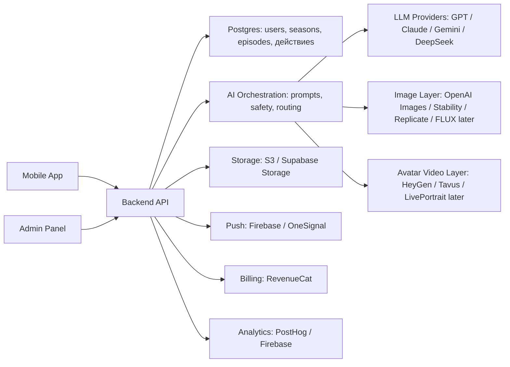

# AURA Build Plan

AURA Build Plan - это рабочий технический документ. Он отделен от AURA Product Master Plan, чтобы продуктовая книга не превращалась в Jira, но вся инженерная, финансовая и delivery-детализация сохранялась.

## Как читать

| Раздел | Для кого | Зачем |
| --- | --- | --- |
| Architecture | CTO / tech lead | Понять систему и границы реализации. |
| Stack / Providers | CTO / engineering | Выбрать сервисы и контролировать риски. |
| Unit Economics | Founder / finance / product | Проверить себестоимость и pricing. |
| API / Data / Events | Engineering / analytics | Собрать backend, аналитику и admin. |
| Sprint Plan / Backlog | PM / delivery | Планировать разработку, часы, бюджет и зависимости. |
<!-- PAGEBREAK -->
# 1. Architecture
## Архитектура как продуктовая система

Технические блоки должны быть прочитаны как слои одной причинной машины: профиль дает контекст, AI собирает эпизод, действие создает evidence, image layer показывает след, analytics доказывает результат.

[[DIAGRAM:architecture_stack]]

<!-- PAGEBREAK -->
## Поток данных

Данные AURA должны идти по той же логике, что и пользовательский опыт: профиль создает контекст, season держит траекторию, action и reflection создают evidence, avatar state превращает evidence в образ.

[[DIAGRAM:data_flow]]

<!-- PAGEBREAK -->
## 1. Architecture Decision

| Слой | Технология | Стоимость | Почему выбрана | Риск |
| --- | --- | --- | --- | --- |
| Frontend | React Native + Expo | $0 platform cost; developer time | Быстрее собрать iOS/Android первый продукт, легче подключить RevenueCat, push, analytics и OTA updates. | Сложные native animations и avatar/video editing могут потребовать native modules. |
| Backend | NestJS on Fly.io/Render/Railway or managed container | $25-300/mo первый продукт, выше при росте | Четкая модульная архитектура, TypeScript, удобно для API, jobs, billing webhooks и admin. | Нужно дисциплинированно не строить enterprise backend раньше времени. |
| Database | Postgres via Supabase Pro | От $25/mo; Pro включает 100k MAU и базовые лимиты | Postgres лучше подходит для связанных сущностей: user, season, episode, action, reflection, avatar state. | При тяжелых assets и логах нельзя складывать все в Postgres. |
| Storage | S3-compatible storage / Supabase Storage for первый продукт | Supabase Pro включает 100GB storage, далее usage-based | Нужно хранить avatar/canvas assets, recaps, exports. | Изображения быстро раздувают storage/egress, нужна компрессия и lifecycle policy. |
| AI Brain | OpenAI GPT-4.1 mini first, Claude/Gemini as fallback later | GPT-4.1 mini: $0.40 input / $1.60 output за 1M tokens | Хороший баланс цены, скорости, structured output и tool calling для первый продукт. | Качество “личности” может требовать prompt QA или более дорогой модели на отдельных шагах. |
| Image | Together FLUX.2 pro/dev or Replicate FLUX | Около $0.015-$0.04/image depending provider/model | Для первый продукт достаточно image-first Life Canvas; видео не нужно в core loop. | Если делать изображение каждый день для всех, себестоимость быстро становится главной статьей. |
| Video avatar | Not первый продукт; later Replicate/Tavus/HeyGen tests | Replicate video examples: $0.09/sec 480p, $0.25/sec 720p for Wan i2v | Видео может стать premium/token moment, но разрушает экономику free первый продукт. | Deepfake/privacy, latency, moderation, cost. |
| Payments | RevenueCat + App Store/Google Play IAP | Free up to $2.5k MTR, then 1% tracked revenue; store fee separately | Быстрый subscription stack, restore purchases, webhooks, entitlement source of truth. | Нужно считать store fee и RevenueCat fee отдельно. |
| Analytics | PostHog / Amplitude / Firebase Analytics | $0-$300/mo early depending tool and events | первый продукт без analytics бессмысленен: нужно видеть loop completion, D1, D7, paywall. | Слишком много событий без product questions. |
| Admin | Retool/Supabase Studio/internal Next.js later | $0-$50/mo early + dev time | Нужно менять prompts, season templates, смотреть safety flags без релиза приложения. | Не строить большой backoffice до первых пользователей. |
## 2. System Architecture

| Блок | Что делает | Интеграции | Данные |
| --- | --- | --- | --- |
| Mobile App | Onboarding, profile, season, episode, action, reset, reflection, Life Canvas, paywall, reminders. | RevenueCat SDK, analytics SDK, push, backend API. | Сохраняет минимум локального cache, не хранит secrets. |
| API Backend | Auth session, profile, seasons, episodes, actions, avatar jobs, billing webhooks, admin. | Supabase/Postgres, OpenAI, image provider, RevenueCat, analytics. | Единый слой бизнес-правил и state transitions. |
| Postgres | Хранит связанные сущности продукта. | Supabase APIs, backend service role. | UserProfile, Season, Episode, Action, Reflection, AvatarState, Subscription, Event. |
| AI Layer | Генерирует episode/action/reset recap, structured JSON, safety checked outputs. | OpenAI primary, optional Claude/Gemini fallback. | PromptVersion, request/response metadata, cost logs. |
| Image Layer | Генерирует image-first Life Canvas shifts. | Together/Replicate/other provider. | Prompt, provider, asset id, latency, cost. |
| Storage | Хранит изображения, exports, preview cards. | S3/Supabase Storage/CDN. | Compressed assets, thumbnails, lifecycle policy. |
| Billing | Entitlements, trial, subscription status, webhooks. | RevenueCat, App Store, Google Play. | Plan, status, renewal, cancellation reason. |
| Analytics | Funnel, retention, paywall, cost-per-loop, avatar causality. | PostHog/Amplitude/Firebase, warehouse later. | Events with user_state and experiment_id. |
| Admin | Prompt publish, safety review, season templates, user issue review. | Backend admin endpoints. | Prompt versions, moderation queue, feature flags. |
### 4. Техническая архитектура: схема системы

| Блок | Что делает | Сервисы | Стоимость | Риск |
| --- | --- | --- | --- | --- |
| Источник данных | Дата рождения, состояние, запрос, действия, заметки, события. | Mobile app + Postgres. | Низкая infra cost. | Privacy/trust; нужна политика удаления и consent. |
| Backend | API, профили, сезоны, эпизоды, права доступа. | Supabase сначала, NestJS позже. | $25-500+/мес. на ранних стадиях. | Разрастание логики без архитектуры. |
| AI слой | Генерация эпизода, действие, reset, safety, routing. | OpenRouter/direct LLM. | Зависит от tokens; считать на активного пользователя. | Generic текст, hallucination, unsafe выводs. |
| Avatar слой | Life Canvas, avatar states, premium video. | OpenAI Images/Stability/Replicate; позже FLUX/LivePortrait/HeyGen. | Главный variable cost после LLM. | Маржа, качество лица, consent. |
| Storage | Хранение изображений, аудио, видео, архива. | S3/Supabase Storage/CDN. | Низкая для image, быстро растет для video. | Хранить тяжелые видео без возврат policy нельзя. |
| Push | Возврат к следующему эпизоду. | Firebase/OneSignal. | Низкая/средняя. | Спам и churn. |
| Analytics | Activation, D1/D7, платный экран, avatar causality. | PostHog/Firebase. | От free до по фактическому использованию. | Без аналитики невозможно управлять первый продукт. |
| Billing | Trial, subscriptions, tokens, entitlement. | RevenueCat + App Store/Google Play. | Комиссии store + tooling. | Ошибки доступа и refund негатив. |
| Admin Panel | Модерация, промпты, сезоны, ручная поддержка. | Retool/Supabase Studio/custom admin. | Низкая в первый продукт. | Без admin нельзя быстро чинить content quality. |
<!-- PAGEBREAK -->
# 2. Stack And Providers
## 3. Recommended Stack For первый продукт

Рекомендация: React Native + Expo, NestJS, Supabase Postgres, S3/Supabase Storage, OpenAI GPT-4.1 mini, Together/Replicate FLUX, RevenueCat, PostHog/Firebase Analytics, Retool or simple internal admin. Это не “идеальный навсегда” стек, а стек, который быстрее всего доводит продукт до интервью, прототипа и первых 30-100 пользователей.

| Решение | Почему | Альтернатива |
| --- | --- | --- |
| React Native вместо Flutter | Больше готовых integrations для paywall/analytics/AI tooling и быстрее нанимать JS/TS команду. | Flutter тоже валиден, если команда уже сильнее во Flutter. |
| NestJS вместо no-code backend | Нужны state transitions, async jobs, billing webhooks, admin endpoints и cost logs. | Supabase Edge Functions можно использовать для быстрого старта, но бизнес-логика быстро усложнится. |
| Postgres вместо Firestore | У AURA много связанных сущностей и отчетности; SQL проще для аналитики и unit economics. | Firestore хорош для realtime/simple mobile apps, но relational product graph здесь важнее. |
| Image-first вместо video-first | Видео дорого, медленно и рискованно; центральную гипотезу avatar causality можно проверить изображением. | Видео тестировать как premium token после proof of loop. |
| One primary LLM | На первый продукт лучше контролировать prompt quality и стоимость, чем строить router. | OpenRouter/LLM router после 1000+ активных пользователей и накопления evals. |
| RevenueCat с первого paid test | Restore, entitlements, webhooks и paywall experiments не стоит писать руками. | Чистый StoreKit/Google Billing только если команда хочет контролировать billing сама. |
## 4. Component Responsibilities

| Компонент | Ответственность | Must | Do not |
| --- | --- | --- | --- |
| Mobile Shell | Navigation, auth state, onboarding, paywall routing, offline event queue. | Fast cold start, no blank loading before Welcome. | Do not embed provider secrets or prompt logic. |
| Onboarding Module | Privacy, consent, birth date, current state, season choice. | Can resume if app closes mid-flow. | Do not ask 20 questions before first episode. |
| Episode Module | Render episode, read progress, dislike/report, action entry. | Supports generated and fallback episodes. | Do not expose raw AI output without product formatting. |
| Action Module | Action choices, difficulty, reminders, completion state. | Always offer a softer version. | Do not punish skipped or partial action. |
| Reset Module | Short ritual, timer, skip, complete, event logging. | 30-60 sec default. | Do not become a full meditation product in первый продукт. |
| Reflection Module | Emotion after, one-line note, save to memory. | Can save without text. | Do not require journaling friction. |
| Life Canvas Module | Pending state, generated image, explanation, save/share. | Show why canvas changed. | Do not show random beauty without causality. |
| Memory Module | Season history, recap, locked paid sections. | Make 7-day trajectory visible. | Do not overbuild timeline/social feed. |
| Billing Module | Paywall config, trial, purchase, restore, entitlement. | Single entitlement source of truth. | Do not hardcode prices in app. |
| Admin Module | Prompt versions, season templates, safety queue, manual overrides. | Prompt rollback. | Do not build a complex CRM. |
## 7. Provider Comparison

| Category | Provider | Pros | Cons | Verdict |
| --- | --- | --- | --- | --- |
| LLM primary | OpenAI GPT-4.1 mini | Low cost, strong structured output, good speed. | May need prompt tuning for warmth. | Use for первый продукт default. |
| LLM quality fallback | Claude Sonnet | Strong writing/reasoning quality. | Much more expensive per token. | Use only for evals or premium generation later. |
| LLM low-cost fallback | Gemini/DeepSeek via router | Potentially cheaper/fast. | Quality and safety variance. | Not day-one unless team already has eval harness. |
| Image primary | Together FLUX.2 dev/pro | Clear per-image pricing and API. | Style consistency needs prompts/seeds. | Good первый продукт candidate. |
| Image alternative | Replicate FLUX | Many models and fast experimentation. | Costs vary by model; latency varies. | Good for experiments and fallback. |
| Video later | Replicate/Tavus/HeyGen | Can create premium wow moments. | Expensive, privacy/deepfake risk, longer latency. | Not free первый продукт. |
| Billing | RevenueCat | Fast subscriptions, entitlements, webhooks. | Adds fee after revenue threshold. | Use from first paid test. |
| Analytics | PostHog/Firebase/Amplitude | Funnels, cohorts, events. | Pricing can rise with events. | Use one; do not duplicate event stacks. |
### Что технически нужно подключать для avatar и Life Series

Если сопоставить техническую часть с продуктовой идеей, АУРА не должна начинаться с самого дорогого “живого видеоаватара”. Техническая логика должна идти ступенями: сначала собрать работающую ежедневную петлю, затем добавить визуальный future-self образ, потом микропрогресс avatar, и только после этого проверять premium видео-avatar как дорогой вау-слой. Иначе продукт рискует потратить бюджет на генерацию роликов до того, как доказал, что пользователь вообще хочет возвращаться в “сериал о себе”.

| Технический блок | Что делает | Что подключать | Роль в первый продукт | Главный риск |
| --- | --- | --- | --- | --- |
| 1. Профиль и смысловой вход | Дата рождения, имя, запрос дня, состояние, выбранная тема сезона. | Backend и база: Supabase/Firebase; LLM-слой для интерпретаций и safety-фильтров. | Обязательно в первый продукт. | Нельзя хранить чувствительные данные без явного согласия и понятной privacy-логики. |
| 2. Сценарий эпизода | Сформировать серию дня: тема, конфликт, мягкий смысл, одно действие, короткий reset. | LLM orchestration + prompt/version storage + moderation/safety rules. | Обязательно в первый продукт. | Если генерация звучит как гадание или диагноз, доверие падает. |
| 3. Static / layered avatar | Показать героя/future-self без дорогого видео: образ, свет, состояние, предметы, черты. | Image generation API или шаблонный avatar-builder; хранение ассетов в storage/CDN. | Лучший первый визуальный слой. | Если avatar не связан с действием, он становится косметикой. |
| 4. Микроизменения avatar | После действия менять не весь avatar, а черту: свет, позу, аксессуар, фон, карточку эпизода. | Template engine + image generation по лимиту + rules engine “действие -> изменение”. | Желательно в первый продукт или сразу после него. | Нужна объяснимая причинность, иначе пользователь не поймет, почему образ изменился. |
| 5. Voice / narration | Озвучить эпизод, reset или обращение future-self. | TTS API, например ElevenLabs или аналог; аудио-кэширование. | Не обязательно, но может усилить эмоциональность. | Голос повышает стоимость и требования к качеству; плохой голос ломает ощущение премиальности. |
| 6. Видео-avatar / living avatar | Сделать ролики “лучшая версия себя”, трейлер сезона, special episode или talking avatar. | HeyGen / D-ID / Tavus для avatar-video; Runway или похожие video generation API для cinematic-сцен. | Не ставить в ежедневную бесплатную норму; тестировать как premium. | Самый дорогой слой: себестоимость, задержку, повторные попытки, права на лицо/образ и consent. |
| 7. Память сериала и аналитика | Хранить эпизоды, действия, состояния avatar, возврат, платный экран, понимание причинности. | Postgres/Supabase, object storage, event analytics, A/B flags. | Обязательно с первой версии. | Без аналитики невозможно понять, где ломается петля: смысл, действие, reset или avatar. |

Практическая рекомендация: первая техническая версия должна быть дешевой, но эмоционально понятной. То есть текстовый эпизод, одно действие, reset, статичный или слоистый avatar, память эпизодов и базовая аналитика. Видео-avatar лучше вынести в отдельный paid/premium эксперимент: например, пользователь получает один бесплатный “трейлер сезона” после нескольких завершенных эпизодов, а дальше платит токенами или подпиской за редкие специальные эпизоды. Это лучше соответствует экономике и не убивает маржу ежедневной петли.

Ниже не финальный выбор подрядчиков, а расширенная карта подключаемых сервисов для первый продукт и следующих итераций. Здесь важно мыслить не “какой один сервис выбрать”, а “какой стек даст нам управляемую себестоимость и нужный эмоциональный эффект”. Цены, лимиты, задержку и правила consent у таких API меняются, поэтому перед финмоделью и ТЗ их нужно перепроверять по официальным страницам и считать на конкретных сценариях: сколько текстовых эпизодов, сколько image/avatar генераций, сколько секунд видео, сколько голос-over и сколько повторные попытки на одного пользователя.

| Тип | Сервис / источник | Как может использоваться в АУРЕ | Цена / единица для проверки | Как читать для решения | Источник |
| --- | --- | --- | --- | --- | --- |
| Image/API | OpenAI Image Generation API | Генерация и редактирование image/avatar cards, визуальных карточек эпизода, future-self образов. | Считать по модели, качеству, размеру и числу изображений. | Подходит для image-first первый продукт: быстро проверить, цепляет ли пользователя “образ себя”. | https://openai.com/index/image-generation-api/ |
| Model marketplace | Replicate | Доступ к разным image/video/open-source моделям через API и pay-as-you-go эксперименты. | Pay-as-you-go по времени работы модели/GPU. | Удобно для прототипирования и сравнения моделей без жесткой привязки к одному поставщику. | https://replicate.com/pricing |
| Image/video API | Stability AI API | Быстрая генерация visual cards, стилизация, image-to-image, отдельные video-эксперименты. | Кредитная модель; Stable Image Core указан как 3 credits за генерацию. | Хороший кандидат для недорогих визуальных карточек и проверки альтернатив к OpenAI/Replicate. | https://platform.stability.ai/pricing |
| Video API | Runway API | Кинематографичная video generation, трейлеры сезонов, visual episodes. | Кредитная модель; пример API billing: 5s video около $0.25 по указанной таблице. | Использовать для редких вау-моментов, а не для ежедневной бесплатной нормы. | https://docs.dev.runwayml.com/usage/billing/ |
| Video/API | Luma Dream Machine / Ray | Text-to-video и image-to-video для коротких “сцен жизни”, mood-трейлеров и visual episodes. | Кредитная модель по секундам видео; тарифы Plus/Pro/Ultra начинаются с $30/$90/$300 в месяц. | Смотреть как cinematic-слой рядом с Runway/Kling, особенно для image-to-video экспериментов. | https://lumalabs.ai/pricing |
| Avatar video API | HeyGen API | Avatar video, talking avatar, digital twin / instant avatar сценарии. | Pay-as-you-go: стандартный Avatar III около $1/min, Avatar IV до $3-5/min, Video Agent около $2/min. | Сильный кандидат для premium-видеослоя; custom digital twin и режимы вычитки требуют enterprise-проверки. | https://help.heygen.com/en/articles/10060327-heygen-api-pricing-explained |
| Avatar video API | D-ID API | Talking avatars / agents / video presenter сценарии. | Планы от пробный период до paid; пробный период дает ограниченные минуты video/streaming, далее кредиты/планы. | Проверять для talking portrait и agent-слоя; важно смотреть watermark, лицензию и права на персональный avatar. | https://www.d-id.com/pricing/api/ |
| Conversational avatar API | Tavus API | Conversational video interface и AI-replica сценарии. | API/цен требует отдельной коммерческой проверки по выбранному сценарию. | Больше подходит для дорогого future-self conversation, чем для простого первый продукт. | https://docs.tavus.io/api-reference |
| Avatar video platform | Synthesia | AI-presenter videos, avatars, dubbing, personal avatars, API access на старших планах. | Планы от ~$29/month; API access указан на Creator/выше, enterprise - custom. | Скорее B2B/training-style бенчмарк, полезен для понимания качества avatar-presenter рынка. | https://www.synthesia.io/pricing |
| Avatar video platform/API | Colossyan | AI avatars, custom avatars, AI-голоса, auto-translation, API для автоматизации видео. | Starter около $27/month с 15 min/month; Business около $88/month, API included/add-on по плану. | Полезен как бенчмарк “аватар + обучение + сценарии”, но для АУРЫ может быть слишком корпоративным. | https://www.colossyan.com/pricing |
| Avatar video platform/API | Elai | Avatar-presenter, talking photo, video slides, API integration. | Free/basic/advanced; Basic около $23/month annually, Advanced около $59/user/month annually. | Смотреть как быстрый бенчмарк talking-avatar без сложной cinematic-части. | https://elai.io/pricing/ |
| Enterprise avatar API | Hour One | Automated avatar video production at scale через enterprise API. | API доступен enterprise-пользователям; цена обычно custom. | Не первый продукт-провайдер, но важен как ориентир верхнего B2B-слоя рынка. | https://helpcenter.hourone.ai/knowledge/api |
| Interactive avatar | DeepBrain AI / AI Studios | Interactive avatar, AI video generator, dubbing, talking avatar, enterprise deployment. | Interactive avatar: add-on slots около $49/slot/month; conversation usage примерно $0.2-0.5/min по модели. | Интересен для future-self conversation, но требует жесткого контроля стоимости минут разговора. | https://help.aistudios.com/en/articles/14683575-how-does-interactive-avatar-pricing-work |
| Avatar/API | AKOOL API | Streaming avatar, talking avatar, talking photo, lipsync, face swap, генератор голоса. | Кредитная сетка: talking avatar 1080p 5 credits/10s, 4K 10 credits/10s; streaming avatar 1-1.2 credits/10s. | Хороший кандидат для тестов talking/streaming avatar, но нужно понять цену одного credit и качество. | https://akool.com/ja-jp/api-pricing |
| Avatar/ad video API | Creatify API | AI Avatar, URL-to-video, product videos, AI shorts, ad clone. | API Starter $99/month за 500 credits; AI Avatar 5 credits/30s; Aurora 0.5-1 credit/sec. | Больше ad/UGC-инструмент; полезен для маркетинговых avatar-роликов и performance-креативов. | https://docs.creatify.ai/billing |
| Voice API | ElevenLabs API | Text-to-speech, голос narration, эмоциональный голос reset. | Считать по плану, символам/минутам и требованиям к голос clone. | Добавлять после проверки текстовой петли; голос повышает стоимость и ожидание качества. | https://elevenlabs.io/docs/overview/intro |
| Voice/STT API | Cartesia | TTS/STT и голосовые agent-сценарии, если АУРА пойдет в аудио/разговорный режим. | Кредитная модель; STT указан как credits per second, voice-agent минуты считаются отдельно. | Резервный вариант для voice-first механик и быстрых low-latency сценариев. | https://cartesia.ai/pricing |
| Backend | Supabase | Auth, Postgres, storage, edge functions, база эпизодов и состояния avatar. | Планы и usage по MAU/storage/egress/functions. | Подходит как быстрый backend для первый продукт, но нужно считать MAU/storage/egress. | https://supabase.com/pricing |
| Backend | Firebase | Auth, analytics, remote config, push notifications, mobile backend. | Spark/Blaze; по фактическому использованию цен для Firebase/Google Cloud ресурсов. | Альтернатива Supabase, особенно если делать mobile-first и быстро включать аналитику/remote config. | https://firebase.google.com/pricing |
| Payments | RevenueCat | Подписки, платные экраны, логика доступа, App Store/Google Play billing, A/B-тесты платного экрана. | Считать по выручке/MAU и выбранному плану. | Практически обязательный кандидат для мобильной подписочной модели, чтобы не писать логику биллинга с нуля. | https://www.revenuecat.com/pricing/ |
| Analytics | PostHog | Продуктовая аналитика, воронки, флаги функций, записи сессий, эксперименты. | по фактическому использованию по событиям, записям сессий и функциям. | Нужен для проверки, где ломается петля: первый пользовательский опыт, первый avatar, действие, reset, платный экран. | https://posthog.com/pricing |

Отдельно нужно рассмотреть локальный/open-source слой. Он не заменяет внешние API в первом прототипе, потому что требует GPU, MLOps, очередей, мониторинга качества, прав на модели и инженеров, которые будут чинить пайплайн. Но он важен стратегически: если у АУРЫ выстрелит регулярная визуальная петля, локальные модели могут снизить переменную себестоимость, дать больше контроля над стилем и убрать зависимость от одного avatar-провайдера.

| Локальная модель / слой | Что делает | Роль для АУРЫ | Экономика | Риск | Источник |
| --- | --- | --- | --- | --- | --- |
| ComfyUI | Оркестрация локальных visual workflows: image, image-to-image, animation nodes, batch generation. | Лаборатория для сборки пайплайна “future-self card -> micro-animation -> video variation”. | Нет оплаты за API-вызов, но нужны GPU/серверы, настройка, обновления, хранение и QA. | Высокая сложность поддержки; custom nodes могут ломаться после обновлений. | https://github.com/comfy-org/ComfyUI |
| FLUX.1 / Stable Diffusion family | Статичные avatar cards, стили, mood-образы, “я в другой жизни”, сезонные visual states. | Кандидат для дешевого image-first слоя после доказательства спроса. | Переменная стоимость уходит в GPU-время; лицензии и коммерческие условия проверять по конкретной модели. | Нужны LoRA/style control, prompt QA и safety-фильтры, иначе образ будет нестабильным. | https://huggingface.co/black-forest-labs/FLUX.1-schnell |
| LivePortrait | Оживление портрета по driving video / motion template, мимика и движение головы. | Хороший локальный кандидат для “живого” future-self без полного text-to-video. | GPU-инференс + подготовка исходных портретов; на Apple Silicon может быть существенно медленнее, чем на RTX. | Нужны consent, стабильная фронтальная фотография, контроль похожести и защита от deepfake-рисков. | https://github.com/KlingAIResearch/LivePortrait |
| SadTalker | Talking head video из одного портрета и аудио. | Прототип для “avatar говорит со мной” без покупки дорогого API на каждой итерации. | Локальный GPU-инференс; Apache 2.0 у репозитория, но все равно проверять веса/зависимости/коммерческое использование. | Качество может выглядеть менее premium, чем у hosted avatar-сервисов; нужен human QA. | https://github.com/OpenTalker/SadTalker |
| Wav2Lip | Lip-sync для уже готового видео/лица по аудиодорожке. | Инструментальный модуль, если нужно синхронизировать рот, а не генерировать весь avatar. | Локальный инференс; стоимость - GPU и поддержка окружения. | Не решает мимику/эмоцию целиком; может давать механический lip-sync. | https://github.com/Rudrabha/Wav2Lip |
| MuseTalk | Real-time/high-quality lip synchronization через latent-space inpainting. | Кандидат для более качественного talking-face слоя после базовой проверки работоспособности. | GPU-инференс и интеграция; нужно тестировать задержку и стабильность на пользовательских лицах. | Research/open-source слой: до production нужен отдельный техаудит качества, лицензий и воспроизводимости. | https://github.com/TMElyralab/MuseTalk |
| AnimateDiff / video diffusion workflows | Короткие стилизованные движения, atmospheric scenes, animated episode cards. | Может дать не “говорящую голову”, а более красивый сериализованный visual mood. | GPU-время и настройка ComfyUI-workflows. | Сложнее держать постоянство лица/персонажа; подходит для mood-сцен, но не для identity-heavy avatar. | https://github.com/guoyww/AnimateDiff |

Из этого получается не один стек, а три реалистичных технических маршрута. Маршрут A - быстрый hosted первый продукт: OpenAI/Stability/Replicate для картинок, Supabase/Firebase для backend, RevenueCat для подписок, PostHog для аналитики. Маршрут B - гибрид: ежедневная петля остается дешевой, а HeyGen/D-ID/AKOOL/Creatify/Runway/Luma включаются только для premium-эпизодов. Маршрут C - локальная визуальная лаборатория: ComfyUI + FLUX/Stable Diffusion + LivePortrait/SadTalker/Wav2Lip/MuseTalk, когда уже понятно, какие визуальные моменты реально удерживают пользователя и какие нужно удешевлять.

| Этап | Что собираем | Кандидаты | Что должно стать понятно |
| --- | --- | --- | --- |
| первый продукт 0: доказать петлю | Backend, LLM-сценарии, static/layered avatar, analytics, платный экран foundation. | Supabase/Firebase, OpenAI Image/Stability/Replicate, RevenueCat, PostHog. | Проверяем: человек понимает “сериал о себе”, возвращается и завершает действия. |
| первый продукт 1: усилить образ | Периодические future-self cards, сезонные изменения, avatar progress, голос reset. | Image API + ElevenLabs/Cartesia + storage/CDN. | Проверяем: визуальный образ повышает возврат и willingness to pay. |
| первый продукт 2: premium video | Редкие трейлеры сезона, talking avatar, “лучшая версия себя” в видео. | HeyGen, D-ID, AKOOL, Creatify, Runway, Luma, Tavus. | Проверяем: пользователь готов платить отдельно за дорогой вау-слой. |
| Scale: снижать себестоимость | Локальные workflows, batch generation, style control, QA и moderation. | ComfyUI, FLUX/Stable Diffusion, LivePortrait, SadTalker, Wav2Lip, MuseTalk. | Переходим сюда только после того, как доказаны сценарии, частота и платность. |

Технический вывод: реализуемость высокая, но АУРА не должна становиться “дорогим генератором видео” раньше времени. Самый здоровый порядок такой: сначала mobile/web первый продукт с текстом, действиями, reset, слоистым avatar, платежной и аналитической инфраструктурой; затем image/avatar generation по лимитам; затем голос; затем редкий premium видео-avatar; и только после подтверждения спроса - локальный визуальный стек для снижения себестоимости и контроля стиля. Так продукт остается проверяемым, экономика - управляемой, а центральная идея “сериал о себе” не зависит от самого дорогого провайдера.
### 3. Технологическое исследование: сравнение и выбор

Цены ниже являются рабочими ориентирами на момент подготовки версии и должны быть перепроверены перед разработкой: AI/API-провайдеры регулярно меняют тарифы, лимиты и модели. Для первый продукт важнее не выбрать “самую мощную модель”, а выбрать стек, где качество достаточно высокое, себестоимость управляемая, а замена провайдера не ломает продукт.

| Раздел | Вариант | Стоимость | Качество | Скорость | Интеграция | Рекомендация |
| --- | --- | --- | --- | --- | --- | --- |
| AI Brain | GPT / OpenAI | Средний/высокий по сравнению с budget-моделями; цен считать по live calculator. | Сильный общий quality, safety и structured output. | Высокая. | Низкая/средняя. | Хороший основной или premium brain для первый продукт, особенно для качества текста. |
| AI Brain | Claude | Haiku дешевле, Sonnet средний, Opus дорогой; Sonnet в официальной таблице $3 input / $15 output за MTok. | Сильный длинный текст, тон, reasoning. | Средняя/высокая. | Низкая. | Кандидат для premium/deep reads и редакторского качества. |
| AI Brain | Gemini | Gemini 2.5 Pro в официальной таблице от $1.25 input и $10 output за MTok для <=200K prompt; batch дешевле. | Сильный multimodal и длинный контекст. | Высокая у Flash, ниже у Pro. | Средняя из-за Google Cloud/AI Studio различий. | Хороший fallback и multimodal layer. |
| AI Brain | DeepSeek | Очень низкий: DeepSeek V4 Flash $0.14 input cache miss / $0.28 output за MTok; Pro дороже, но все еще низкий. | Сильная экономика, качество нужно тестировать на русском тоне и safety. | Высокая, но зависит от лимитов. | Низкая, OpenAI/Anthropic-compatible API. | Budget layer для массовых черновиков и cost control. |
| AI Brain | OpenRouter | Наценка/цены зависят от выбранной модели. | Позволяет сравнивать GPT/Claude/Gemini/DeepSeek. | Зависит от маршрута. | Низкая для multi-model первый продукт. | Лучший роутер на старте, если хотим быстро менять модели. |

| Раздел | Вариант | Стоимость | Качество | Контроль стиля | Масштабирование | Рекомендация |
| --- | --- | --- | --- | --- | --- | --- |
| Avatar Generation | FLUX | Дешевле при локальном/Replicate pipeline, но требует GPU/QA. | Высокое качество, хороший creative control. | Высокий при LoRA/style workflows. | Хорошо после настройки. | Не первый день первый продукт, но лучший кандидат для снижения себестоимости после проверки спроса. |
| Avatar Generation | Stable Diffusion | Низкая при локальном inference. | Зависит от модели и workflow. | Высокий при ControlNet/LoRA. | Хорошо, если есть MLOps. | Scale layer, не самый быстрый hosted первый продукт. |
| Avatar Generation | Midjourney | Подписка, не API-first для production. | Очень сильная эстетика. | Ограничен для стабильного avatar/persona pipeline. | Слабее для автоматизированного приложения. | Использовать для moodboard/style exploration, не как production backend. |
| Avatar Generation | OpenAI Images | Считать по image/token цен; удобно для hosted первый продукт. | Хорошее качество и интеграция. | Средний/высокий. | Хорошо через API. | Сильный кандидат для первый продукт image-first. |
| Avatar Generation | Ideogram | Проверять по API/плану. | Силен в text-in-image/poster style. | Средний. | Зависит от API. | Кандидат для share cards/posters, не единственный avatar engine. |

| Раздел | Вариант | Стоимость | Качество | Риски | первый продукт пригодность |
| --- | --- | --- | --- | --- | --- |
| Animated Avatar | LivePortrait | GPU/инфраструктура, дешевле hosted при масштабе. | Хорошо для оживления портрета, но нужен QA. | Deepfake/consent, стабильность лица. | Could Have: прототип или premium после базового первый продукт. |
| Animated Avatar | SadTalker | Локальный GPU, низкая переменная стоимость. | Может выглядеть менее premium. | Uncanny valley, голос/lip sync. | Только эксперимент. |
| Animated Avatar | Tavus | Коммерческая проверка по API и сценарию. | Силен для conversational avatar. | Дорого и не нужно ежедневно. | Не первый продукт; premium/future-self conversation. |
| Animated Avatar | HeyGen | Публичные API-ориентиры около $1/min и выше по avatar/video типам. | Сильный hosted avatar layer. | Маржа, права на образ, enterprise terms. | Premium/token, не базовая петля. |
| Animated Avatar | Synthesia | Планы от примерно $29/month, API на старших планах/enterprise. | B2B presenter quality. | Может выглядеть training-style, не personal magic. | Benchmark, не основной первый продукт. |

| Слой | Вариант | Плюсы | Минусы | Выбор |
| --- | --- | --- | --- | --- |
| Mobile Stack | React Native | Быстро, JS/TS, много SDK, RevenueCat/PostHog/Firebase удобно. | Нужен контроль performance и native edge cases. | Рекомендация для первый продукт, если команда близка к JS/TS. |
| Mobile Stack | Flutter | Стабильный UI, хороший cross-platform control. | Другой стек/найм, интеграции иногда требуют мостов. | Равноценная альтернатива, если команда Flutter. |
| Mobile Stack | Native iOS | Лучшее качество iOS. | Дороже и медленнее для двух платформ. | Не первый продукт, если нет iOS-only стратегии. |
| Mobile Stack | Native Android | Контроль Android. | Не закрывает iOS, где подписочный wellness часто сильнее. | Не первый продукт отдельно. |
| Backend | Supabase | Postgres, auth, storage, edge functions, быстрый старт. | Логику нужно дисциплинировать. | Рекомендация для первый продукт. |
| Backend | Firebase | Push/analytics/realtime, быстрый mobile start. | NoSQL и vendor lock-in. | Хорошо для push/analytics, но Postgres удобнее для сезонов. |
| Backend | NestJS | Строгая backend-архитектура на TS. | Дольше старт. | Добавлять, когда логика вырастет. |
| Backend | FastAPI | Удобен для AI/python pipelines. | Еще один язык рядом с mobile/frontend. | Использовать для AI-service позже, не обязательно в первый продукт. |

Итоговый технологический выбор для первый продукт: React Native или Flutter для клиента, Supabase/Postgres как backend foundation, OpenRouter + один основной LLM + fallback, OpenAI Images/Stability/Replicate для image-first Life Canvas, RevenueCat для подписок, PostHog/Firebase для аналитики и пушей. Видео-avatar не включать в базовый первый продукт.

#### Победители по технологическим слоям и точка пересчета бюджета

Чтобы команда не спорила абстрактно “какая модель лучше”, решение нужно зафиксировать слоями. В первый продукт побеждает не самый красивый или мощный сервис, а тот, который быстрее проверяет пользовательскую петлю и не ломает маржу. Перед началом разработки цены нужно перепроверить по официальным страницам, потому что тарифы AI/API меняются быстрее, чем цикл продукта.

| Слой | Победитель | Почему | Как считать бюджет | Риск |
| --- | --- | --- | --- | --- |
| AI Brain: ежедневный эпизод | OpenRouter + основной GPT/Claude/Gemini/DeepSeek fallback | Нужна возможность быстро сравнить тон, цену и качество без переписывания продукта. | Считать 1-3 генерации на активного пользователя в день; лимитировать повторные попытки. | Один провайдер может стать дорогим или давать generic tone. |
| AI Brain: deep/premium read | Claude или GPT как premium-quality слой | Для платных глубоких разборов важнее тон, связность и доверие. | Считать отдельно от ежедневную петлю; не включать безлимитно в Plus. | Премиум-текст должен реально отличаться от free. |
| Image / Life Canvas первый продукт | OpenAI Images / Stability / Replicate | Hosted API быстрее для первого продукта и не требует MLOps. | Лимитировать до ключевых моментов: День 1, День 7, milestones. | При ежедневных изображениях cost быстро растет. |
| Image scale | FLUX / Stable Diffusion через локальный или managed pipeline | После доказанного спроса можно снижать себестоимость и контролировать стиль. | Появляется GPU/MLOps cost, но ниже marginal cost на масштабе. | Нужны QA, safety, стабильность лица и лицензии. |
| Animated avatar | Не первый продукт; HeyGen/Tavus только для premium test, LivePortrait/SadTalker для R&D | Видео создает wow, но почти наверняка опасно для подписочной маржи. | Считать как token/premium purchase, не как ежедневный entitlement. | Deepfake/consent, задержки, возвраты, высокая себестоимость. |
| Mobile | React Native, если команда JS/TS; Flutter, если команда Flutter | Оба варианта годятся; важнее скорость прототипирования и SDK платежей/аналитики. | 1 mobile engineer + design system достаточно для первый продукт. | Native-only удвоит бюджет до доказанного спроса. |
| Backend | Supabase/Postgres сначала, NestJS позже | Быстрее запустить auth, storage, data model, admin и edge functions. | Низкий стартовый infra cost. | Если не дисциплинировать схему, первый продукт превратится в хаос. |
<!-- PAGEBREAK -->
# 3. Data, API, Analytics
## 10. Data Model

| Сущность | Поля | Зачем нужна |
| --- | --- | --- |
| User | id, email/apple_id/google_id, created_at, locale, consent_status, subscription_status | Аккаунт и права доступа. |
| UserProfile | user_id, name, birth_date, timezone, current_goal, privacy_flags | Минимальный персональный контекст. |
| Season | id, user_id, theme, status, day_index, started_at, completed_at | 7-дневная история. |
| Episode | id, season_id, day, title, insight, conflict, resource, risk, prompt_version | Daily content. |
| Action | id, episode_id, difficulty, text, selected_at, completed_at, status | Поведенческий шаг. |
| ResetSession | id, action_id, type, duration, started_at, completed_at | Мост к действию. |
| Reflection | id, action_id, emotion_before, emotion_after, note, created_at | Память и recap. |
| AvatarState | id, user_id, season_id, episode_id, visual_traits, cause_action_id, asset_id | Причинный visual progress. |
| CanvasAsset | id, user_id, type, url, provider, generation_cost, status, created_at | Изображения/recaps. |
| Subscription | user_id, plan, store, status, trial_start, renewal_at, revenuecat_id | Платный доступ. |
| Notification | id, user_id, type, scheduled_at, sent_at, opened_at | Возврат. |
| AnalyticsEvent | id, user_id, event_name, properties, created_at | Измерение первый продукт. |
| PromptVersion | id, name, version, template, safety_rules, active | Контроль AI-качества. |
## 11. API и системные контракты

| Метод | Endpoint | Задача | Input | Output | Примечание |
| --- | --- | --- | --- | --- | --- |
| POST | /auth/session | Создать/обновить сессию. | provider_token | user, session | Apple/Google/email magic link. |
| PATCH | /profile | Сохранить дату рождения, имя, состояние, запрос. | name, birth_date, mood, goal | profile | Валидация consent. |
| GET | /seasons/templates | Получить темы сезонов. | profile_context | season_templates | Можно персонализировать. |
| POST | /seasons | Стартовать сезон. | theme_id | season | Создать day_index=1. |
| POST | /episodes/generate | Создать daily episode. | season_id, day, profile, memory | episode | LLM + safety + prompt version. |
| POST | /actions/select | Выбрать действие. | episode_id, difficulty | action | Action может быть generated или template. |
| POST | /reset/start | Начать reset. | action_id, reset_type | reset_session | Логировать start. |
| POST | /actions/complete | Завершить действие. | action_id, status | action | Триггер reflection/avatar. |
| POST | /reflections | Сохранить reflection. | action_id, emotion_after, note | reflection | Одна строка, low friction. |
| POST | /avatar/generate | Создать avatar shift. | episode_id, action_id, reflection_id | avatar_state, asset | Async если генерация долгая. |
| GET | /memory | Получить историю сезонов. | user_id | episodes, actions, assets | Ограничить free archive. |
| GET | /paywall | Получить paywall config. | user_state, experiment_id | plans, copy, trial | RevenueCat config. |
| POST | /billing/webhook | Обновить подписку. | store/revenuecat event | subscription_status | Idempotent. |
| POST | /events | Записать аналитику. | event_name, properties | ok | Batch on mobile. |
| POST | /admin/prompts/publish | Опубликовать prompt version. | template, rules | prompt_version | Admin-only. |
## 5. Database Schema Draft

| Table | Core columns | Indexes | Notes |
| --- | --- | --- | --- |
| users | id, email_hash, auth_provider, locale, timezone, created_at, deleted_at | id, auth_provider | PII минимум; не хранить лишние персональные данные. |
| user_profiles | user_id, display_name, birth_date, current_goal, mood, privacy_flags, updated_at | user_id | Birth date is sensitive; access only through backend. |
| consents | id, user_id, policy_version, accepted_at, revoked_at | user_id, policy_version | Нужно для доверия и compliance. |
| season_templates | id, theme, title, description, active, sort_order | active | Управляется из admin. |
| seasons | id, user_id, template_id, status, day_index, started_at, completed_at | user_id, status | Один active season в первый продукт. |
| prompt_versions | id, type, version, template, safety_rules, active, created_at | type, active | Все AI outputs должны знать prompt version. |
| episodes | id, season_id, day_index, title, insight, conflict, resource, risk, prompt_version_id, safety_status | season_id, day_index | Structured JSON, не raw blob only. |
| actions | id, episode_id, difficulty, text, estimated_minutes, status, selected_at, completed_at | episode_id, status | Action is observable behavior. |
| reset_sessions | id, action_id, reset_type, duration_sec, status, started_at, completed_at | action_id | Skip allowed. |
| reflections | id, action_id, emotion_after, note, created_at | action_id | One-line reflection. |
| avatar_states | id, user_id, season_id, episode_id, action_id, visual_traits_json, explanation, asset_id, created_at | user_id, season_id | Core causal visual state. |
| assets | id, user_id, provider, type, url, thumbnail_url, status, estimated_cost, latency_ms | user_id, provider, status | Cost and provider logging mandatory. |
| subscriptions | user_id, store, revenuecat_id, entitlement, status, trial_start, renewal_at | user_id, status | RevenueCat webhook source. |
| notifications | id, user_id, type, scheduled_at, sent_at, opened_at, status | user_id, scheduled_at | D1/D7 return loop. |
| events | id, user_id, event_name, user_state, properties_json, client_ts, server_ts | event_name, server_ts, user_id | Could later move to warehouse. |
| generation_logs | id, user_id, provider, model, input_units, output_units, estimated_cost, latency_ms, status | provider, model, created_at | Unit economics depends on this. |
## 6. API Groups

| Group | Endpoints | Owner | QA |
| --- | --- | --- | --- |
| Auth/Profile | POST /auth/session, PATCH /profile, GET /profile, DELETE /profile | Backend/mobile | Can create, resume, export/delete data. |
| Consent | GET /consent/current, POST /consent/accept, POST /consent/revoke | Backend | Policy version stored. |
| Season | GET /seasons/templates, POST /seasons, GET /seasons/current, PATCH /seasons/:id | Backend/product | Only one active первый продукт season. |
| Episode | POST /episodes/generate, GET /episodes/today, POST /episodes/:id/report | AI/backend | Fallback and safety status. |
| Action | POST /actions/select, PATCH /actions/:id, POST /actions/:id/complete | Backend/mobile | Partial completion valid. |
| Reset | POST /reset/start, POST /reset/:id/complete | Backend/mobile | Skip does not break flow. |
| Reflection | POST /reflections, PATCH /reflections/:id | Backend/mobile | Text optional. |
| Avatar | POST /avatar/generate, GET /avatar/:job_id, GET /avatar/current | AI/image/backend | Async job, pending/failure/retry. |
| Memory | GET /memory, GET /recap/weekly, POST /recap/generate | Backend/AI | Free locks and paid unlocks. |
| Billing | GET /paywall, POST /billing/webhook, GET /entitlements | Backend/mobile | Sandbox purchase and restore. |
| Events | POST /events, POST /events/batch | Data/mobile | Offline batch and dedupe. |
| Admin | GET/POST /admin/prompts, /admin/templates, /admin/moderation | Backend/internal | Role protected, audit log. |
## 14. Analytics Events

| Event | Когда | Properties | Какое решение помогает принять |
| --- | --- | --- | --- |
| app_opened | Открытие приложения. | source, user_state, app_version | Базовая активность. |
| onboarding_started | Welcome start. | source | Понять drop-off. |
| consent_accepted | Privacy accepted. | copy_version | Trust barrier. |
| profile_completed | Дата/состояние сохранены. | fields_count, skipped_fields | Тяжесть входа. |
| season_started | Выбран сезон. | theme, source | Темы спроса. |
| episode_generated | Episode ready. | model, prompt_version, latency, cost | AI cost/quality. |
| episode_read | Пользователь дочитал. | read_time, scroll_depth | Insight engagement. |
| action_selected | Выбор действия. | difficulty, action_type | Action fit. |
| reset_completed | Reset завершен. | duration, type | Reset value. |
| action_completed | Действие выполнено. | time_to_complete, difficulty | Core loop. |
| reflection_saved | Заметка сохранена. | emotion_after, note_length | Memory friction. |
| avatar_generated | Avatar ready. | provider, latency, cost, style | Visual cost/quality. |
| avatar_causality_understood | Пользователь ответил/кликнул объяснение. | yes_no | Главная гипотеза. |
| paywall_viewed | Paywall shown. | placement, offer, price | Monetization timing. |
| trial_started | Trial started. | plan, price | WTP. |
| subscription_started | Paid. | plan, store, revenue | Revenue. |
| push_opened | Push click. | push_type, day_index | Return loop. |
| season_completed | Day 7 complete. | completed_actions, recaps_saved | D7 success. |
## 18. Event Taxonomy

| Event | When | Properties | Decision |
| --- | --- | --- | --- |
| app_opened | Every app open. | source, user_state, app_version | Baseline activity. |
| onboarding_started | Welcome start. | source, campaign | Top funnel. |
| consent_accepted | Privacy accepted. | policy_version | Trust barrier. |
| profile_started | Profile screen opened. | fields_visible | Onboarding friction. |
| profile_completed | Profile saved. | fields_count, skipped_birth_date | Personalization readiness. |
| season_template_viewed | Season select opened. | recommended_theme | Theme demand. |
| season_started | Season chosen. | theme, day_index | Season intent. |
| episode_generate_started | Backend generation starts. | model, prompt_version | Latency/cost. |
| episode_generated | Episode saved. | latency_ms, estimated_cost, safety_status | AI reliability. |
| episode_read | Read threshold reached. | read_time, scroll_depth | Content engagement. |
| episode_reported | User reports issue. | reason, prompt_version | Safety/product quality. |
| action_selected | Action chosen. | difficulty, estimated_minutes | Action fit. |
| action_softened | User asks easier version. | original_difficulty | Difficulty tuning. |
| reset_started | Reset begins. | type, duration | Reset adoption. |
| reset_completed | Reset complete. | duration, skipped=false | Ritual value. |
| action_completed | Action marked done. | status, time_to_complete | Core behavior. |
| reflection_saved | Emotion/note saved. | emotion_after, note_length | Memory friction. |
| avatar_generate_started | Image job starts. | provider, style | Image pipeline. |
| avatar_generated | Asset ready. | latency_ms, estimated_cost, provider | Visual cost/quality. |
| avatar_causality_checked | User answers/interaction shows understanding. | understood=true/false | Main hypothesis. |
| tomorrow_hook_seen | Hook shown. | day_index, reminder_prompted | Return setup. |
| push_opt_in | Notifications enabled. | placement | Reminder viability. |
| paywall_viewed | Paywall shown. | placement, offer, price | Monetization timing. |
| trial_started | Trial starts. | plan, store | WTP. |
| subscription_started | Paid starts. | plan, net_price | Revenue. |
| season_completed | Day 7 complete. | actions_completed, recaps_saved | D7 success. |
| share_card_clicked | Share card opened. | screen, style | Virality. |
| data_delete_requested | User requests deletion. | reason optional | Trust/privacy. |
## 15. Metrics Dashboard

| Метрика | Формула | Цель | Какое решение принимает |
| --- | --- | --- | --- |
| Activation to episode | episode_generated / onboarding_started | 45%+ early target | Если ниже, onboarding/profile слишком тяжелые или promise непонятен. |
| Episode relevance | positive relevance answers / tested users | 60%+ | Если ниже, prompt/profile context не работают. |
| Action selected | action_selected / episode_read | 50%+ | Если ниже, actions не кажутся посильными. |
| Completed first loop | avatar_generated / episode_generated | 25-35%+ | Если ниже, action/reset/reflection слишком тяжелые. |
| Avatar causality | users who correctly explain shift / avatar viewers | 70%+ | Если ниже, центральная идея не считывается. |
| D1 return | users active next day / activated users | 20-30%+ | Если ниже, story hook слабый. |
| D7 completion | season_completed / season_started | 10-15%+ | Если ниже, season loop не удерживает. |
| Trial intent | trial_started or paywall positive intent / paywall_viewed | 5-10%+ | Если ниже, платная ценность не ясна. |
| Cost per completed loop | AI + image + infra cost / completed loops | Должен быть кратно ниже paid ARPU | Если растет, урезать video/expensive generation. |
| Safety incidents | critical flags / generated outputs | 0 critical | Если есть critical, остановить public testing. |
<!-- PAGEBREAK -->
# 4. Unit Economics And Cost Control
## Экономика петли

Себестоимость нужна не как финансовая таблица ради таблицы. Она показывает, почему AURA нельзя начинать с бесплатного ежедневного видео и почему image-first подход защищает продукт.

[[DIAGRAM:unit_economics]]

<!-- PAGEBREAK -->
## Cost stack

Экономика AURA должна быть видна на одном экране: что стоит дешево, что становится дорогим, где появляется риск видео и почему cost per completed loop важнее красивого demo.

[[DIAGRAM:cost_stack]]

<!-- PAGEBREAK -->
### Модель себестоимости: сколько может стоить продукт на разных масштабах

Ниже не финальная финансовая модель, а ориентировочная рамка для принятия решения. Она показывает, почему ежедневный видео-avatar опасен для первый продукт, а image-first Life Canvas выглядит здоровее. Числа нужно уточнять после выбора конкретных моделей и тарифов, но логика расходов уже видна.

| Масштаб | LLM/text | Images/Life Canvas | Video/avatar | Storage/infra/push | Support/повторные попытки | Итого / месяц | Как читать |
| --- | --- | --- | --- | --- | --- | --- | --- |
| 100 MAU | $5-25 | $10-60 | $0-100 | $0-50 | $0-50 | $15-285 | Ручной прототип и первые тесты; можно позволить себе больше ручной работы. |
| 1,000 MAU | $30-150 | $80-500 | $0-1,000 | $50-250 | $50-300 | $210-2,200 | первый продукт уже должен иметь лимиты image/video и понятную аналитику. |
| 10,000 MAU | $200-1,000 | $700-5,000 | $0-10,000+ | $300-1,500 | $300-2,000 | $1,500-19,500+ | Видео каждый день почти точно ломает подписочную экономику. |
| 100,000 MAU | $1,500-8,000 | $5,000-50,000 | $0-100,000+ | $2,000-15,000 | $3,000-20,000 | $11,500-193,000+ | На масштабе нужны лимиты, batching, локальные модели или premium tokens. |

Самая важная экономическая граница: ежедневный текст и легкий Life Canvas можно встроить в подписку, а видео-avatar нужно считать как premium или token. Если подписка стоит $7.99-9.99 в месяц, продукт не может бесплатно генерировать дорогие видео каждый день для активного пользователя. Поэтому первый продукт должен быть image-first, а video-first сценарий нужно проверять как отдельную платную гипотезу.
## 8. Unit Economics Assumptions

Ниже модель не претендует на бухгалтерскую точность. Ее задача - понять порядок величин и главный риск. Допущение нормального первый продукт: 1 MAU в среднем имеет 8 активных дней в месяц, получает 4 image-based avatar shifts в месяц, daily AI использует GPT-4.1 mini, видеоаватар не входит в первый продукт. Store fee, VAT/tax, paid acquisition и зарплаты команды не включены в product COGS и считаются отдельно.

| Статья | Модельное допущение | Источник / основание |
| --- | --- | --- |
| AI text | 8 active days/user/month; ~3,200 input tokens and ~1,000 output tokens per active day | OpenAI GPT-4.1 mini public pricing: $0.40 input and $1.60 output per 1M tokens. |
| Image | 4 images/user/month at $0.03 each | Together FLUX.2 pro around $0.03/image; Replicate FLUX ranges around $0.003-$0.04/image depending model. |
| Storage | $0.006/user/month placeholder | Supabase Pro includes 100GB file storage, then overage. |
| Analytics | $0.01/user/month placeholder | Tool-dependent; первый продукт can start low/free but events must be planned. |
| Push | $0.002/user/month placeholder | Firebase/APNs costs usually not the first bottleneck for первый продукт. |
| Support | $0.025/user/month placeholder | Internal support/ops placeholder for early cohorts. |
| Infra base | $65 at 100-1,000 MAU; $220 at 10k; $1,300 at 100k | Supabase/hosting/monitoring/admin estimates, not exact invoices. |
| Optional video | 15% of MAU get one 5-sec video at $0.09/sec in stress scenario | Replicate video example $0.09/sec 480p. |
## 9. Unit Economics By Scale

| MAU | AI text | Images | Storage | Analytics | Push | Support | Infra/Admin | Total/mo | Cost/MAU | If optional video |
| --- | --- | --- | --- | --- | --- | --- | --- | --- | --- | --- |
| 100 | $2 | $12 | $1 | $1 | $0 | $3 | $65 | $84 | $0.84 | $90 |
| 1000 | $23 | $120 | $6 | $10 | $2 | $25 | $65 | $251 | $0.25 | $319 |
| 10000 | $230 | $1,200 | $60 | $100 | $20 | $250 | $220 | $2,080 | $0.21 | $2,755 |
| 100000 | $2,304 | $12,000 | $600 | $1,000 | $200 | $2,500 | $1,300 | $19,904 | $0.20 | $26,654 |

Главный вывод: в image-first первый продукт себестоимость не выглядит убийственной, но изображения уже становятся основной переменной статьей. Видео нельзя давать всем бесплатно: даже один 5-секундный video moment для 15% MAU заметно увеличивает расходы. Поэтому video avatar должен быть либо premium/token, либо validation-only ручным экспериментом.
## 10. Sensitivity Analysis

| Variable | Low | Base | High | Impact |
| --- | --- | --- | --- | --- |
| Images per MAU | 2/mo | 4/mo | 12/mo | Главный variable cost. Daily images for free users can triple cost. |
| Image model | $0.003/image | $0.03/image | $0.04+/image | Provider/model choice can change image COGS by 10x. |
| Active days | 4/mo | 8/mo | 20/mo | Retention increases value but also AI usage. |
| Paid conversion | 1% | 5% | 10% | At low conversion free COGS must be aggressively limited. |
| Video usage | 0 | premium only | free daily | Free daily video likely breaks первый продукт margin. |
| Store fee | 15% | 30% | 30% + taxes | Subscription net revenue must be modeled after platform fees. |
| Support load | self-serve | light | high-touch wellbeing | If users treat AURA like coaching/therapy, support cost and safety burden rise. |
## 11. Revenue And Margin Scenarios

| MAU | Paid conversion | Paid users | Net revenue/mo after 30% store fee at $7.99 | Product COGS/mo | Вывод |
| --- | --- | --- | --- | --- | --- |
| 1,000 | 1% | 10 | $56 | $251 | Убыточно без ограничения free costs. 1% paid conversion недостаточен. |
| 1,000 | 5% | 50 | $280 | $251 | Почти бьется product COGS, но не покрывает маркетинг и команду. |
| 10,000 | 3% | 300 | $1,678 | $2,080 | Нужно либо лучше конвертировать, либо снижать image frequency/free cost. |
| 10,000 | 7% | 700 | $3,914 | $2,080 | Product gross margin начинает выглядеть рабочей, paid acquisition еще не доказан. |
| 100,000 | 5% | 5,000 | $27,965 | $19,904 | Становится бизнесом только при сильном retention и контроле image/video costs. |
## 12. Cost Control Rules

| Правило | Почему | Как внедрить |
| --- | --- | --- |
| No free daily video | Видео может стоить больше подписочной маржи. | Video only paid token/premium validation. |
| Image budget per free user | Images dominate variable COGS. | Free: 1-2 images/week; paid: more styles and recaps. |
| Prompt caching and templates | Большая часть system prompt повторяется. | Cache where provider supports it; use structured templates. |
| Async generation | Latency and retries не должны блокировать UX. | Queue, pending state, retry, fallback. |
| Cost log per generation | Без cost-per-loop нельзя принимать pricing decisions. | provider, tokens, images, seconds, latency, estimated_cost. |
| Manual QA before scaling | AI quality важнее автомасштаба до 100 users. | Prompt review and admin override for early cohorts. |
### 5. Юнит-экономика: рабочая модель расходов

Допущение для чтения таблицы: это не бухгалтерская модель, а stress-test. Сценарий text+image-first предполагает ежедневный эпизод, ограниченные изображения, редкий видео-layer. Если делать видео-avatar каждый день, расходы могут стать выше подписочной выручки.

| Пользователи / месяц | AI расходы | Изображения | Видео | Push | Storage | Инфраструктура | Поддержка | Итого | Маржинальный вывод |
| --- | --- | --- | --- | --- | --- | --- | --- | --- | --- |
| 100 | $5-30 | $10-80 | $0-150 | $0-10 | $0-20 | $0-50 | $0-100 | $15-440 | Проверка вручную; маржа не показательна. |
| 1,000 | $30-200 | $80-700 | $0-1,500 | $0-30 | $20-100 | $50-300 | $100-500 | $280-3,330 | первый продукт должен иметь лимиты visual/video. |
| 10,000 | $200-1,500 | $700-7,000 | $0-15,000+ | $20-150 | $100-800 | $300-2,000 | $500-4,000 | $1,820-30,450+ | Подписка работает только без ежедневного видео. |
| 100,000 | $1,500-12,000 | $5,000-70,000 | $0-150,000+ | $100-1,000 | $800-8,000 | $2,000-20,000 | $5,000-30,000 | $14,400-291,000+ | Нужны batching, limits, локальные модели, premium tokens. |
| 1,000,000 | $12,000-100,000 | $40,000-500,000 | $0-1,500,000+ | $1,000-8,000 | $8,000-80,000 | $20,000-150,000 | $50,000-250,000 | $131,000-2,588,000+ | Без собственной оптимизации visual layer экономика может сломаться. |

Для первой платной версии целевая продуктовая маржа должна быть не ниже 70-80% до маркетинга. Это означает: текст и легкие image-сцены могут жить в подписке, а видео-avatar должен быть premium/token, milestone или редкая paid-сцена. Если CAC окажется выше 1-2 месячных маржинальных вкладов, paid acquisition нужно откладывать и запускаться через organic/creator/UGC.

#### Финмодель: маржа, CAC и runway до первой выручки

Рабочая финансовая логика для АУРЫ должна быть консервативной. На старте мы не доказываем миллиардный рынок, а проверяем, сходится ли маленькая подписочная машина: пользователь активируется, возвращается, видит платную глубину, платит, а себестоимость AI/visual слоя не съедает чек. Ниже - не финальный P&L, а decision-модель для первого бюджета.

| Сценарий | Масштаб | Команда | Разработка/подготовка | Операционные расходы | Первая выручка | Для какого решения |
| --- | --- | --- | --- | --- | --- | --- |
| Concierge validation | 30-50 | Founder/product + designer + AI operator | $0-5k | $500-2k | $0-1k | Проверить смысл, готовность платить и D2/D7 без разработки. |
| Clickable + landing | 100-500 leads | Product + designer + no-code/web | $2k-10k | $500-3k | $0-3k preorders | Понять лучший оффер и цену до mobile первый продукт. |
| первый продукт soft launch | 1k-5k MAU | 1 mobile, 1 backend/fullstack, designer, product/AI | $40k-120k | $1k-8k/month | $1k-20k MRR при первых платящих | Доказать activation, D7 и переход из пробного периода в оплату. |
| Seed-ready pilot | 10k-50k MAU | Mobile, backend, AI, designer, growth, support | $150k-400k | $10k-60k/month | $20k-200k MRR при working funnel | Искать инвестиции только если возврат и маржа видны. |

| Метрика | Цель | Почему важна | Когда останавливать/менять |
| --- | --- | --- | --- |
| Gross margin до маркетинга | 70-80%+ | Иначе paid acquisition и support быстро съедят подписку. | <50% при image-first сценарии. |
| CAC срок окупаемости | 1-2 месяца для ранних paid tests, 3-6 месяцев допустимо позже | Mobile subscriptions часто требуют терпения, но на старте нельзя покупать трафик вслепую. | CAC не окупается при D30 возврат. |
| Trial start | 5-10%+ от активированных пользователей | Показывает, что платная глубина понятна. | <2-3% после нескольких платный экран/offers. |
| Trial-to-paid | 20-30%+ для теплого validation traffic | Нужен первый сигнал willingness to pay. | <10% и нет качественных причин платить. |
| Runway до первой выручки | 6-12 недель validation + 8-12 недель первый продукт | Не строить 6 месяцев без денег и сигналов. | Нет preorders/готовность платить после 6 недель. |

#### Цены провайдеров: что закладывать в расчет

Перед разработкой финмодель нужно пересчитать по live цен. Для текущего решения достаточно зафиксировать порядок расходов: LLM-текст можно держать дешево, image layer требует лимитов, а video/avatar layer должен быть платным отдельно. Ниже - рабочая таблица по публичным тарифам и рискам.

| Провайдер | Слой | Публичный тариф / ориентир | Как использовать | Риск для экономики | Источник |
| --- | --- | --- | --- | --- | --- |
| OpenAI | Text + images | GPT-Image-2: image input $8/MTok, cached $2/MTok, output $30/MTok; text input $5/MTok, cached $1.25/MTok. Realtime голос существенно дороже: audio input $32/MTok, output $64/MTok. | первый продукт images и premium-quality текст. | Без лимитов изображений и себестоимость повторных попыток станет непредсказуемым. | openai.com/api/pricing |
| Claude | Premium text / deep reads | Claude Haiku/Sonnet/Opus отличаются на порядки; Batch API дает 50% discount; web search отдельно $10/1,000 searches. | Deep reads, редакторский тон, сложные интерпретации. | Sonnet/Opus нельзя использовать безлимитно в ежедневную петлю. | docs.anthropic.com цен |
| Gemini | Text / multimodal fallback | Gemini Pro до 200k prompt: $1.25 input и $10 output/MTok; Flash/Lite дешевле: в публичной таблице есть $0.15 input и $1.25 output/MTok для легкого слоя. | Fallback, multimodal, budget variants. | Нужно контролировать thinking/output tokens и search grounding. | ai.google.dev pricing |
| DeepSeek | Budget text | DeepSeek V4 Flash: $0.14 input cache miss и $0.28 output/MTok; cache hit $0.0028/MTok. V4 Pro после discount: $0.435 input и $0.87 output/MTok. | Черновые генерации, массовый budget слой, A/B prompts. | Нужно тестировать русский tone, trust и safety. | api-docs.deepseek.com |
| HeyGen API | Hosted avatar video | Avatar III около $1/min; Avatar IV Photo $3/min, Digital Twin/Studio $4/min; Video Agent $2/min; Photo/Digital Twin creation $1/call. | Только premium/token видео-avatar и сезонные трейлеры. | Ежедневное видео быстро дороже подписки. | HeyGen API Pricing Explained |
| Synthesia | Avatar presenter бенчмарк | Планы начинаются около $29/month; API/enterprise зависят от плана. | Benchmark качества, не основной consumer первый продукт. | Может выглядеть как B2B-training, а не личная магия. | synthesia.io/цен |
| Tavus | Conversational avatar | Требует коммерческой проверки под сценарий API. | Future-self conversation позже. | Дорого, сложно, не нужно до доказательство of возврат. | docs.tavus.io |

Расчетный вывод: ежедневный AI-текст даже на 10,000 MAU может оставаться управляемым, если ограничить output и повторные попытки. Ежедневные изображения уже требуют лимитов и batching. Ежедневный видео-avatar на HeyGen/Tavus-подобных тарифах почти точно не сходится при подписке $7.99-9.99, если не продавать его отдельно как token/premium moment.
<!-- PAGEBREAK -->
# 5. Monetization Implementation
## Лестница монетизации

Платность не должна появляться до первого value moment. Сначала человек проходит loop, затем получает причину платить за season, memory, styles и редкие premium moments.

[[DIAGRAM:monetization_ladder]]

Эта глава отвечает на вопрос: как именно собирать AURA первый продукт технически, сколько это примерно стоит при росте пользователей и какие решения нельзя откладывать до разработки. Этот слой не заменяет финальное ТЗ, но задает архитектурную рамку, стек, unit economics и границы первый продукт.

Главное решение: первый продукт должен быть mobile-first, image-first и analytics-first. Видеоаватар, marketplace, community и тяжелый AI companion не входят в первый продукт, потому что главный риск сейчас - не наличие рынка, а прохождение петли Episode -> Action -> Reset -> Avatar -> Return Tomorrow.

**Почему этот блок здесь.** Технический смысл здесь простой: все сущности должны сохранять причинную цепочку от эпизода до Life Canvas.
### Монетизация: что проверять у конкурентов

Монетизацию АУРЫ нельзя выбирать только из вкуса команды. Ее нужно вывести из конкурентов и себестоимости. В соседних рынках уже видны подписки, встроенные покупки, пробные периоды, годовые планы, кредиты/токены и premium-пакеты. Рабочее решение на сейчас: базовая ежедневная петля должна быстро давать ценность бесплатно или через пробный период, а платная часть должна продавать глубину: историю сезона, расширенный avatar, больше визуальных моментов, персональные ритуалы, архив эпизодов, premium-интерпретации и редкие видео- или avatar-генерации.

| Модель | Почему подходит | Как использовать | Риск |
| --- | --- | --- | --- |
| Подписка | Лучше всего для ежедневного ритуала и памяти сезона. | Основная модель, если возврат подтверждается. | Paywall до первого момента ценности вызовет сопротивление. |
| Freemium + платная глубина | Хорошо совпадает с логикой “сначала почувствуй серию, потом углубляй”. | Оставить короткую daily-петлю доступной, платно продавать глубину и историю. | Если free слишком полный, сложно объяснить подписку. |
| Токены / кредиты | Подходит для дорогих визуальных или video-генераций. | Использовать для premium avatar-моментов, не для базового ежедневного действия. | Может сделать продукт похожим на генератор картинок, а не на ежедневный ритуал. |
| Разовые пакеты | Подходит для сезонов, тем, визуальных стилей, специальных эпизодов. | Можно тестировать после подтверждения базовой петли. | Слабее для регулярной выручки, если нет подписки. |
| Premium coaching / человеческий слой | Может быть дорого и ценно для глубокой аудитории. | Не первый продукт; рассмотреть как высокий чек позже. | Сложнее операционно и меняет природу продукта. |

Следующий расчет финмодели должен быть простым: цена подписки или средний годовой чек платящего пользователя минус себестоимость генераций, хранение, платежные комиссии, поддержка и маркетинг. Отдельно нужно считать продуктовую маржу без маркетинга и затем проверять, выдерживает ли она платное привлечение. Если стоимость привлечения окажется выше допустимой маржи, придется менять прайсинг, бесплатные лимиты, частоту генераций или маркетинговый канал.
### Монетизационная матрица: что именно продавать

Для АУРЫ важно не просто выбрать “подписку”, а понять, какая платная ценность выглядит честной. Пользователь не должен платить за туманное обещание “мы знаем твою судьбу”. Он должен платить за продолжение личного сезона, сохранение истории, глубину интерпретации, визуальную эволюцию и редкие дорогие avatar-моменты, которые невозможно бесконечно раздавать бесплатно.

| Модель | Вероятность | Потенциал | Что продаем | Решение |
| --- | --- | --- | --- | --- |
| Подписка | Высокая | Высокий | Открывает сезон, архив, расширенные эпизоды, weekly recap, больше avatar-состояний. | Основная модель, если D1/D7 возврат подтверждается. |
| Покупка сезонов | Средняя | Средний | Отдельные темы: отношения, деньги, уверенность, тело, творчество. | Хорошо как дополнение к подписке или тест willingness to pay. |
| Персональные прогнозы / deep reads | Высокая | Высокий | Разбор месяца, совместимость с периодом, сезонная карта, большой personal report. | Можно тестировать рано, но без жестких предсказаний и псевдогарантий. |
| Visual tokens | Средняя | Высокий | Видео-avatar, cinematic trailer, future-self poster, редкие Life Canvas сцены. | Лучший способ не ломать подписочную маржу дорогой генерацией. |
| Маркетплейс практик | Низкая в первый продукт | Высокий позже | Сезоны от экспертов, практики, авторские маршруты. | Не делать до доказанного ядра и модерации качества. |
| Коучи внутри | Средняя позже | Высокий чек | Платные сессии, сопровождение, human анализ. | Отдельная бизнес-модель, не смешивать с первым первый продукт. |
### Почему люди платят соседним продуктам и что забирает АУРА

Деньги в соседних категориях появляются не потому, что у приложений красивые интерфейсы. Пользователь платит, когда продукт регулярно снимает напряжение, возвращает к привычке, дает ощущение личной связи или обещает более глубокий доступ к себе. АУРА должна собрать эти мотивы в одну понятную подписочную ценность.

| Соседний тип продукта | Почему платят / возвращаются | Что берет АУРА | Ограничение |
| --- | --- | --- | --- |
| Calm / mindfulness | Платят за снижение тревоги, сон, регулярный reset и ощущение безопасного пространства. | Забираем короткий reset и спокойный тон, но добавляем действие и личную историю. | Не обещать лечение тревоги или медицинский эффект. |
| Finch / cozy self-care | Платят за мягкую заботу, ежедневный прогресс, эмоциональную привязанность и коллекционирование. | Забираем мягкий прогресс и avatar-эмоцию, но связываем их с реальными действиями пользователя. | Не превращать продукт в игрушку без взрослой ценности. |
| Replika / AI companion | Платят за персональное внимание, диалог, близость и ощущение “меня помнят”. | Забираем память и персональность, но не делаем романтического companion как ядро. | Нужны safety-рамки и границы зависимости. |
| Nebula / astrology | Платят за личный язык, символическое объяснение себя, совместимость и прогнозность. | Забираем символический вход, но переводим его в действие, сезон и визуальную трансформацию. | Не строить продукт на категоричных судьбоносных заявлениях. |
| Duolingo / progression | Платят или возвращаются из-за видимого движения, серии, целей, наград и простого ежедневную петлю. | Забираем петлю возвращения и season logic, но избегаем жесткого shame-streak. | Прогресс должен ощущаться поддерживающим, а не давящим. |
### Аналитика, платный экран и финмодель: что нужно доказать до ТЗ

После рынков, конкурентов и технической реализуемости остается главный бизнес-вопрос: при каких цифрах АУРА имеет смысл. Здесь нельзя ограничиться фразой “будет подписка”. Нужна измеримая система: какие события считаем, где показываем платный экран, что продаем, сколько стоит один пользовательский цикл, какую маржу оставляет static/image/video сценарий и какой CAC эта маржа способна выдержать.

Первый вывод: аналитика должна появиться в продукте раньше красоты. Если мы не знаем, дошел ли человек до первого эпизода, понял ли смысл avatar, сделал ли действие, вернулся ли завтра и где уперся в платный экран, то любые разговоры про финмодель будут декоративными. Поэтому в первый продукт АУРЫ нужны не только генерация и интерфейс, но и нормальная событийная модель.

| Слой аналитики | События | Зачем считать | Какое решение принимаем |
| --- | --- | --- | --- |
| Первый вход | открытие приложения, старт первого опыта, ввод даты рождения, выбор темы, согласие на обработку данных, завершение входа | Понять, не пугает ли вход через дату рождения, символы и персональные данные. | Если drop-off высокий до первого эпизода, упрощаем вход и переносим часть вопросов позже. |
| Первый момент пользы | первый эпизод создан, первый avatar показан, reset запущен, первый шаг выбран, первый шаг завершен | Проверить, случается ли “ага, это про меня” до платного экрана. | Платный экран нельзя ставить до того, как пользователь увидел личный смысл и действие. |
| Ежедневная петля | ежедневный эпизод открыт, reset завершен, рефлексия сохранена, прогресс обновлен, изменение avatar увидено | Понять, есть ли ритуал и что именно возвращает: текст, reset, avatar, прогресс или напоминание. | Сохраняем только те механики, которые реально двигают возврат на D1/D7. |
| Avatar и visual value | avatar-карточка создана, сохранена или отправлена; видео-avatar запрошен и завершен | Отделить “вау” от платной ценности: человек просто смотрит или готов платить/делиться. | Если video смотрят, но не покупают, оставляем его как маркетинговый hook, а не базовую механику. |
| Платный экран и деньги | платный экран показан, пробный период начат, покупка начата/завершена/сорвалась, подписка отменена | Проверить цену, момент показа, пробный период, годовой план и формулировку платной глубины. | Если конверсия слабая, меняем не только цену, но и момент показа платного экрана и состав платной глубины. |
| Качество и безопасность | контент перегенерирован, пользователь поставил негативную оценку, возник safety-сигнал, обращение в поддержку, запрос возврата | В персональном/spiritual продукте доверие важнее количества генераций. | Если много негативных оценок и возвратов, усиливаем ограничения, объяснение и контроль пользователя. |

Вторая часть - сама монетизация. Для АУРЫ базовая модель должна быть гибридной: подписка продает ежедневную глубину и память сезона, а токены или разовые пакеты продают дорогие визуальные сцены. Это важно потому, что App Store и Google Play забирают комиссию, инфраструктура подписок тоже стоит денег, а video/avatar генерация может быстро съесть маржу. По официальным правилам Apple Small Business Program снижает комиссию до 15% для подходящих разработчиков до порога $1M proceeds; Google Play для автоматически продлеваемых подписок указывает 15% комиссию сервиса; RevenueCat позволяет стартовать бесплатно и затем берет процент от отслеживаемой выручки сверх порога; PostHog и похожие analytics-инструменты считаются по фактическому использованию. Значит, финмодель должна учитывать не только AI API, но и комиссии магазинов, инструменты подписки, analytics, storage, поддержку и возвраты.

| Статья финмодели | Как влияет | Откуда проверять | Решение для АУРЫ |
| --- | --- | --- | --- |
| App Store / Google Play комиссия | Уменьшает валовую выручку до чистой выручки; для подписок и small-business сценариев часто считать 15%, но условия нужно подтвердить по аккаунту и стране. | Apple Small Business Program; комиссии Google Play | В базовой модели считать 15% как оптимистичный сценарий и 30% как стресс-сценарий. |
| RevenueCat / инфраструктура подписок | Нужен для логики доступа, платного экрана, пробных периодов и экспериментов, восстановлений покупок и связки с аналитикой. | тарифы RevenueCat | В первый продукт экономит разработку; в финмодели закладывать процент комиссии после бесплатного порога. |
| Аналитика / эксперименты | События, воронки, флаги функций, записи сессий, A/B-тесты платного экрана. | тарифы PostHog | Это не “приятное дополнение”: без аналитики нельзя считать возврат, конверсию и срок окупаемости. |
| Стоимость AI-текста | Стоимость генерации эпизода, интерпретации, reset, micro-coaching. | Выбранный LLM-провайдер | Должна быть низкой и входить в ежедневную подписочную петлю. |
| Стоимость image/avatar | Стоимость карточек, future-self образов, сезонных изменений. | OpenAI/Stability/Replicate или локальный visual stack | Давать лимиты: например, daily text бесплатно/в подписке, image - несколько раз в неделю или по плану. |
| Стоимость video/avatar | Стоимость секунд или минут talking/cinematic avatar. | HeyGen/D-ID/AKOOL/Creatify/Runway/Luma/Tavus | Не включать безлимитно в подписку; продавать как premium, token или награда за milestone. |
| Возвраты, поддержка и повторные попытки | Ошибки генерации, неудачные образы, жалобы на подписку, повторные попытки. | Внутренняя аналитика и теги поддержки | Добавлять запас к себестоимости, особенно в video/avatar сценариях. |

Третья часть - формула. Для первой финмодели достаточно не “огромной Excel-машины”, а понятной unit-логики, которую можно расширять:

- Чистая выручка на платящего пользователя = цена подписки или средняя выручка на платящего пользователя минус комиссия магазина, возвраты и инструменты подписки.
- Продуктовая валовая маржа = чистая выручка минус AI-текст, генерацию image/video/avatar, голос, хранение данных, аналитику, поддержку и повторные попытки.
- Маржинальный вклад = продуктовая валовая маржа минус расходы на платное привлечение.
- Срок окупаемости = CAC / месячный маржинальный вклад.
- Допустимый CAC = LTV * целевая доля на маркетинг, где LTV зависит от повторных возвращений, оттока и соотношения годовых/месячных подписок.

| Сценарий | Что проверяем в цене | Себестоимость | Монетизация | Вывод |
| --- | --- | --- | --- | --- |
| Базовая подписка: текст + reset + память | $7.99-9.99 в месяц или $39.99-59.99 в год как проверяемый диапазон, не финальная цена. | Низкая: LLM, storage, analytics, инструменты подписки. | Подписка после первого момента ценности: бесплатный ежедневный тизер и платная глубина. | Это самый здоровый первый продукт-сценарий: высокий шанс сохранить маржу и проверить повторный возврат. |
| Подписка с image/avatar | Подписка выше или лимиты: ограниченное число image/avatar-сцен в неделю/месяц. | Средняя: image API или локальная генерация, модерация и повторные попытки. | Платная глубина: future-self карточки, сезонные изменения и визуальный архив. | Работает, если avatar повышает возврат на D7/D30 или конверсию в оплату. |
| Premium видео-avatar | Токены, разовые покупки, специальные эпизоды или дорогой premium-тариф. | Высокая: секунды/минуты видео, голос, повторные попытки, ожидание качества. | Не безлимит; награда за milestone + платные пакеты. | Делать только после проверки готовности платить, иначе можно получить красивый продукт с плохой маржей. |
| Гибридная модель на масштабе | Подписка за ежедневную петлю + токены за video + годовой план для улучшения денежного потока. | Управляемая: внешние API в начале, локальный стек на масштабе. | Лучший кандидат после первый продукт: подписка удерживает, premium-слой увеличивает среднюю выручку на платящего пользователя. | Целевое направление, если базовая петля доказала повторный возврат. |

Четвертая часть - маркетинг и срок окупаемости. Сначала считаем продуктовую маржу без маркетинга, потом проверяем, выдерживает ли она привлечение. Для АУРЫ это особенно важно, потому что avatar/future-self может хорошо работать в креативах, но дорогой AI-видеослой может съесть деньги быстрее, чем платный пользователь окупится.

| Канал | Что тестируем | Метрика | Риск |
| --- | --- | --- | --- |
| Органика / TikTok / Reels | “Мой сериал о себе”, future-self, before/after avatar, архетип дня, визуальная трансформация. | доля пересылок, конверсия в установку, активация до первого эпизода, возврат на D1. | Может привести любопытных пользователей, которые смотрят вау, но не платят. |
| Influencers / spiritual creators | Аудитория уже верит в персональные интерпретации и практики. | CAC по автору, доля стартов пробного периода, конверсия в оплату, доля возвратов. | Важно не уйти в обещания “судьбы” и не потерять доверие/safety. |
| Оптимизация App Store | Mindfulness, horoscope, manifestation, avatar, self-care запросы могут давать намерение. | позиции по ключам, конверсия страницы продукта, старт пробного периода, конверсия в оплату. | Слишком широкая категория даст дорогой/размытый трафик. |
| Платная реклама | Тестировать только после понятной юнит-модели и понятного платного экрана. | CAC, переход из пробного периода в оплату, D7/D30, срок окупаемости. | Если CAC выше допустимого, нужно менять цену, долю годовых подписок или бесплатные лимиты. |

Практический вывод по финмодели: сейчас нельзя утверждать “бизнес точно сходится”, но можно утверждать, что есть проверяемый путь к модели. Самый сильный вариант - не продавать одно видео и не делать безлимитный генератор, а строить подписку вокруг ежедневного ритуала и платной глубины, где дорогие avatar/video-сцены ограничены токенами, награды за milestone или premium-тариф. Следующий артефакт после этого отчета - отдельная таблица финмодели с тремя сценариями: консервативный, базовый и оптимистичный; в каждом сценарии должны быть цена, комиссия магазина, переход к пробному периоду, переход из пробного периода в оплату, месячный отток, среднее число image/video-генераций, себестоимость, валовая маржа, CAC и срок окупаемости.

Для этой версии исследования собрана отдельная финансовая модель. Это не финальный прогноз выручки, а первая управленческая экономика, которая показывает, какие допущения делают продукт жизнеспособным. Главный результат модели: консервативный сценарий не сходится, если платящих пользователей мало; базовый и оптимистичный сценарии начинают выглядеть рабочими только при строгом ограничении AI-себестоимости, хорошем переходе из пробного периода в оплату и вынесении видео-avatar в premium/token-слой.

| Сценарий | Масштаб | Чистая выручка | Маржа | Срок окупаемости | Вывод |
| --- | --- | --- | --- | --- | --- |
| Консервативный | 10,000 MAU / 84 платящих пользователей | $413 чистая выручка в месяц | 29.2% продуктовой валовой маржи | 23.2 мес. | Не проходит: мало платящих пользователей, CAC и AI-себестоимость слишком тяжелые для ранней базы. |
| Базовый | 50,000 MAU / 1,650 платящих пользователей | $13.1k чистая выручка в месяц | 68.8% продуктовой валовой маржи | 5.5 мес. | Проходит как первый продукт-экономика, если video ограничен, images лимитированы, а ежедневная петля остается дешевой. |
| Оптимистичный | 150,000 MAU / 8,370 платящих пользователей | $97.0k чистая выручка в месяц | 70.6% продуктовой валовой маржи | 4.8 мес. | Выглядит как сильный сценарий масштабирования, но требует повторного возврата, высокой доли годовых подписок и работающей premium-token логики. |

Что это меняет в продуктовой рекомендации: АУРА должна выглядеть дорогой для пользователя, но быть дешевой внутри базовой петли. Дороговизна должна ощущаться через точность интерпретации, память сезона, красивый future-self образ и редкие специальные эпизоды, а не через ежедневную генерацию видео. Если команда хочет “супер вау” с аватарами, это нужно упаковывать как milestone, premium pack, сезонный трейлер или token-расход. Тогда продукт может быть красивым, интересным и дорогим, не превращаясь в убыточную AI-фабрику.

| Рычаг | Что делать | Почему важно |
| --- | --- | --- |
| Сделать ежедневную петлю дешевым | Текст, reset, память и static/layered avatar должны быть основной ежедневной нормой. | Именно это сохраняет продуктовую валовую маржу. |
| Лимитировать image/avatar generation | Давать визуальные моменты по плану, milestone или платную глубину, а не безлимитно. | Себестоимость изображений быстро растет на активной базе, даже если unit cost кажется маленьким. |
| Видео-avatar только premium | HeyGen/D-ID/AKOOL/Runway/Luma использовать для специальных эпизодов, token-пакетов или сезонных трейлеров. | Видео дает вау, но разрушает маржу при ежедневном бесплатном использовании. |
| Поднимать долю годовых подписок | Продавать годовой план после первого сильного момента ценности и нескольких завершенных эпизодов. | Годовой план улучшает денежный поток и позволяет выдержать CAC. |
| Считать CAC через срок окупаемости | Платную рекламу запускать только после видимого перехода из пробного периода в оплату и возврат на 7-й и 30-й день. | Даже при хорошей продуктовой валовой марже маркетинг может сделать первый месяц отрицательным. |
### 6. Монетизация: конкуренты и итоговая модель АУРЫ

| Конкурент | Что бесплатно | За что платят | Стоимость | Что вызывает негатив | Что продлевает подписку |
| --- | --- | --- | --- | --- | --- |
| Calm | Ограниченный бесплатный контент/пробный вход. | Библиотека медитаций, сон, программы, premium content. | Обычно subscription; цену проверять по стране/store. | Жалобы на цену, пробный период/renewal, повторяемость. | Сон, доверие, привычка, библиотека. |
| Finch | Базовая self-care петля и персонаж. | Cosmetics, расширения, больше персонализации. | Subscription/встроенные покупки по store. | Ограничения free, цена, детскость для части аудитории. | Привязанность к персонажу и мягкий прогресс. |
| Replika | Базовый AI companion chat. | Romantic/advanced modes, голос/video, кастомизация. | Subscription. | Границы intimacy, изменения функциональности, цена. | Эмоциональная связь и память. |
| Nebula | Часть astrology/horoscope контента. | Персональные разборы, совместимость, прогнозы. | Subscription/встроенные покупки. | Недоверие, платный экран, generic readings. | Личный язык, регулярные прогнозы. |
| Character AI | Большой объем chat/characters. | Скорость, лимиты, premium access. | Subscription. | Качество, лимиты, безопасность. | Бесконечный контент и roleplay. |
| Headspace | Ограниченный пробный период/free content. | Курсы, медитации, сон, focus. | Subscription. | Цена и контент, который не всем нужен. | Бренд, sleep/focus routine, доверие. |

| Гипотеза монетизации | Потенциал | Сложность | Риск | Приоритет |
| --- | --- | --- | --- | --- |
| Aura Plus subscription | Высокий | Средняя | Нужен D7 возврат. | первичный |
| Premium visual tokens | Высокий | Средняя/высокая | Может увести в генератор картинок. | первичный/следующий |
| Season packs | Средний | Низкая/средняя | Разовый чек слабее подписки. | следующий |
| Deep personal reports | Высокий | Средняя | Нельзя звучать как жесткое предсказание. | следующий |
| Creator seasons | Высокий позже | Высокая | Качество и модерация. | P2 |
| Human coaching | Высокий чек | Очень высокая | Меняет бизнес-модель. | Won’t Have первый продукт |

Итоговая модель АУРЫ: free first episode -> Aura Plus subscription for seasons/memory/avatar evolution -> premium visual tokens for expensive scenes -> later season packs/deep reports. Marketplace, community и human coaching не входят в первый продукт.

#### Конкурентная монетизация: что реально проверять на платный экран

Для финального цен decision недостаточно знать, что у конкурентов “есть подписка”. Нужно вручную открыть платный экран и зафиксировать момент показа, пробный период, monthly/annual price, что остается бесплатным и какая именно глубина продается. Ниже - практическая карта проверки по ключевым конкурентам.

| Конкурент | Что бесплатно | За что платят | Цена / что проверить | Негатив | Вывод для АУРЫ |
| --- | --- | --- | --- | --- | --- |
| Calm | Ограниченный free content; Calm Premium открывает библиотеку. | Daily Calm, Sleep Stories, музыка, masterclasses, весь premium library. | Официальная help-страница отправляет смотреть current regional plans; публичные трекеры часто показывают около $14.99/month или $69.99/year в США. | Цена/renewal, ощущение неиспользуемой библиотеки. | Не продавать библиотеку; продавать сезон, память и weekly result. |
| Headspace | Trial/free content зависит от региона и кампании. | Meditation, sleep, focus, courses, mental-health companion. | Проверять current store/web платный экран. | Цена, “контента много, пользуюсь мало”. | Сделать paid value не библиотекой, а продолжением личной истории. |
| Finch | Базовая self-care петля и pet/progress доступны бесплатно. | Косметика, расширенная персонализация, больше items/seasonal content. | Проверять App Store/Google Play встроенные покупки. | Цена, ограничения, детскость. | Avatar должен быть взрослым Life Canvas, а не игрушкой. |
| Replika | Базовый companion chat. | Advanced relationship modes, голос/video, customization, higher tiers. | Цены сильно зависят от in-app tier/tests; обязательно снимать платный экран. | Непрозрачность tiers, изменения функций, цена, trust. | Не делать зависимый companion; продавать управляемую глубину и память. |
| Nebula | Часть horoscope/astrology контента. | Персональные разборы, совместимость, прогнозы, premium astrology. | Проверять store/web платный экран. | Generic readings, ранний платный экран, trust. | Не обещать судьбу; продавать мягкую интерпретацию + действие. |
| Character AI | Core chat остается доступным. | c.ai+ обычно около $9.99/month: priority/faster access and extras. | Проверять official/in-app c.ai+ page. | Safety, limits, качество, молодежная аудитория. | Не конкурировать как infinite chat; строить структурированный season. |

| Тариф АУРЫ | Цена для теста | Что входит | Зачем | Риск |
| --- | --- | --- | --- | --- |
| Free first episode | $0 | Первый эпизод, одно действие, reset, один Life Canvas след. | Показать ценность до денег. | Если free не дает wow, платный экран бессмысленен. |
| Aura Plus | $7.99-9.99 в месяц или $39.99-59.99 в год | 7-дневные сезоны, память, daily episodes, avatar evolution, weekly recap. | Основная подписка для удержания. | Нужен D7 и ощущение результата. |
| Aura Premium | $14.99-19.99/month | Deep reads, больше visual styles, premium seasons, больше image moments. | Повысить средняя выручка на платящего пользователя без обязательного видео. | Премиум должен реально отличаться от Plus. |
| Visual tokens | $2.99-9.99 packs | Видео-avatar, cinematic trailer, future-self poster, rare scenes. | Отдельно монетизировать дорогой visual layer. | Не превращать АУРУ в AI image/video toy. |
<!-- PAGEBREAK -->
# 6. Delivery Plan
## Roadmap сборки

Спринты идут не от “сделать побольше функций”, а от доказательства: сначала foundation, затем episode/action, затем Life Canvas, затем return/paywall, затем admin и launch.

[[DIAGRAM:sprint_roadmap]]

<!-- PAGEBREAK -->
## Карта зависимостей

Команда не может строить все параллельно. Wireframes блокируют UI, prompt блокирует episode, image provider блокирует Life Canvas, RevenueCat блокирует paywall, analytics блокирует решение.

[[DIAGRAM:dependency_map]]

<!-- PAGEBREAK -->
## Бюджет по спринтам

Бюджет должен быть привязан к доказательству петли. Самые дорогие спринты оправданы только если приближают продукт к проверке causality и return.

[[DIAGRAM:budget_chart]]

Эта часть переводит AURA из система решений в план разработки. Он отвечает на вопросы: что строим в первый продукт, кто что делает, сколько это займет, сколько примерно стоит, какие зависимости есть между задачами и по каким критериям принимать работу.

Главная продуктовая гипотеза остается прежней: пользователь должен пройти петлю Episode -> Action -> Reset -> Reflection -> Avatar -> Tomorrow Hook и понять, что Life Canvas изменился из-за его действия. Все спринты ниже служат только этой петле. Любая задача, которая не помогает проверить эту петлю, не входит в первый продукт.

**Почему этот блок здесь.** Этот блок сохраняет фокус: любая деталь важна только тогда, когда помогает доказать центральную петлю AURA.
## 1. Требования к первому продукту

| Пункт | Решение |
| --- | --- |
| Product | AURA mobile первый продукт: personal 7-day season with daily episode, action, reset, reflection, Life Canvas shift and return hook. |
| Primary user | Spiritual self-improvers / habit-progress users / avatar-future-self users who already show pull toward self-care and AI personalization. |
| Core loop | Episode -> Action -> Reset -> Reflection -> Avatar -> Tomorrow Hook. |
| первый продукт success | User completes first loop, understands avatar causality, returns on Day 2 and shows paid/trial intent after value. |
| первый продукт non-goals | No free daily video, no social network, no marketplace, no coach marketplace, no AR/metaverse, no public UGC. |
| Team assumption | 1 frontend/mobile, 1 backend, 0.5 AI/product engineer, 0.5 designer, 0.5 QA/data/product ops. |
| Cost assumption | Blended planning rate: $50 per hour. This is an estimate for planning, not a vendor quote. |
## 2. Sprint Plan

| Sprint | Theme | Goal | Hours | Cost at $50/h | Dependencies | Deliverables | Acceptance |
| --- | --- | --- | --- | --- | --- | --- | --- |
| Sprint 1 | Foundation: app shell, auth, consent, profile, season start | Пользователь может открыть приложение, принять consent, заполнить минимальный профиль и выбрать первый сезон. | 180 | $9,000 | Design wireframes , privacy copy, season template list. | React Native app shell, backend skeleton, Postgres schema , auth/session, consent, profile, season templates, first analytics events. | Welcome -> Consent -> Profile -> Season Select проходит без ручной помощи; данные сохраняются; события видны в аналитике. |
| Sprint 2 | Episode and action loop | Пользователь получает первый episode, выбирает action, проходит reset и сохраняет reflection. | 220 | $11,000 | Prompt , profile/season data, AI provider key, safety rules. | Episode generation, structured output, safety fallback, action options, reset flow, reflection flow, event tracking. | 10 тестовых профилей получают безопасный episode; каждый episode имеет easy/normal/brave actions; reset/reflection не ломают состояние. |
| Sprint 3 | Life Canvas / Avatar causality | Пользователь видит image-first Life Canvas shift и понимает, почему он изменился. | 240 | $12,000 | Image provider, storage, visual style rules, causal explanation copy. | AvatarState model, image generation job, asset storage, pending/failure states, causal explanation, cost logging. | После completed action создается asset или fallback; explanation явно ссылается на action; generation cost логируется. |
| Sprint 4 | Return, memory, paywall | Пользователь получает Tomorrow Hook, возвращается на Day 2, видит memory link и paid value. | 230 | $11,500 | Completed first loop, notification setup, RevenueCat sandbox, paywall copy. | Tomorrow hook, push opt-in, Day 2 memory reference, Memory archive , Paywall, RevenueCat webhook, entitlement logic. | Day 2 episode ссылается на Day 1; paywall появляется после value moment; sandbox purchase/restore работают. |
| Sprint 5 | Admin, analytics, QA, soft launch | Команда может управлять prompts/templates, видеть funnel/costs и запустить 30-100 пользователей. | 260 | $13,000 | Core flows ready, event taxonomy, prompt versions, first cohort plan. | Admin prompt/template controls, moderation queue, dashboard, cost dashboard, QA fixes, TestFlight/closed testing build, launch checklist. | Activation, completed loop, avatar causality, D1, paywall and cost events видны; prompt rollback работает; build готов к первой cohort. |
## 3. Budget Summary

| Item | Hours | Cost | Note |
| --- | --- | --- | --- |
| Sprint 1 | 180 | $9,000 | Foundation and onboarding. |
| Sprint 2 | 220 | $11,000 | Episode/action/reset/reflection. |
| Sprint 3 | 240 | $12,000 | Life Canvas and avatar causality. |
| Sprint 4 | 230 | $11,500 | Return, memory, paywall. |
| Sprint 5 | 260 | $13,000 | Admin, analytics, QA, launch. |
| Subtotal | 1130 | $56,500 | Planning estimate. |
| Contingency 20% | 226 | $11,300 | AI/image/payment surprises and QA. |
| Total planning budget | 1356 | $67,800 | Approximate первый продукт build budget before marketing. |
## 4. Detailed Backlog

| ID | Sprint | Epic | Task | Role | Hours | Cost | Dependencies | Output |
| --- | --- | --- | --- | --- | --- | --- | --- | --- |
| P0-01 | 1 | App Shell | Create React Native + Expo project structure | Frontend | 14 | $700 | None | Runnable mobile app shell |
| P0-02 | 1 | Backend | Create NestJS backend skeleton and env config | Backend | 16 | $800 | Repo setup | API service with healthcheck |
| P0-03 | 1 | Database | Create Postgres schema  | Backend | 22 | $1,100 | техническая архитектура | Users, profiles, seasons, episodes, actions tables |
| P0-04 | 1 | Auth | Implement auth/session flow | Fullstack | 24 | $1,200 | Backend, app shell | User session in app and backend |
| P0-05 | 1 | Consent | Build consent screen and consent API | Fullstack | 18 | $900 | Privacy copy | Consent version stored |
| P0-06 | 1 | Profile | Build profile form and API | Fullstack | 28 | $1,400 | Consent | Birth/current state saved |
| P0-07 | 1 | Season | Build season templates and start season | Fullstack | 28 | $1,400 | Profile | Active season created |
| P0-08 | 1 | Analytics | Add app_opened/onboarding/profile/season events | Data/Frontend | 18 | $900 | Analytics provider | Early funnel visible |
| P0-09 | 1 | QA | Sprint 1 QA and bugfix buffer | QA/Team | 12 | $600 | Sprint 1 flows | Stable foundation |
| P0-10 | 2 | AI | Create PromptVersion registry | Backend/AI | 18 | $900 | DB schema | Prompt versions saved |
| P0-11 | 2 | Episode | Implement episode generation endpoint | AI/Backend | 36 | $1,800 | OpenAI key, prompt  | Structured episode JSON |
| P0-12 | 2 | Safety | Add safety rules and fallback episode template | AI/Product | 24 | $1,200 | Prompt  | Unsafe/generic fallback |
| P0-13 | 2 | Episode UI | Build episode screen | Frontend | 28 | $1,400 | Episode API | Episode readable in app |
| P0-14 | 2 | Action | Generate and save easy/normal/brave actions | AI/Backend | 24 | $1,200 | Episode output | Action options |
| P0-15 | 2 | Action UI | Build action selection screen | Frontend | 24 | $1,200 | Action API | Action selected |
| P0-16 | 2 | Reset | Build 30-60 second reset flow | Frontend | 24 | $1,200 | Action selected | Reset complete/skip |
| P0-17 | 2 | Reflection | Build reflection save flow | Fullstack | 24 | $1,200 | Action completion | Emotion/note saved |
| P0-18 | 2 | Analytics | Track episode/action/reset/reflection events | Data/Frontend | 18 | $900 | Event taxonomy | Core loop events |
| P0-19 | 2 | QA | Prompt QA on 10 test profiles | Product/AI | 20 | $1,000 | Episode endpoint | Prompt fixes |
| P0-20 | 3 | Avatar Data | Create AvatarState and Asset models | Backend | 20 | $1,000 | DB schema | Visual state stored |
| P0-21 | 3 | Image Provider | Integrate image provider | AI/Backend | 34 | $1,700 | Provider key | Generated image asset |
| P0-22 | 3 | Storage | Implement private asset storage and thumbnails | Backend | 28 | $1,400 | Storage bucket | Stored image + thumbnail |
| P0-23 | 3 | Avatar Job | Build async generation queue with retry | Backend | 34 | $1,700 | Image provider, storage | Pending/success/failure job states |
| P0-24 | 3 | Avatar UI | Build Life Canvas screen | Frontend | 36 | $1,800 | Avatar API | Image shown with explanation |
| P0-25 | 3 | Causality | Implement causal explanation template | Product/AI | 18 | $900 | Action/reflection data | Changed because copy |
| P0-26 | 3 | Cost Logging | Log provider, latency and estimated cost | Backend/Data | 18 | $900 | Generation APIs | Cost per generation |
| P0-27 | 3 | Analytics | Track avatar_generated and causality check | Data/Frontend | 18 | $900 | Avatar UI | Avatar hypothesis events |
| P0-28 | 3 | QA | Avatar causality QA with 10 examples | Product/Design | 34 | $1,700 | Avatar screen | Visual/copy fixes |
| P0-29 | 4 | Return | Build Tomorrow Hook screen | Frontend | 20 | $1,000 | Avatar screen | Next day hook |
| P0-30 | 4 | Notifications | Implement push opt-in and reminder scheduling | Mobile/Backend | 34 | $1,700 | Push credentials | Reminder opens app |
| P0-31 | 4 | Memory | Generate Day 2 with Day 1 memory | AI/Backend | 30 | $1,500 | Day 1 data | Day 2 continuity |
| P0-32 | 4 | Memory UI | Build Memory archive  | Frontend | 30 | $1,500 | Memory API | Season timeline |
| P0-33 | 4 | Paywall | Build paywall after completed loop | Frontend/Product | 26 | $1,300 | Paywall copy | Paywall screen |
| P0-34 | 4 | Billing | Integrate RevenueCat sandbox and webhook | Mobile/Backend | 42 | $2,100 | Store setup | Purchase/restore/entitlements |
| P0-35 | 4 | Analytics | Track paywall, trial, D1 events | Data/Frontend | 18 | $900 | Paywall/notifications | Return and paid funnel |
| P0-36 | 4 | QA | End-to-end Day 1 -> Day 2 QA | QA/Team | 30 | $1,500 | Sprint 4 flows | Stable return loop |
| P0-37 | 5 | Admin | Build prompt/template admin controls | Backend/Internal | 40 | $2,000 | PromptVersion | Publish/rollback prompts |
| P0-38 | 5 | Safety | Build moderation/report queue | Backend/Admin | 34 | $1,700 | Report events | Review unsafe outputs |
| P0-39 | 5 | Dashboard | Build первый продукт funnel dashboard | Data | 36 | $1,800 | Events | Activation/loop/D1/paywall |
| P0-40 | 5 | Cost Dashboard | Build generation cost dashboard | Data/Backend | 24 | $1,200 | Cost logs | Cost per completed loop |
| P0-41 | 5 | Weekly Recap | Build weekly recap  | AI/Frontend | 36 | $1,800 | Memory archive | Day 7 recap |
| P0-42 | 5 | Privacy | Implement export/delete data path | Backend | 24 | $1,200 | Data model | Delete/export tested |
| P0-43 | 5 | Release | Prepare TestFlight/closed testing build | Mobile | 30 | $1,500 | QA pass | Installable build |
| P0-44 | 5 | Launch Ops | Create cohort tracking and interview protocol | Product/Growth | 22 | $1,100 | план запуска | 30-100 user launch kit |
| P0-45 | 5 | QA | Final QA and bugfix buffer | Team | 38 | $1,900 | All flows | Soft-launch ready первый продукт |
## 5. Epic Requirements

| Epic | Requirement | Acceptance |
| --- | --- | --- |
| Onboarding | Welcome, consent, profile and season selection must take user to first episode without confusion. | User can complete in under 90 seconds; consent stored; profile saved. |
| Episode | Episode must be personal, safe, structured and linked to season/day/profile. | 10 test users do not call it generic horoscope; unsafe outputs fall back. |
| Action | Every episode must produce easy, normal and brave actions. | User can choose a 2-minute option and complete it today. |
| Reset | Reset is a short bridge before action, not a standalone meditation product. | 30-60 sec timer works; skip does not break flow. |
| Reflection | Reflection must be low friction. | Emotion-only save allowed; note optional. |
| Life Canvas | Avatar/image shift must be causally tied to completed action. | User sees explanation: changed because of action X. |
| Tomorrow Hook | After value moment, user sees why tomorrow matters. | Reminder opt-in and next-day teaser shown. |
| Memory | Day 2 and archive must remember Day 1. | Day 2 episode references previous action/reflection. |
| Paywall | Paywall appears after completed loop, not before first value. | RevenueCat sandbox purchase and restore work. |
| Analytics | Every critical state transition must be measurable. | Activation, completed loop, avatar causality, D1, paywall visible. |
| Admin | Team can update prompts/templates and review safety flags. | Prompt publish/rollback and moderation queue work. |
| Privacy | User can trust data handling. | Consent version, private assets, delete/export path. |
## 6. Dependencies And Critical Path

| Dependency | Blocks | Decision |
| --- | --- | --- |
| Wireframes before Sprint 1 UI | Frontend screens, copy placement, state design. | Need low-fi Figma before serious frontend polish. |
| Privacy copy before profile | Consent screen and birth date trust. | Do not collect birth date without explanation. |
| Prompt  before Sprint 2 | Episode/action generation. | PromptVersion must be versioned from day one. |
| Image provider before Sprint 3 | Life Canvas generation. | Choose one provider for первый продукт; avoid router complexity. |
| Visual style rules before avatar QA | Causality comprehension. | Define 2-3 Life Canvas styles, not unlimited customization. |
| RevenueCat setup before Sprint 4 | Paywall and entitlement. | Store setup can take time; start early. |
| Event taxonomy before launch | Go/no-go decisions. | Analytics is not optional. |
| Admin controls before first cohort >30 users | Prompt fixes and safety operations. | Manual DB edits are acceptable only in tiny internal testing. |
## 7. Definition Of Done

| Layer | Done | Not done if |
| --- | --- | --- |
| Product | A new user can complete Day 1 loop and return to Day 2. | Any part of Episode -> Action -> Reset -> Avatar is mocked without measurement. |
| Design | All первый продукт screens, loading states and failure states exist in Figma. | Only happy path is designed. |
| Backend | State transitions are persisted and linked. | AI outputs are disconnected blobs. |
| AI | Outputs are structured, safe, versioned and logged. | No prompt version or fallback. |
| Image | Avatar state is causal, private, stored and costed. | Random image without explanation. |
| Billing | Paywall, trial, purchase, restore and entitlement work in sandbox. | Subscription state hardcoded. |
| Analytics | Core funnel and cost dashboard visible. | Team relies on vibes. |
| Admin | Prompt/template rollback and moderation queue work. | Every content fix requires deploy. |
| Launch | 30-100 user cohort can be invited and tracked. | No owner for interviews and cohort notes. |
## 8. Open Questions Before Build

| Question | Default decision | Owner |
| --- | --- | --- |
| React Native or Flutter? | React Native + Expo unless team has stronger Flutter capacity. | Tech lead |
| Which image provider first? | Together/Replicate FLUX; one provider, no router in первый продукт. | AI/backend |
| Do we require face upload? | No. Symbolic Life Canvas first. | Product/design |
| Which season themes ship first? | Calm, Confidence, Focus, Relationships. | Product |
| What is paid in первый продукт? | Season continuation, memory, recap, styles; no free video. | Product |
| What is the first launch platform? | iOS-first closed testing if audience and team fit; otherwise Expo both stores later. | Founder/tech |
| Who owns prompt QA? | Product + AI engineer together; not only developer. | Founder |
| What kills the build? | Users cannot explain avatar causality after prototype/interviews. | Founder/product |
## 9. Team Plan

| Role | Allocation | Responsibility |
| --- | --- | --- |
| Product owner / founder | 0.5-1.0 FTE | Scope, user interviews, acceptance, prompt QA, launch decisions. |
| Product designer | 0.5 FTE first 2-3 weeks, then part-time | Wireframes, flow, states, Life Canvas direction, paywall. |
| Mobile engineer | 1.0 FTE | React Native app, UI states, analytics, RevenueCat SDK, push. |
| Backend engineer | 1.0 FTE | API, Postgres, billing webhook, jobs, storage, admin. |
| AI/product engineer | 0.5 FTE | Prompts, generation, safety, image provider, evals. |
| QA/data/product ops | 0.5 FTE | Testing, dashboard, cohort tracking, interview notes. |
## 10. Итоговое решение по разработке

The build should start only after low-fi Figma wireframes exist for the ten critical screens: Welcome, Consent, Profile, Season, Episode, Action, Reset, Reflection, Avatar and Paywall. Once those are in place, Sprint 1 can begin. The первый продукт budget estimate is roughly $56.5k at a $50/hour planning rate, plus 20% contingency for a total planning envelope around $67.8k before marketing. This can be reduced with founder labor, no-code admin shortcuts and concierge operations, but the scope should not remove analytics, avatar causality, safety or cost logging.

The product is ready to leave research. The next real question is not “is there a market?” The next question is: can a real person complete Day 1 and say, without explanation from us, “my Life Canvas changed because I did the action.”
<!-- PAGEBREAK -->
# 7. QA, Risks, Release
## 13. Security And Privacy Requirements

| Requirement | Reason | Implementation |
| --- | --- | --- |
| PII minimization | Дата рождения чувствительна. | Не собирать адрес, телефон, фото лица в первый продукт unless absolutely needed. |
| Data deletion | Trust and compliance. | DELETE /profile and asset deletion job. |
| Consent versioning | Нужно знать, с какой политикой согласился user. | consents table with policy_version. |
| Provider secrecy | API keys and prompts are sensitive. | All AI calls via backend only. |
| Asset privacy | Avatar/Life Canvas может быть личным. | Private buckets, signed URLs, thumbnails. |
| Safety moderation | Wellbeing/spirituality adjacent risk. | Prompt rules, output filter, report issue, admin review. |
| No deterministic claims | Не обещать судьбу/диагноз. | AI output contract forbids medical/absolute predictions. |
| Audit log | Admin changes prompts and templates. | admin_actions table. |
## 16. Technical Risk Register

| Risk | Probability | Impact | Mitigation |
| --- | --- | --- | --- |
| AI output feels generic | High | High | PromptVersion, manual QA, profile context, user feedback flag. |
| Image not causally understood | High | Very high | Explanation copy, visual trait mapping, prototype interviews. |
| Video cost explodes | Medium | High | No free video in первый продукт, premium/token only. |
| Paywall breaks trust | Medium | High | Paywall only after completed loop. |
| Data/privacy concerns | Medium | High | Consent, deletion, no face upload in первый продукт. |
| Analytics unreliable | Medium | High | Event taxonomy, QA checklist, dashboard before launch. |
| Admin not ready | Medium | Medium | Minimal prompt/template controls before 100 users. |
| Backend overbuilt | Medium | Medium | Build only core loop modules before community/marketplace. |
## 19. QA Checklist Before First Cohort

| Area | Check | Owner |
| --- | --- | --- |
| Onboarding | User can complete profile in under 90 seconds. | Product/QA |
| Privacy | Consent version stored and visible. | Backend |
| Episode | 10 test profiles produce safe, non-generic outputs. | AI/Product |
| Action | Every episode has easy/normal/brave action. | AI/Product |
| Reset | Reset can complete, skip and resume without broken state. | Mobile |
| Reflection | Emotion-only save works. | Mobile/Backend |
| Avatar | Pending, success, failure and retry states work. | Mobile/Backend |
| Causality | Avatar explanation names the action that caused change. | Product |
| Storage | Assets are private and have thumbnails. | Backend |
| Billing | Sandbox purchase, restore and webhook sync work. | Mobile/Backend |
| Analytics | Core funnel events visible in dashboard. | Data |
| Cost | Every AI/image call writes estimated cost. | Backend/Data |
| Safety | Report issue creates admin review item. | Backend/Admin |
| Notifications | Tomorrow reminder can be scheduled and opened. | Mobile |
| Memory | Day 1 and Day 2 references connect correctly. | Backend/AI |
| Deletion | Data deletion path tested on staging. | Backend |
## 16. Acceptance Criteria

| Область | Критерий приемки | Метрика / проверка |
| --- | --- | --- |
| Activation | Пользователь проходит Welcome -> Profile -> Season -> Episode без ручной помощи. | onboarding_start_to_episode_generated >= 45% на первых тестах. |
| Personal relevance | Эпизод звучит достаточно лично, но не делает опасных обещаний. | >= 60% интервьюируемых говорят “это похоже на мой день”. |
| Action fit | Каждый episode имеет 3 действия разной сложности. | >= 50% activated users select an action. |
| Loop completion | Пользователь может выполнить action, reset/reflection и увидеть avatar shift. | >= 25-35% activated users complete first loop. |
| Avatar causality | Изменение Life Canvas явно связано с действием. | >= 70% completed-loop users правильно объясняют причинность. |
| Return | День 2 ссылается на вчерашний шаг. | D1 return >= 20-30% в concierge/early cohort. |
| Season | 7-дневный сезон можно пройти полностью. | D7 season completion >= 10-15% early target. |
| Paywall | Paywall появляется после value moment. | trial_start_intent >= 5-10% среди completed-loop users. |
| Safety | Нет медицинских, психологических или судьбоносных обещаний. | 0 критических safety incidents в manual QA. |
| Cost | Каждый AI/image/video вызов логирует стоимость. | unit cost считается по пользователю и дню. |
| Privacy | Пользователь может удалить/export данные. | Privacy actions работают в тестовом окружении. |
| Operational control | Prompt/version можно менять без релиза приложения. | Admin prompt publish проверен на staging. |
## 17. Edge Cases And Empty States

| Случай | Поведение системы | Тон сообщения пользователю |
| --- | --- | --- |
| Дата рождения не введена | Разрешить пропуск только для exploration или объяснить, зачем нужна дата. | Можно начать мягко, но персональность будет слабее. |
| AI episode failed | Показать fallback episode из template, логировать error. | Сегодняшний эпизод собран в безопасном режиме. |
| Avatar generation slow | Показать pending state и уведомить, когда готово. | Твой Life Canvas собирается, это может занять минуту. |
| Avatar generation failed | Fallback layered avatar state. | Мы сохранили твой прогресс и покажем визуальный след чуть позже. |
| Пользователь не сделал действие | Предложить меньший шаг или comeback episode. | Можно выбрать мягкую версию на 2 минуты. |
| Пропущен день | Не ломать сезон; добавить comeback bridge. | История не потеряна. Продолжим с маленького шага. |
| Paywall dismissed | Оставить tomorrow hook и ограниченный free доступ. | Следующая серия будет доступна в базовом формате. |
| Subscription canceled | Сохранить данные, ограничить premium features. | Твоя история сохранена, premium-сцены можно вернуть позже. |
| Unsafe content flag | Не показывать output, заменить safe template, отправить в review. | Мы переформулировали эпизод в более безопасной рамке. |
## 20. API And Backend Work Packages

| Пакет | Backend | Frontend | Definition of Done |
| --- | --- | --- | --- |
| Auth/Profile | Auth provider, consent, profile table, profile API. | Welcome, Privacy, Birth + State. | User can create profile and edit/delete personal data. |
| Season/Episode | Season table, episode generation endpoint, prompt versioning. | Season select, episode screen. | User starts season and receives Day 1 episode. |
| Action/Reset/Reflection | Action, reset_session, reflection APIs. | Action select, reset, done/reflection. | Completed loop is persisted. |
| Avatar/Life Canvas | Avatar generation queue, asset storage, provider logging. | Avatar pending/success/failure. | User sees causal avatar shift. |
| Memory/Recap | Archive endpoint, weekly recap generation. | Memory, weekly recap. | Day 7 recap generated from history. |
| Billing | RevenueCat integration, entitlement sync, paywall config. | Paywall, restore purchase, subscription state. | Trial/subscription unlocks paid features. |
| Analytics | Event collector or SDK config, event taxonomy. | Track all core events. | Funnels visible for activation, D1, D7, paywall. |
| Admin | Prompt editor, season templates, moderation queue. | Internal only. | Team can change prompts without app release. |
## 21. Итоговое техническое решение

Строить AURA первый продукт нужно как легкий мобильный продукт с жестким контролем AI/image costs. Архитектурно важно не переусложнить запуск: React Native, NestJS, Postgres, RevenueCat, один основной LLM, image-first avatar, простая admin-панель и сильная аналитика. Финансово важнейшее ограничение: free пользователь не должен получать дорогой ежедневный video/avatar pipeline. До доказательства D1/D7 и willingness to pay нужно считать не “сколько стоит разработать мечту”, а “сколько стоит один completed loop и один вернувшийся завтра пользователь”.
## 20. Источники и допущения

| Источник | Что взяли в модель | URL |
| --- | --- | --- |
| OpenAI | GPT-4.1 mini pricing used: $0.40 input / $1.60 output per 1M tokens. | https://developers.openai.com/api/docs/models/gpt-4.1-mini |
| Anthropic | Claude Sonnet 4.6 pricing: $3 input / $15 output per 1M tokens; Haiku 4.5: $1 / $5. | https://platform.claude.com/docs/en/about-claude/pricing |
| Together AI | Image pricing examples include FLUX.2 pro around $0.03/image and FLUX.2 dev around $0.0154/image. | https://www.together.ai/pricing |
| Replicate | FLUX and video examples used for stress testing; e.g. FLUX 1.1 pro $0.04/image and Wan i2v 480p $0.09/sec. | https://replicate.com/pricing |
| Supabase | Pro starts at $25/mo, includes 100k MAU, 8GB disk, 250GB egress, 100GB file storage. | https://supabase.com/pricing |
| RevenueCat | Starts free up to $2,500 MTR, then 1% tracked revenue after that threshold. | https://www.revenuecat.com/pricing/ |
